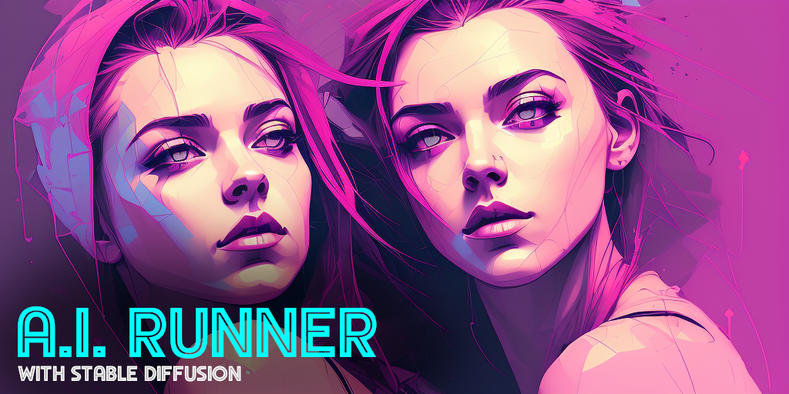
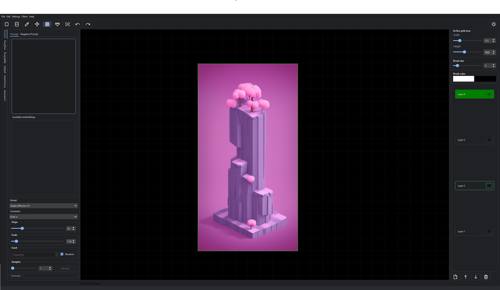

---

### Stable Diffusion on your own hardware 

No web server to run, additional requirements to install or technical knowledge required. 

[Just download the compiled package](https://capsizegames.itch.io/ai-runner) and start generating AI Art!

---

## ⭐ Features

Easily generate AI art using Stable Diffusion.

- Easy setup - download and run. No need to install any requirements*
- Fast! Generate images in approximately 2 seconds using an RTX 2080s, 512x512 dimensions, 20 steps euler_a (approximately 10 seconds for 512x512 20 steps Euler A on 1080gtx). Also runs on CPU†
- txt2img, img2img, inpaint, outpaint, pix2pix, depth2img, controlnet, txt2vid
- Layers and drawing tools
- Image filters
- Dark mode
- Infinite scrolling canvas - use outpainting to create artwork at any size you wish or expand existing images.
- NSFW filter toggle
- Standard Stable Diffusion settings
- Fast load time, responsive interface
- Pure python - does not rely on a webserver

### Requirements

- Cuda capable GPU (2080s or higher recommended)
- At least 10gb of RAM
- at least 5.8gb of disc space to install AI Runner

The core AI Runner  program takes approximately 5.8gb of disc space to install, however the size of each model varies. 
Typically models are between 2.5gb to 10gb in size. The more models you download, the more disc space you will need.

---

## Using AI Runner

[Instructions on how to use AI Runner can be found in the wiki](https://github.com/Capsize-Games/airunner/wiki/AI-Runner)

---

## 🔧 Installation

### [Download the official build on itch.io](https://capsizegames.itch.io/ai-runner)!

This is the compiled version of AI Runner which you can use without installing any additional dependencies.

For those interested in installing the development version, there are three options to choose from. 

[See the installation 
wiki page for more information](https://github.com/Capsize-Games/airunner/wiki/Installation-instructions)

---

### Unit tests

Unit tests can be run using the following command:

**All tests:**
`python -m unittest discover tests`

**Individual test:**
`python -m unittest tests.test_canvas`
