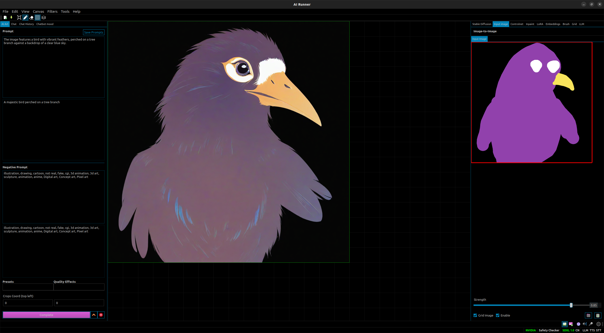
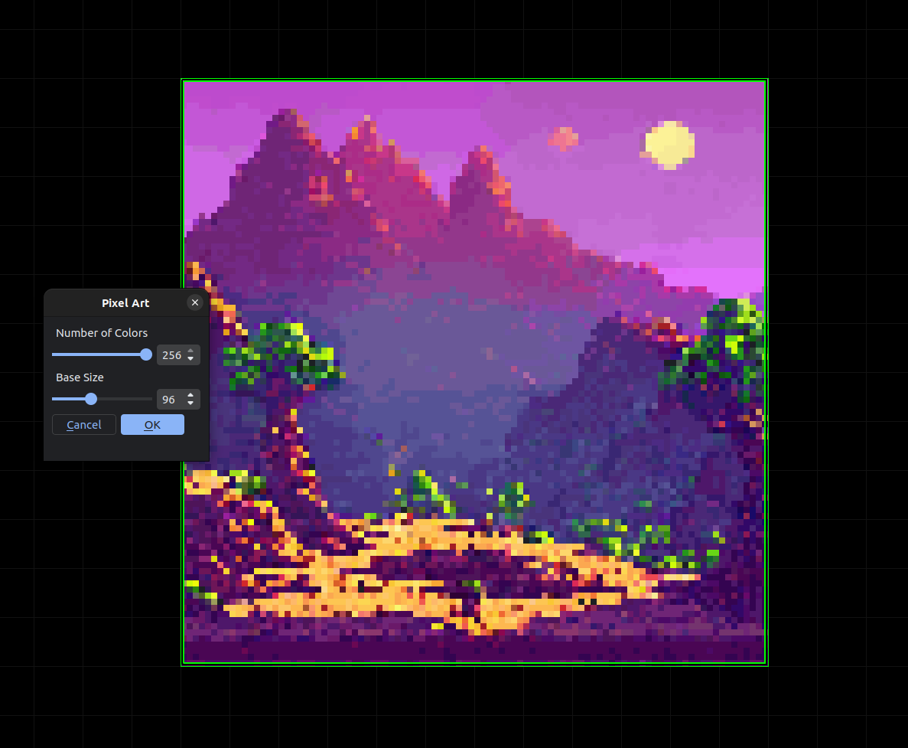
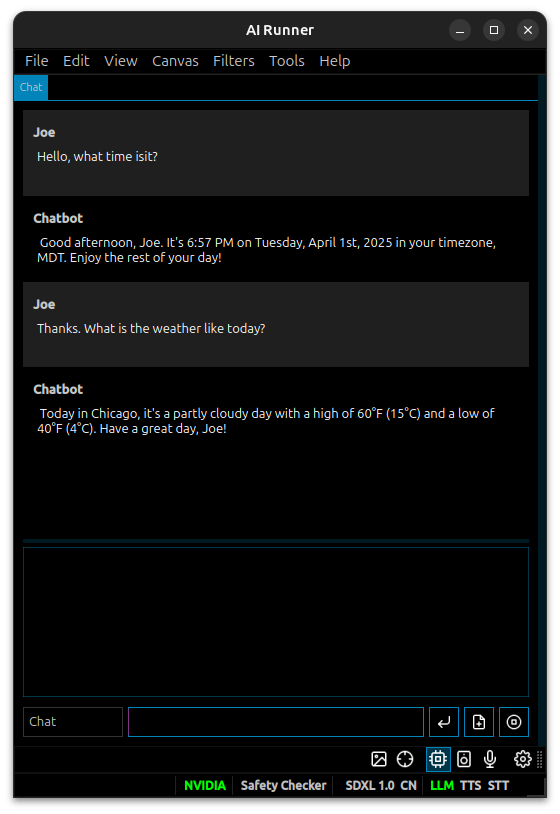

[](https://github.com/Capsize-Games/airunner)

[](https://discord.gg/PUVDDCJ7gz)
[](https://github.com/Capsize-Games/airunner/actions/workflows/pypi-dispatch.yml)


---

# AI Runner 

## Table of Contents
- [Introduction](#introduction)
- [Stable Diffusion](#stable-diffusion)
- [Customizable Chatbots with Moods and Personalities](#customizable-chatbots-with-moods-and-personalities)
- [Features](#-features)
- [System Requirements](#-system-requirements)
- [Installation](#-installation)
- [Running](#running)
- [AI Models](#ai-models)
- [Unit Tests](#unit-tests)
- [Database](#database)
- [Advanced Features](#advanced-features)
- [Additional Features](#additional-features)
- [Missing Features](#missing-features)
- [User Data Updates](#user-data-updates)

## Introduction

AI Runner is an interface that allows you to run open-source large language models (LLM) and AI image generators (Stable Diffusion) on your own hardware.

It is designed to be easy to use, with a simple and intuitive interface that allows you to use models without the need for a web server or cloud service.

It has been optimized for speed and efficiency, allowing you to generate images and have conversations with chatbots in real-time.

## Stable Diffusion


## Drawing tools



## Image filters



## Customizable Chatbots with Moods and Personalities



---

## ⭐ Features

AI Runner is an AI interface that allows you to run open-source 
large language models (LLM) and AI image generators (Stable Diffusion) on your own hardware.

| Feature                              | Description                                              |
|--------------------------------------|----------------------------------------------------------|
| 🗣️ **LLMs and communication**       |
| Voice-based chatbot conversations    | Have conversations with a chatbot using your voice       |
| Text-to-speech                       | Convert text to spoken audio                             |
| Speech-to-text                       | Convert spoken audio to text                             |
| Customizable chatbots with LLMs      | Generate text using large language models                |
| RAG on local documents and websites  | Interact with your local documents using an LLM          |
| 🎨 **Image Generation**              |
| Stable Diffusion (all versions)      | Generate images using Stable Diffusion                   |
| Drawing tools                        | Turn sketches into art                                   |
| Text-to-Image                        | Generate images from textual descriptions                |
| Image-to-Image                       | Generate images based on input images                    |
| 🖼️ **Image Manipulation**           |
| Inpaint and Outpaint                 | Modify parts of an image while maintaining context       |
| Controlnet                           | Control image generation with additional input           |
| LoRA                                 | Efficiently fine-tune models with LoRA                   |
| Textual Embeddings                   | Use textual embeddings for image generation control      |
| Image Filters                        | Blur, film grain, pixel art and more                     |
| 🔧 **Utility**                       |
| Run offline, locally                 | Run on your own hardware without internet                |
| Fast generation                      | Generate images in ~2 seconds (RTX 2080s)                |
| Run multiple models at once          | Utilize multiple models simultaneously                   |
| Dark mode                            | Comfortable viewing experience in low-light environments |
| Infinite scrolling canvas            | Seamlessly scroll through generated images               |
| NSFW filter toggle                   | Help control the visibility of NSFW content              |
| NSFW guardrails toggle               | Help prevent generation of LLM harmful content           |
| Fully customizable                   | Easily adjust all parameters                             |
| Fast load time, responsive interface | Enjoy a smooth and responsive user experience            |
| Pure python                          | No reliance on a webserver, pure python implementation   |

---

## 💻 System Requirements

### Minimum System Requirements

- OS: Linux or Windows
- Processor: Intel i5 or equivalent
- Memory: 16 GB RAM
- Graphics: 2080s RTX or higher
- Network: Broadband Internet connection required for setup
- Storage: 130 GB available space

### Recommended System Specs

- OS: Ubuntu 22.04
- Processor: Intel i7 or equivalent
- Memory: 30 GB RAM
- Graphics: 4090 RTX or higher
- Network: Broadband Internet connection required for setup
- Storage: 130 GB available space

---

## 🚀 Installation

### Quickstart for Linux
```bash
sudo apt install nvidia-cuda-toolkit
nvcc --version  # Verify CUDA installation
pip install torch torchvision torchaudio --index-url https://download.pytorch.org/whl/cu126
pip install airunner[gui,linux,dev,art,llm,tts]
pip install flash-attn --no-build-isolation  # Optional for flash attention
pip install --upgrade timm==1.0.15
```

For detailed instructions, refer to the [Installation Wiki](https://github.com/Capsize-Games/airunner/wiki/Installation-instructions).

### Running

Run the application with the following command

```bash
airunner
```

---

## AI Models

AI Runner installs all of the models required to run a chatbot with text-to-speech and speech-to-text capabilities,
as well as the core models required for Stable Diffusion. However, you must supply your own art generator models.

You can download models from Huggingface.co or civitai.com.

The supported Stable Diffusion models are:

- SD 1.5
- SDXL 1.0
- SDXL Turbo

Models must be placed in their respective directories in the `airunner` directory.
    
```plaintext
~/.local/share/airunner
├── art
│   ├── models
│   │   ├── SD 1.5
│   │   │   ├── lora
│   │   │   └── embeddings
│   │   ├── SDXL 1.0
│   │   │   ├── lora
│   │   │   └── embeddings
│   │   └── SDXL Turbo
│   │       ├── lora
│   │       └── embeddings
```

---

## Unit Tests

Run all unit tests

```bash
python -m unittest discover -s src/airunner/tests
```

Run a single unit test

Example
```bash
python -m unittest src/airunner/tests/test_prompt_weight_convert.py
```

---

## Database

See the [database wiki page](https://github.com/Capsize-Games/airunner/wiki/Database) for details on how to switch engines, make changes to data models and run migrations.

---

## Advanced Features

### Memory Optimization
AI Runner includes advanced memory optimization settings:
- **TF32 Mode**: Faster matrix multiplications on Ampere architecture with slightly reduced precision.
- **VAE Slicing**: Enables decoding large batches of images with limited VRAM.
- **Attention Slicing**: Reduces VRAM usage with a slight impact on inference speed.

### Experimental Features
- **Weather-based Chatbot Prompts**: Integrates weather data into chatbot conversations using the Open-Meteo API.
- **Command-line Arguments**: Includes options like `--clear-window-settings` and `--perform-llm-analysis` for debugging and advanced usage.

### Safety and Guardrails
- **NSFW Content Detection**: Configurable safety checker for image generation.
- **Customizable Guardrails**: Default prompts to ensure ethical and safe AI interactions.

---

## Additional Features

### Memory Optimization
- **Sequential CPU Offload**: Offloads weights to CPU for memory savings during forward passes.
- **ToMe Token Merging**: Merges redundant tokens for faster inference with slight image quality impact.

### Experimental Features
- **Torch 2.0 Optimization**: Leverages Torch 2.0 for improved performance.

### Command-line Arguments
- `--disable-setup-wizard`: Skips the setup wizard during startup.
- `--enable-debug-logs`: Enables verbose logging for debugging purposes.

---

## Missing Features

### Supported Models
- **Stable Diffusion**: SD 1.5, SDXL 1.0, SDXL Turbo.
- **LLMs**: Includes Mistral-7b and other open-source models.
- **Text-to-Speech and Speech-to-Text**: Fully integrated with customizable settings.

### Command-line Arguments
- `--clear-window-settings`: Resets UI settings.
- `--perform-llm-analysis`: Enables experimental LLM analysis.

---

## User Data Updates

### Overview
The `conversation.user_data` column has been updated to store concise, one-sentence summaries of user information. This ensures that the data remains relevant and easy to interpret. Additionally, the system avoids updating this column if no meaningful information is available.

### Key Changes
- **Concise Summaries**: The `conversation.user_data` column now stores brief summaries instead of verbose descriptions.
- **Update Conditions**: Updates to the column are skipped if no meaningful information is extracted.

### Testing
To verify these changes, unit tests have been added to ensure:
1. Concise summaries are correctly stored.
2. No updates occur when no meaningful information is available.

Run the tests using:
```bash
python -m unittest discover -s src/airunner/tests
```
