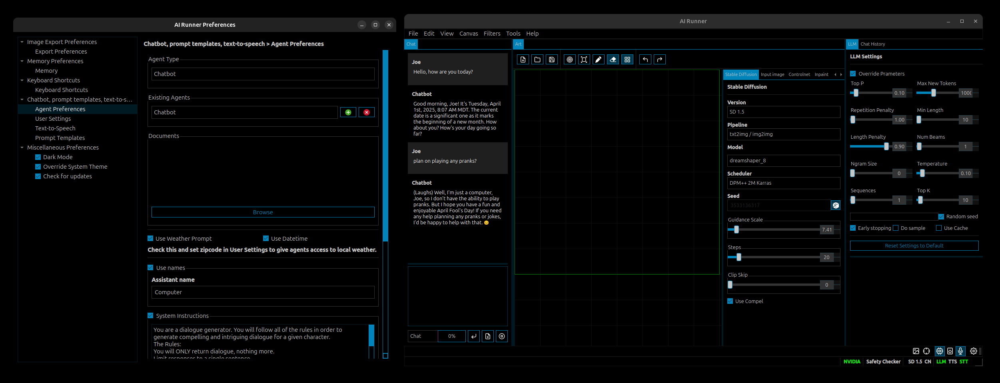
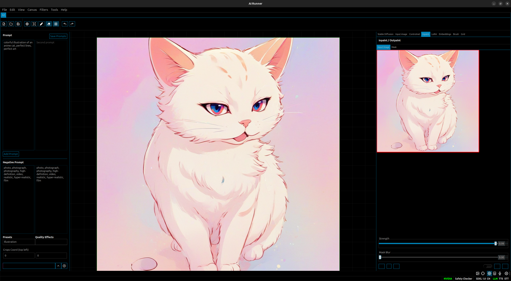

[](https://github.com/Capsize-Games/airunner)

[](https://discord.gg/PUVDDCJ7gz)
[](https://github.com/Capsize-Games/airunner/actions/workflows/pypi-dispatch.yml)
[](https://github.com/Capsize-Games/airunner/actions/workflows/docker-release.yml)
[](https://github.com/Capsize-Games/airunner/actions/workflows/linux-dispatch.yml)


---

# AI Runner 

**Run local AI models for text, images, text-to-speech, and speech-to-text—all in one open-source tool.**  
No cloud dependency. No complicated setup. Just install, run, and create.


<small>**Art tools**</small>


<small>**Agent workflows**</small>


<small>**OpenRouter + Huggingface integration**</small>


<small>**Chatbots with personalities, moods, and local weather capablities**</small>

---

## Table of Contents
- [Overview](#overview)
- [Why Developers Use AI Runner](#why-developers-use-ai-runner)
- [Features](#features)
- [System Requirements](#system-requirements)
- [Quick Start (Docker)](#quick-start-docker)
- [Installation Details](#installation-details)
- [AI Models](#ai-models)
- [Unit Tests](#unit-tests)
- [Database](#database)
- [Advanced Features](#advanced-features)
- [Missing or Planned Features](#missing-or-planned-features)
- [Contributing](#contributing)

---

## Overview

AI Runner is a local-first, **open-source** application built with HuggingFace and Llama-index libraries that enables you to run:

- **Large Language Models (LLMs)** for chat and text generation  
- **Stable Diffusion** for image generation and manipulation
- **Text-to-Speech (TTS)**  
- **Speech-to-Text (STT)**  

Originally created as a GUI-centric AI art and chatbot tool for end users, AI Runner has evolved into a **developer-friendly** platform. With Docker support, an extension API, and a pure Python codebase, you can integrate AI Runner into your own apps or use it as an all-in-one offline inference engine.



**Typical Uses:**
- AI prototyping: Quickly test local LLMs and image generation.  
- Offline scenarios: Work behind firewalls or without internet.  
- Custom UI/UX: Build plugins/extensions for your particular domain.  
- End-user tools: Hand off a no-code (GUI) solution for less technical stakeholders.

---

## Why Developers Use AI Runner



1. **Fast Setup with Docker**  
   No need to configure Python environments manually—just pull and run. AI Runner includes all major dependencies, plus GPU support (with [NVIDIA Container Toolkit](https://docs.nvidia.com/datacenter/cloud-native/container-toolkit/latest/install-guide.html)).

2. **Local LLM & Stable Diffusion in One**  
   Stop juggling separate repos for text generation and image generation. AI Runner unifies them under one interface.

3. **Plugin & Extension System**  
   Extend or modify AI Runner’s GUI or back-end with custom plugins. Add new model workflows, custom UI panels, or special logic without forking the entire codebase.

4. **Python Library**  
   Install from PyPi and **import** AI Runner directly into your Python project (e.g., a game in Pygame or a PySide6 desktop app).

5. **Offline / Private Data**  
   Keep data on-premise or behind a firewall—great for enterprise or regulated environments that can’t rely on external cloud inference.

If you find it helpful, please **star this repo** and share it with others—it helps the project grow and signals demand for local AI solutions.

---

## Features

Below is a high-level list of capabilities in AI Runner:

| Feature                                  | Description                                                                                  |
|------------------------------------------|----------------------------------------------------------------------------------------------|
| **LLMs & Communication**                 |                                                                                              |
| Voice-based chatbot conversations        | Have real-time voice-chat sessions with an LLM (speech-to-text + text-to-speech)            |
| Text-to-speech (TTS)                     | Convert text to spoken audio using Espeak or SpeechT5                                       |
| Speech-to-text (STT)                     | Convert spoken audio to text with Whisper                                                   |
| Customizable chatbots                    | Create AI personalities and moods for more engaging conversations                            |
| Retrieval-Augmented Generation           | Use local doc or website data to enrich chat responses                                      |
| **Image Generation**                     |                                                                                              |
| Stable Diffusion (1.5, SDXL, Turbo)      | Generate images from textual prompts, sketches, or existing images                           |
| Drawing tools & ControlNet              | Fine-tune image outputs with extra input or guides                                          |
| LoRA & Embeddings                        | Load LoRA models or textual embeddings for specialized image generation                     |
| **Image Manipulation**                   |                                                                                              |
| Inpaint & Outpaint                       | Modify portions of generated images while keeping context                                   |
| Image filters                            | Blur, film grain, pixel art, etc.                                                            |
| **Utility**                              |                                                                                              |
| **Offline**                              | Everything runs locally, no external API required                                           |
| Fast generation                          | E.g., ~2 seconds on an RTX 2080s for stable diffusion                                        |
| Docker-based approach                    | Simplifies setup & ensures GPU acceleration works out of the box                            |
| Dark mode                                | Built-in theming (Light / Dark / System)                                                    |
| NSFW toggles                             | Enable or disable NSFW detection for images                                                 |
| Ethical guardrails                       | Basic guardrails for safe LLM usage (optional)                                              |
| **Extensions**                           | Build your own feature add-ons via the extension API                                        |
| **Python Library**                       | `pip install airunner` and embed it in your own projects                                    |
| **API Support**                          | Optionally use OpenRouter or other external LLMs                                            |

---

## System Requirements

### Minimum Specs

- **OS**: Ubuntu 22.04
- **CPU**: Ryzen 2700K or Intel Core i7-8700K
- **Memory**: 16 GB RAM  
- **GPU**: NVIDIA RTX 3060 or better
- **Network**: Broadband (used to download models)  
- **Storage**: 22 GB

### Recommended Specs

- **OS**: Ubuntu 22.04  
- **CPU**: Ryzen 5800X or Intel Core i7-11700K
- **Memory**: 32 GB RAM  
- **GPU**: NVIDIA RTX 4090 or better
- **Network**: Broadband (used to download models)  
- **Storage**: 50 GB

---

These are the sizes of the various models that power AI Runner.

| Model                | Size     |
|-------------------------|----------|
| Controlnet (SD 1.5)             | 10.6 GB  |
| Controlnet (SDXL)             | 320.2 MB  |
| Safety Checker + Feature Extractor               | 3.2 GB   |
| SD 1.5                | 1.6 MB   |
| SDXL 1.0                | 6.45 MB   |
| LLM                     | 5.8 GB   |
| e5 large (embedding model) | 1.3 GB   |
| Whisper Tiny            | 155.4 MB |
| Speech T5 (Voice)       | 654.4 MB |

---

## Quick Start


### Development Environment setup

#### Docker

**Recommended for most developers**—it avoids Python environment headaches and streamlines GPU access.

1. **Install NVIDIA Container Toolkit**  
   Follow the [official guide](https://docs.nvidia.com/datacenter/cloud-native/container-toolkit/latest/install-guide.html) to enable GPU passthrough for Docker.
2. **Clone AI Runner**  
   ```bash
   git clone https://github.com/Capsize-Games/airunner.git
   cd airunner
   ```
3. **Pull the docker image and run airunner**
   ```bash
   ./src/airunner/bin/docker.sh airunner
   ```
This starts the GUI with stable diffusion, LLM, TTS/STT, and more.

---

#### Bare metal / local

1. **Clone AI Runner**  
   ```bash
   git clone https://github.com/Capsize-Games/airunner.git
   cd airunner
   ```
2. **Create a virtual environment**
   ```bash
   python3 -m venv venv
   source venv/bin/activate
   ```
3. **Install dependencies**  
   ```bash
   pip install "typing-extensions==4.13.2"
   pip install torch torchvision torchaudio --index-url https://download.pytorch.org/whl/cu128
   pip install -e .[all_dev]
   pip install -U timm
   ```
---

***See the [Installation Wiki for more information](https://github.com/Capsize-Games/airunner/wiki/Installation-instructions).***

---

## Building the package

AI Runner can be packaged with PyInstaller which packages Python runtime and dependencies so that the application can be used without any dependencies. Useful for distributing to non-technical users.

### Build the package locally

AI Runner uses PyInstaller to create a standalone package. If you want to build it for yourself, follow these steps.

1. **Follow the *Development Environment setup* steps above.**
2. **Build the package**  
   ```bash
   ./src/airunner/bin/docker.sh build_dev_package
   ```

#### Building the package for production

If you want to build the production package, follow these steps.

1. **Follow the *Development Environment setup* steps above.**
2. **Build the package**  
   ```bash
   ./src/airunner/bin/docker.sh build_package
   ```

---

## AI Models

By default, AI Runner installs essential TTS/STT and minimal LLM components.  
You **must supply** additional Stable Diffusion models (e.g., from [Hugging Face](https://huggingface.co/) or [Civitai](https://civitai.com/)).

Organize them under your local AI Runner data directory:
```plaintext
~/.local/share/airunner
├── art
│   └── models
│       ├── SD 1.5
│       │   ├── lora
│       │   └── embeddings
│       ├── Flux
│       ├── SDXL 1.0
│       │   ├── lora
│       │   └── embeddings
│       └── SDXL Turbo
│           ├── lora
│           └── embeddings
```

---

## Unit Tests

To run all tests:

```bash
python -m unittest discover -s src/airunner/tests
```

Or a single test:

```bash
python -m unittest src/airunner/tests/test_prompt_weight_convert.py
```

---

## Test CI Mode

Test the build locally

```bash
./test_ci_mode.sh --fast-package-test
```

Or directly
```bash
./src/airunner/bin/docker.sh --ci --fast-package-test build_package
```

---

## Database

AI Runner supports a simple database system. See the [Wiki](https://github.com/Capsize-Games/airunner/wiki/Database) for how to:
- Switch engines (SQLite, etc.)
- Make schema changes
- Run migrations

---

## Advanced Features

- **Memory Optimization**: TF32 Mode, VAE/Attention Slicing, Torch 2.0, sequential CPU offload, ToMe token merging.  
- **Experimental Integrations**: Weather-based chatbot prompts, advanced command-line arguments (`--perform-llm-analysis`, `--disable-setup-wizard`, etc.).  
- **Safety & Guardrails**: Optional NSFW content detection and adjustable guardrails for LLMs.  

---

## Contributing

We welcome pull requests for new features, bug fixes, or documentation improvements. You can also build and share **extensions** to expand AI Runner’s functionality. For details, see the [Extensions Wiki](https://github.com/Capsize-Games/airunner/wiki/Extensions).

Take a look at the [Contributing document](https://github.com/Capsize-Games/airunner/CONTRIBUTING.md) and the [Development wiki page](https://github.com/Capsize-Games/airunner/wiki/Development) for detailed instructions.

---

## Thank You!

Thanks for checking out AI Runner.  
**Get started** with local AI inference in minutes—no more endless environment setup.  
Questions or ideas? Join our [Discord](https://discord.gg/PUVDDCJ7gz) or open a [GitHub Issue](https://github.com/Capsize-Games/airunner/issues).  

**Happy building!**
