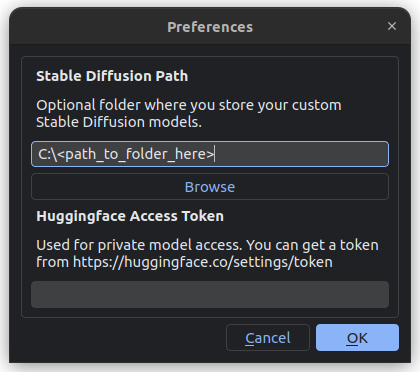

[](https://capsizegames.itch.io/ai-runner)
[](https://discord.gg/PUVDDCJ7gz)
[](https://github.com/Capsize-Games/airunner/actions/workflows/pypi-dispatch.yml)


---

# AI Runner 


AI Runner is an interface which allows you to run open-source large language models (LLM) and AI image generators (Stable Diffusion) on your own hardware.

It is designed to be easy to use, with a simple and intuitive interface that allows you to run AI models without the need for a web server or cloud service.

It has been optimized for speed and efficiency, allowing you to generate images and have conversations with chatbots in real-time.

## Stable Diffusion


## Customizable Chatbots with Moods and Personalities



---

## ⭐ Features

AI Runner is an AI interface which allows you to run open-source 
large language models (LLM) and AI image generators (Stable Diffusion) on your own hardware.

| Feature                              | Description                                              |
|--------------------------------------|----------------------------------------------------------|
| 🗣️ **LLMs and communication**       |
| Voice-based chatbot conversations    | Have conversations with a chatbot using your voice       |
| Text-to-speech                       | Convert text to spoken audio                             |
| Speech-to-text                       | Convert spoken audio to text                             |
| Customizable chatbots with LLMs      | Generate text using large language models                |
| RAG on local documents and websites  | Interact with your local documents using an LLM          |
| 🎨 **Image Generation**              |
| Stable Diffusion (all versions)      | Generate images using Stable Diffusion                   |
| Drawing tools                        | Turn sketches into art                                   |
| Text-to-Image                        | Generate images from textual descriptions                |
| Image-to-Image                       | Generate images based on input images                    |
| 🖼️ **Image Manipulation**           |
| Inpaint and Outpaint                 | Modify parts of an image while maintaining context       |
| Controlnet                           | Control image generation with additional input           |
| LoRA                                 | Efficiently fine-tune models with LoRA                   |
| Textual Embeddings                   | Use textual embeddings for image generation control      |
| Image Filters                        | Blur, film grain, pixel art and more                     |
| 🔧 **Utility**                       |
| Run offline, locally                 | Run on your own hardware without internet                |
| Fast generation                      | Generate images in ~2 seconds (RTX 2080s)                |
| Run multiple models at once          | Utilize multiple models simultaneously                   |
| Dark mode                            | Comfortable viewing experience in low-light environments |
| Infinite scrolling canvas            | Seamlessly scroll through generated images               |
| NSFW filter toggle                   | Help control the visibility of NSFW content              |
| NSFW guardrails toggle               | Help prevent generation of LLM harmful content           |
| Fully customizable                   | Easily adjust all parameters                             |
| Fast load time, responsive interface | Enjoy a smooth and responsive user experience            |
| Pure python                          | No reliance on a webserver, pure python implementation   |

---

## 💻 System Requirements

#### Minimum system requirements

- OS: Linux
- Processor: Intel i5 or equivalent
- Memory: 16 GB RAM
- Graphics: 2080s RTX or higher
- Network: Broadband Internet connection required for setup
- Storage: 130 GB available space

#### Recommended system specs

- OS: Linux
- Processor: Intel i7 or equivalent
- Memory: 30 GB RAM
- Graphics: 4090 RTX or higher
- Network: Broadband Internet connection required for setup
- Storage: 130 GB available space

---

## 🚀 Installation

There are several ways to get started with AI Runner such as packaged, from source and as a library.

[Detailed packaging and installation instructions can be found in the wiki](https://github.com/Capsize-Games/airunner/wiki/Installation-instructions).

### Install as a library

Installation

```bash
pip install airunner
```

Running

```bash
airunner
```


---

## Models

AI Runner installs all of the models required to run a chatbot with text-to-speech and speech-to-text capabilities,
as well as the core models required for Stable Diffusion. However, you must supply your own art generator models.

You can download models from Huggingface.co or civitai.com.

The supported Stable Diffusion models are:

- SD 1.5
- SDXL 1.0
- SDXL Turbo

Models must be placed in their respective directories in the `airunner` directory.
    
```plaintext
~/.local/share/airunner
├── art
│   ├── models
│   │   ├── SD 1.5
│   │   │   ├── lora
│   │   │   └── embeddings
│   │   ├── SDXL 1.0
│   │   │   ├── lora
│   │   │   └── embeddings
│   │   └── SDXL Turbo
│   │       ├── lora
│   │       └── embeddings
```

---

## Unit tests

Run all unit tests

```bash
python -m unittest discover -s src/airunner/tests
```

Run a single unit tests `python -m unittest src/airunner/tests/<file_name>`

Example
```bash
python -m unittest src/airunner/tests/test_prompt_weight_convert.py
```

---

## Privacy and Security

Although AI Runner v3.0 is built with Huggingface libraries, we have taken
care to strip the application of any telemetry or tracking features.

---

### Internet access

Only the setup wizard needs access to the internet in order to download the required models.

For more information see the [Darklock](https://github.com/capsize-games/darklock)  and
[Facehuggershield](https://github.com/capsize-games/facehuggershield) libraries.

---

### Disc access

Write access for the transformers library has been disabled, preventing it from creating a huggingface 
cache directory at runtime.

The application itself may still access the disc for reading and writing, however we have restricted
reads and writes to the user provided `airunner` directory (by default this is located at `~/.local/share/airunner`).

All other attempts to access the disc are blocked and logged for your review.

For more information see `src/security/restrict_os_access.py`.

---

### Huggingface Hub

**_Huggingface Hub  contains telemetry and tracking features that have been completely disabled in AI Runner._**

The security measures taken for this library are as follows

- Prevented from accessing the internet
- Prevented from accessing the disc
- All environment variables set for maximum security
- All telemetry disabled

See [Facehuggershield](https://github.com/capsize-games/facehuggershield) for more information.
