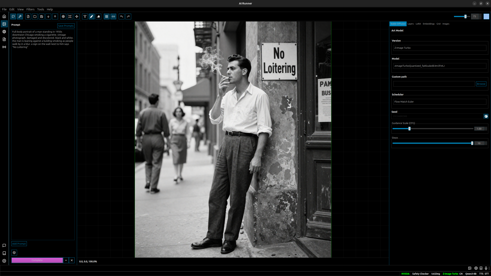

# AI Runner

```
Support development. Send crypto: 0x02030569e866e22C9991f55Db0445eeAd2d646c8
```

## Your new favorite local AI platform

AI Runner is an all-in-one, offline-first desktop application, headless server, and Python library for local LLMs, TTS, STT, and image generation.





[](https://discord.gg/ukcgjEpc5f)  [](https://github.com/Capsize-Games/airunner/actions/workflows/pypi-dispatch.yml) 

[🐞 Report Bug](https://github.com/Capsize-Games/airunner/issues/new?template=bug_report.md) · [✨ Request Feature](https://github.com/Capsize-Games/airunner/issues/new?template=feature_request.md) · [🛡️ Report Vulnerability](https://github.com/Capsize-Games/airunner/issues/new?template=vulnerability_report.md) · [📖 Wiki](https://github.com/Capsize-Games/airunner/wiki)

---

## ✨ Key Features

| Feature | Description |
|---------|-------------|
| **🗣️ Voice Chat** | Real-time conversations with LLMs using espeak or OpenVoice |
| **🤖 Custom AI Agents** | Configurable personalities, moods, and RAG-enhanced knowledge |
| **🎨 Visual Workflows** | Drag-and-drop LangGraph workflow builder with runtime execution |
| **🖼️ Image Generation** | Stable Diffusion (SD 1.5, SDXL) and FLUX models with drawing tools, LoRA, inpainting, and filters |
| **🔒 Privacy First** | Runs locally with no external APIs by default, configurable guardrails |
| **⚡ Fast Generation** | Uses GGUF and quantization for faster inference and lower VRAM usage |

### 🌍 Language Support

| Language | TTS | LLM | STT | GUI |
|----------|-----|-----|-----|-----|
| English | ✅ | ✅ | ✅ | ✅ |
| Japanese | ✅ | ✅ | ❌ | ✅ |
| Spanish/French/Chinese/Korean | ✅ | ✅ | ❌ | ❌ |

---

## ⚙️ System Requirements

| | Minimum | Recommended |
|---|---------|-------------|
| **OS** | Ubuntu 22.04, Windows 10 | Ubuntu 22.04 (Wayland) |
| **CPU** | Ryzen 2700K / i7-8700K | Ryzen 5800X / i7-11700K |
| **RAM** | 16 GB | 32 GB |
| **GPU** | NVIDIA RTX 3060 | NVIDIA RTX 5080 |
| **Storage** | 22 GB - 100 GB+ (actual usage varies, SSD recommended) | 100 GB+ |

---

## 💾 Installation

### Docker (Recommended)

**GUI Mode:**
```bash
xhost +local:docker && docker compose run --rm airunner
```

**Headless API Server:**
```bash
docker compose run --rm --service-ports airunner --headless
```

> **Note:** `--service-ports` is required to expose port 8080 for the API.

The headless server exposes an HTTP API on port 8080 with endpoints:
- `GET /health` - Health check and service status
- `POST /llm` - LLM inference
- `POST /art` - Image generation

### Manual Installation (Ubuntu/Debian)

**Python 3.13+ required.** We recommend using `pyenv` and `venv`.

1. **Install system dependencies:**
   ```bash
   sudo apt update && sudo apt install -y \
     build-essential cmake git curl wget \
     nvidia-cuda-toolkit pipewire libportaudio2 libxcb-cursor0 \
     espeak espeak-ng-espeak qt6-qpa-plugins qt6-wayland \
     mecab libmecab-dev mecab-ipadic-utf8 libxslt-dev mkcert
   ```

2. **Create data directory:**
   ```bash
   mkdir -p ~/.local/share/airunner
   ```

3. **Install AI Runner:**
   ```bash
   pip install torch torchvision torchaudio --index-url https://download.pytorch.org/whl/cu128
   pip install airunner[all_dev]
   ```

4. **Install llama-cpp-python with CUDA (Python 3.13, RTX 5080):**
  ```bash
  CMAKE_ARGS="-DGGML_CUDA=on -DGGML_CUDA_ARCHITECTURES=90" FORCE_CMAKE=1 \
    pip install --no-binary=:all: --no-cache-dir "llama-cpp-python==0.3.16"
  ```
  - Uses GGML_CUDA (CUBLAS flag is deprecated).
  - `90` matches RTX 5080 class GPUs; drop `-DGGML_CUDA_ARCHITECTURES` if you are unsure and let it auto-detect.
  - On Python 3.12 you may instead use the prebuilt wheel: `--extra-index-url https://abetlen.github.io/llama-cpp-python/whl/cu121 "llama-cpp-python==0.3.16+cu121"`.

4. **Run:**
   ```bash
   airunner
   ```

For detailed instructions, see the [Installation Wiki](https://github.com/Capsize-Games/airunner/wiki/Installation-instructions).

---

## 🤖 Models

AI Runner downloads essential TTS/STT models automatically. LLM and image models must be configured:

| Category | Model | Size |
|----------|-------|------|
| **LLM (default)** | Llama 3.1 8B Instruct (4bit) | ~4 GB |
| **Image** | Stable Diffusion 1.5 | ~2 GB |
| **Image** | SDXL 1.0 | ~6 GB |
| **Image** | FLUX.1 Dev/Schnell (GGUF) | 8-12 GB |
| **TTS** | OpenVoice | 654 MB |
| **STT** | Whisper Tiny | 155 MB |

**LLM Providers:** Local (HuggingFace), Ollama, OpenRouter, OpenAI

**Art Models:** Place your models in `~/.local/share/airunner/art/models/`

---

## 🛠️ CLI Commands

| Command | Description |
|---------|-------------|
| `airunner` | Launch GUI |
| `airunner-headless` | Start headless API server |
| `airunner-hf-download` | Download/manage models from HuggingFace |
| `airunner-civitai-download` | Download models from CivitAI |
| `airunner-build-ui` | Rebuild UI from `.ui` files |
| `airunner-tests` | Run test suite |
| `airunner-generate-cert` | Generate SSL certificate |

**Note:** To download models, use *Tools → Download Models* from the main application menu, or use `airunner-hf-download` / `airunner-civitai-download` from the command line.

---

## 🖥️ Headless Server

AI Runner can run as a headless HTTP API server, enabling remote access to LLM, image generation, TTS, and STT capabilities. This is useful for:

- Running AI services on a remote server
- Integration with other applications via REST API
- VS Code integration as an Ollama/OpenAI replacement
- Automated pipelines and scripting

### Quick Start

```bash
# Start with defaults (port 8080, LLM only)
airunner-headless

# Start with a specific LLM model
airunner-headless --model /path/to/Qwen2.5-7B-Instruct-4bit

# Run as Ollama replacement for VS Code (port 11434)
airunner-headless --ollama-mode

# Don't preload models - load on first request
airunner-headless --no-preload
```

### Command Line Options

| Option | Description |
|--------|-------------|
| `--host HOST` | Host address to bind to (default: `0.0.0.0`) |
| `--port PORT` | Port to listen on (default: `8080`, or `11434` in ollama-mode) |
| `--ollama-mode` | Run as Ollama replacement on port 11434 |
| `--model, -m PATH` | Path to LLM model to load |
| `--art-model PATH` | Path to Stable Diffusion model to load |
| `--tts-model PATH` | Path to TTS model to load |
| `--stt-model PATH` | Path to STT model to load |
| `--enable-llm` | Enable LLM service |
| `--enable-art` | Enable Stable Diffusion/art service |
| `--enable-tts` | Enable TTS service |
| `--enable-stt` | Enable STT service |
| `--no-preload` | Don't preload models at startup |

### Environment Variables

| Variable | Description |
|----------|-------------|
| `AIRUNNER_LLM_MODEL_PATH` | Path to LLM model |
| `AIRUNNER_ART_MODEL_PATH` | Path to art model |
| `AIRUNNER_TTS_MODEL_PATH` | Path to TTS model |
| `AIRUNNER_STT_MODEL_PATH` | Path to STT model |
| `AIRUNNER_NO_PRELOAD` | Set to `1` to disable model preloading |
| `AIRUNNER_LLM_ON` | Enable LLM service (`1` or `0`) |
| `AIRUNNER_SD_ON` | Enable Stable Diffusion (`1` or `0`) |
| `AIRUNNER_TTS_ON` | Enable TTS service (`1` or `0`) |
| `AIRUNNER_STT_ON` | Enable STT service (`1` or `0`) |

### API Endpoints

#### Native AIRunner Endpoints

| Method | Endpoint | Description |
|--------|----------|-------------|
| GET | `/health` | Health check and service status |
| POST | `/llm` | LLM text generation (streaming) |
| POST | `/llm/generate` | LLM text generation |
| POST | `/art` | Image generation |
| POST | `/tts` | Text-to-speech |
| POST | `/stt` | Speech-to-text |

#### Ollama-Compatible Endpoints (port 11434)

| Method | Endpoint | Description |
|--------|----------|-------------|
| GET | `/api/tags` | List available models |
| GET | `/api/version` | Get version info |
| GET | `/api/ps` | List running models |
| POST | `/api/generate` | Text generation |
| POST | `/api/chat` | Chat completion |
| POST | `/api/show` | Show model info |

#### OpenAI-Compatible Endpoints

| Method | Endpoint | Description |
|--------|----------|-------------|
| GET | `/v1/models` | List models |
| POST | `/v1/chat/completions` | Chat completion with tool support |

### Example: LLM Request

```bash
curl -X POST http://localhost:8080/llm \
  -H "Content-Type: application/json" \
  -d '{
    "prompt": "What is the capital of France?",
    "stream": true,
    "temperature": 0.7,
    "max_tokens": 100
  }'
```

### Example: Image Generation (Art)

```bash
# Requires: airunner-headless --enable-art
curl -X POST http://localhost:8080/art \
  -H "Content-Type: application/json" \
  -d '{
    "prompt": "A beautiful sunset over mountains",
    "negative_prompt": "blurry, low quality",
    "width": 512,
    "height": 512,
    "steps": 20,
    "seed": 42
  }'
# Returns: {"images": ["base64_png_data..."], "count": 1, "seed": 42}
```

### Example: Text-to-Speech (TTS)

```bash
# Requires: airunner-headless --enable-tts
curl -X POST http://localhost:8080/tts \
  -H "Content-Type: application/json" \
  -d '{"text": "Hello, world!"}'
# Returns: {"status": "queued", "message": "Text queued for speech synthesis"}
# Audio plays through system speakers
```

### Example: Speech-to-Text (STT)

```bash
# Requires: airunner-headless --enable-stt
# Audio must be base64-encoded WAV (16kHz mono recommended)
curl -X POST http://localhost:8080/stt \
  -H "Content-Type: application/json" \
  -d '{"audio": "UklGRi4AAABXQVZFZm10IBAAAAABAAEA..."}'
# Returns: {"transcription": "Hello world", "status": "success"}
```

### Example: Ollama Mode with VS Code

1. Start the headless server in Ollama mode:
   ```bash
   airunner-headless --ollama-mode --model /path/to/your/model
   ```

2. Configure VS Code Continue extension to use `http://localhost:11434`

3. The server will respond to Ollama API calls, allowing seamless integration.

### Auto-Loading Models

When `--no-preload` is used, models are automatically loaded on the first request to the corresponding endpoint. This is useful for:

- Reducing startup time
- Running multiple services without loading all models upfront
- Memory-constrained environments

---

## 📦 Model Management

### Download Models

```bash
# List available models
airunner-hf-download

# List only LLM models
airunner-hf-download list --type llm

# Download a model (GGUF by default)
airunner-hf-download qwen3-8b

# Download full safetensors version
airunner-hf-download --full qwen3-8b

# Download any HuggingFace model
airunner-hf-download Qwen/Qwen3-8B

# List downloaded models
airunner-hf-download --downloaded
```

### Delete Models

```bash
# Delete a model (with confirmation)
airunner-hf-download --delete Qwen3-8B

# Delete without confirmation (for scripts)
airunner-hf-download --delete Qwen3-8B --force
```

### Download from CivitAI

```bash
# Download a model from CivitAI URL
airunner-civitai-download https://civitai.com/models/995002/70s-sci-fi-movie

# Download a specific version
airunner-civitai-download https://civitai.com/models/995002?modelVersionId=1880417

# Download to a custom directory
airunner-civitai-download <url> --output-dir /path/to/models

# Use API key for authentication (for gated models)
airunner-civitai-download <url> --api-key your_api_key

# Or set CIVITAI_API_KEY environment variable
export CIVITAI_API_KEY=your_api_key
airunner-civitai-download <url>
```

---

## 🔒 HTTPS Configuration

AI Runner's local server uses HTTPS by default. Certificates are auto-generated in `~/.local/share/airunner/certs/`.

For browser-trusted certificates, install [mkcert](https://github.com/FiloSottile/mkcert):
```bash
sudo apt install libnss3-tools
mkcert -install
```

---

## ⚖️ Colorado AI Act Notice

**Effective February 1, 2026**, the [Colorado AI Act (SB 24-205)](https://leg.colorado.gov/bills/sb24-205) regulates high-risk AI systems.

**Your Responsibility:** If you use AI Runner for decisions with legal or significant effects on individuals (employment screening, loan eligibility, insurance, housing), you may be classified as a **deployer of a high-risk AI system** and must:
- Implement a risk management policy
- Complete impact assessments
- Provide consumer notice and appeal mechanisms
- Report algorithmic discrimination to the Colorado Attorney General

**AI Runner's Design:** AI Runner is designed with privacy as a core principle—it runs entirely locally with no external data transmission by default. However, certain optional features connect to external services:

- **Model Downloads:** Connecting to HuggingFace or CivitAI to download models
- **Web Search / Deep Research:** Search queries sent to DuckDuckGo; web pages scraped for research
- **Weather Prompt:** Location coordinates sent to Open-Meteo API if enabled
- **External LLM Providers:** Prompts sent to OpenRouter or OpenAI if configured

**We recommend using a VPN** when using features that connect to external services. See our full [Privacy Policy](src/airunner/components/downloader/gui/windows/setup_wizard/user_agreement/privacy_policy.md) for details.

---

## 🧪 Testing

```bash
# Run headless-safe tests
pytest src/airunner/utils/tests/

# Run display-required tests (Qt/GUI)
xvfb-run -a pytest src/airunner/utils/tests/xvfb_required/
```

---

## Contributing

See [CONTRIBUTING.md](CONTRIBUTING.md) and the [Development Wiki](https://github.com/Capsize-Games/airunner/wiki/Development).

## Documentation

- [Wiki](https://github.com/Capsize-Games/airunner/wiki)
- [API Service Layer](src/airunner/components/application/api/README.md)
- [ORM Models](src/airunner/components/data/models/README.md)

---

<a href="https://airunner.org">
   
</a>

