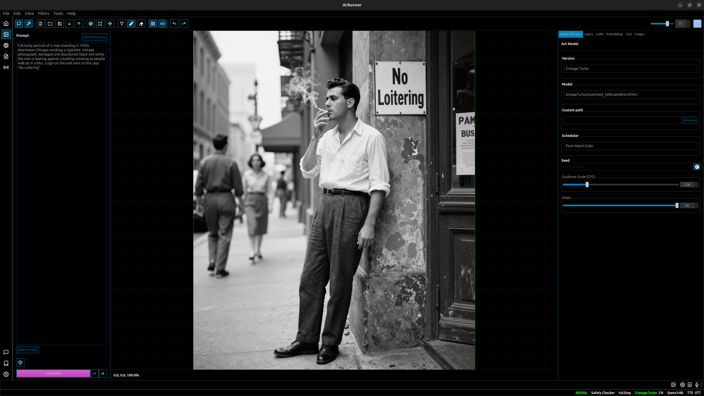
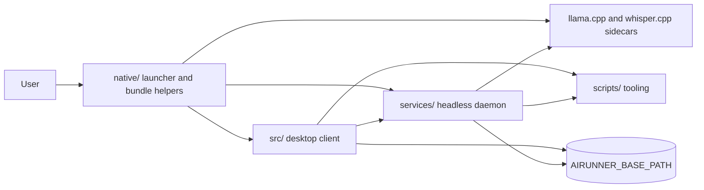

# AI Runner

## Edge AI for art and chat companions, built with privacy, flexibility, and creativity in mind.

AI Runner is a private AI companion you shape — name, personality, voice, memory — and a layered canvas for AI art generation. Everything runs on your machine by default.





[](https://github.com/Capsize-Games/airunner/actions/workflows/eval-tests.yml)
[](https://github.com/Capsize-Games/airunner/actions/workflows/native-runtime-sidecars.yml)
[](https://github.com/Capsize-Games/airunner/actions/workflows/docker-release.yml)
[](https://github.com/Capsize-Games/airunner/actions/workflows/pypi-dispatch.yml)
[](https://www.python.org/downloads/)
[](https://www.gnu.org/licenses/gpl-3.0)
[](https://github.com/Capsize-Games/airunner/commits/master)
[](https://discord.gg/7254Hkzc4T)

[🐞 Report Bug](https://github.com/Capsize-Games/airunner/issues/new?template=bug_report.md) · [✨ Request Feature](https://github.com/Capsize-Games/airunner/issues/new?template=feature_request.md) · [🛡️ Report Vulnerability](https://github.com/Capsize-Games/airunner/issues/new?template=vulnerability_report.md) · [📖 Wiki](https://github.com/Capsize-Games/airunner/wiki)

---

## What AI Runner Is For

AI Runner is built around two interlocking experiences.

**A companion you shape.** Name it, give it a personality, assign it
a voice, and let it build memory of who you are over time. Your
companion is aware of the time, date, and weather, and its mood shifts
naturally through conversation. Everything — the conversations, the
memories, the personality — stays on your machine.

**A canvas for AI art.** A layered drawing and generation surface where
you can sketch, paint, generate, and filter. Convert sketches to images,
iterate with image-to-image, composite on layers, and apply styles and
filters — with your companion present alongside you while you create.

Neither experience requires an internet connection, an API key, or a
subscription. Everything runs on your hardware.

## ✨ Key Features

| Feature | Description |
|---------|-------------|
| **🤖 AI Companion** | Shape a named, voiced companion with persistent personality, shifting mood, and long-term memory built from your conversations |
| **🎨 Layered Canvas** | Draw, paint, generate, and filter on a multi-layer canvas — convert sketches to images, composite scenes, and iterate in place |
| **🖼️ Image Generation** | SDXL and Z-Image Turbo with LoRA, embeddings, image-to-image, inpainting, and post-process filters, background removal |
| **🗣️ Voice Conversation** | Full TTS and STT — speak to your companion and hear it respond in a voice you choose |
| **🧠 Memory & Recall** | Companion builds long-term memory of you across sessions with RAG-powered recall |
| **🌤️ Environmental Awareness** | Companion is aware of time, date, and local weather — grounded in the real moment |
| **🔒 Privacy First** | Private by default — no telemetry and no data leaves your machine unless you explicitly enable an optional cloud feature |
| **🛡️ Safety Filters** | Configurable NSFW output filtering and always-on prompt classifier for illegal content |
| **📦 Model Management** | Built-in HuggingFace and Civitai downloaders with support for multiple local LLMs and image models |

### 🌍 Language Support

| Language | TTS | LLM | STT | GUI |
|----------|-----|-----|-----|-----|
| English | ✅ | ✅ | ✅ | ✅ |
| Japanese | ✅ | ✅ | ❌ | ✅ |
| Spanish/French/Chinese/Korean | ✅ | ✅ | ❌ | ❌ |

## 🧱 Package Overview


```mermaid
flowchart LR
  User[User] --> Native[native/ launcher and bundle helpers]
  Native --> GUI[src/ desktop client]
  Native --> Daemon[services/ headless daemon]
  GUI --> Daemon
  Native --> Sidecars[llama.cpp and whisper.cpp sidecars]
  Daemon --> Sidecars
  GUI --> Scripts[scripts/ tooling]
  Daemon --> Scripts
  GUI --> Data[(AIRUNNER_BASE_PATH)]
  Daemon --> Data
```

| Package | Role |
|---------|------|
| [src](src/README.md) | Desktop GUI client, daemon client bridge, widgets, and application entry points |
| [services](services/README.md) | Headless daemon, FastAPI server, runtime registry, orchestration, downloads, and persistence |
| [native](native/README.md) | Python launcher entry point, runtime layout helpers, and native sidecar support |
| [scripts](scripts/README.md) | Developer tooling: test runner, UI build, install helpers, and quality reports |

---

## ⚙️ System Requirements

| | Minimum | Recommended |
|---|---------|-------------|
| **OS** | Ubuntu 22.04, Windows 10 * | Ubuntu 22.04 (Wayland) |
| **CPU** | Ryzen 2700K / i7-8700K | Ryzen 5800X / i7-11700K |
| **RAM** | 16 GB | 32 GB |
| **GPU** | NVIDIA RTX 3060 | NVIDIA RTX 5080 |
| **Storage** | 22 GB - 100 GB+ (actual usage varies, SSD recommended) | 100 GB+ |

> \* Windows support is experimental and community-maintained; Linux is the primary supported platform.

---

## 💾 Installation

Current status:
AIRunner runs as a Python application with two install paths.

Choose one of the two primary install modes:

| Install mode | Best for | Primary command |
|--------------|----------|-----------------|
| `dev` | Contributors working from a repo checkout | `./scripts/install.sh` |
| `distributed` | Operators separating daemon and GUI-client installs | `./deployment/install_distributed.sh --role ...` |

1. `dev` for contributors working from this repo checkout.
  This reuses `./venv` by default, installs the Python packages in editable
  mode, and builds the pinned `llama.cpp` and `whisper.cpp` sidecars under
  `build/runtime-sidecars/linux/`.
  ```bash
  ./scripts/install.sh
  ```
  If you already have the venv, rerun the command and it will reuse the
  existing environment instead of recreating it, and it refreshes the local
  editable installs without re-solving the full dependency graph. Add
  `--refresh-deps` when you want a full dependency refresh, and add
  `--sidecars-cuda` when you want CUDA-enabled native sidecars.

2. `distributed` for operators who want the daemon and GUI client installed
  separately, including split-machine setups.
  ```bash
  ./deployment/install_distributed.sh --role daemon
  ./deployment/install_distributed.sh --role gui-client
  ```

The manual and Docker paths below are still useful developer/operator
installation flows.

### Docker (Recommended)

**GUI Mode:**
```bash
xhost +local:docker && docker compose run --rm airunner
```

**Headless API Server:**
```bash
docker compose run --rm --service-ports airunner --headless
```

> **Note:** `--service-ports` is required to expose the container's published port (8080), which maps to the headless daemon's HTTP API.

To trim container dependencies for a specific deployment, rebuild with a
profile list such as:

```bash
docker build \
  --build-arg AIRUNNER_INSTALL_PROFILES=core,llm-native,stt-native \
  -t airunner:headless .
```

The container publishes the headless daemon's HTTP API on port 8080 with endpoints:
- `GET /health` - Health check and service status
- `POST /llm` - LLM inference
- `POST /art` - Image generation

### Advanced Python Installation (Ubuntu/Debian)

Use this path when you want to assemble the environment manually instead of
using `./scripts/install.sh` for repo development or
`./deployment/install_distributed.sh` for managed daemon and GUI-client
installs.

**Python 3.13+ required.** We recommend using `pyenv` and `venv`.

1. **Install system dependencies:**
   ```bash
   sudo apt update && sudo apt install -y \
     build-essential cmake git curl wget pkg-config \
     nvidia-cuda-toolkit pipewire libportaudio2 libxcb-cursor0 \
     espeak espeak-ng-espeak qt6-qpa-plugins qt6-wayland \
     libsentencepiece-dev \
     mecab libmecab-dev mecab-ipadic-utf8 libxslt-dev mkcert
   ```

2. **Create data directory:**
   ```bash
   mkdir -p ~/.local/share/airunner
   ```

3. **Choose the package profiles you need:**

   - `llm-native`: local llama.cpp runtime and LLM toolchain
   - `stt-native`: local STT runtime helpers
   - `art-python`: Python image-generation runtimes
   - `tts-python`: Python TTS runtimes without MeCab-backed language packs
   - `headless`: aggregate of the four runtime extras above (`llm-native`,
     `stt-native`, `art-python`, `tts-python`)
   - `development`: test, lint, and packaging tooling
   - `openvoice_jp` / `openvoice_kr`: MeCab-backed Japanese and Korean voice packs

   All of the runtime profiles above live on the `airunner-services` package.
   The desktop GUI ships in the root `airunner` package, which pulls in
   `airunner-services==6.0.1` automatically (issue #2037). The optional
   `airunner-native[gui]` extra provides the native launcher and bundle
   tooling.

4. **Install AI Runner:**

   The published packages are `airunner` (desktop GUI), `airunner-services`
   (headless daemon, API server, and model runtimes), `airunner-native`
   (optional native launcher), and `airunner-common` (shared metadata). The
   `airunner` package itself only ships `analysis`, `ml`, and `development`
   extras; all model runtimes live in the `airunner-services` extras (issues
   #2039/#2040).

   From PyPI (full GUI install):
   ```bash
   # torch family pinned to the CUDA 12.9 wheel line (issues #2036/#2041)
   pip install torch torchvision torchaudio --index-url https://download.pytorch.org/whl/cu129
   # Desktop GUI; pulls in airunner-services==6.0.1 automatically
   pip install "airunner"
   # Model runtimes (LLM, STT, art, TTS); `headless` aggregates the four extras
   pip install "airunner-services[headless]"
   # Optional: native launcher and bundle tooling (also pulls the GUI)
   pip install "airunner-native[gui]"
   ```

   For a headless-only install (no GUI), install the services package with the
   runtimes you need:
   ```bash
   pip install "airunner-services[headless]"
   ```

   From a local clone in editable mode:
   ```bash
   git clone https://github.com/Capsize-Games/airunner.git
   cd airunner
   python -m venv venv
   source venv/bin/activate
   pip install --upgrade pip setuptools wheel
   # The pinned torch line (2.13.0+cu129) requires setuptools>=77.0.3 with no
   # setuptools<82 upper bound, so the latest setuptools is safe for `pip check`
   # (issue #2057). Older torch wheels (e.g. some 2.11.x) still declare
   # `setuptools<82`; if you use one, `pip install "setuptools<82"` first.
   pip install torch torchvision torchaudio --index-url https://download.pytorch.org/whl/cu129
   # Install the local shared package first so the editable installs below
   # resolve airunner-common from this checkout (services/native declare it as
   # a runtime dependency). Their setup.py files no longer import
   # airunner_common at build time (issue #2038), so --no-build-isolation is
   # no longer required. airunner-common is published to PyPI since issue
   # #2061, but a repo checkout should stay self-contained.
   pip install -e ./shared
   pip install -e "./services[headless,development]"
   pip install -e ./native
   pip install -e .
   ```

  The base `tts-python` profile intentionally excludes the MeCab-backed
  Japanese and Korean voice packs so a fresh virtual environment can install
  without extra native build steps.

  To include those language packs after installing the system packages above, use:
  ```bash
  pip install -e "./services[openvoice_jp,openvoice_kr]"
  ```

5. **Install llama-cpp-python with CUDA (Python 3.13, Linux):**
  ```bash
  pip install --no-cache-dir \
    --extra-index-url https://abetlen.github.io/llama-cpp-python/whl/cu124 \
    "llama-cpp-python==0.3.21"
  ```
  - This is the verified runtime for `Qwen3.5-9B-Q8_0.gguf` in this repo.
  - The `cu124` wheel enables GPU offload on Linux without rebuilding from source.
  - If you must build from source for an RTX 5080 / compute capability 12.0, use CUDA toolkit 12.8+ and `GGML_CUDA_ARCHITECTURES=120`.

6. **Run:**
   ```bash
   airunner
   ```

### Alembic Upgrades

When you need to run database migrations manually from a local clone, use the
repo Alembic config and upgrade all heads:

```bash
source venv/bin/activate
alembic -c src/airunner/alembic.ini upgrade heads
```

If you are targeting a non-default database, set `AIRUNNER_DATABASE_URL`
before running the command.

For detailed instructions, see the [Installation Wiki](https://github.com/Capsize-Games/airunner/wiki/Installation-instructions).

## Hybrid Runtime Migration

The hybrid-runtime rewrite is being delivered in explicit phases: runtime
foundation, LLM cutover, STT isolation, art/TTS isolation, then packaging,
bundles, CI, and rollout hardening. The phase order, rollout gates, and full
issue-tree checklist live in [HYBRID_RUNTIME_MIGRATION.md](./HYBRID_RUNTIME_MIGRATION.md).

AIRunner ships as a Python application with one primary `airunner` entry
point.

---

## 🤖 Models

AI Runner downloads essential TTS/STT models automatically. LLM and image models must be configured:

| Category | Model | Size |
|----------|-------|------|
| **LLM (default)** | Llama 3.1 8B Instruct (4bit) | ~4 GB |
| **Image** | Stable Diffusion 1.5 | ~2 GB |
| **Image** | SDXL 1.0 | ~6 GB |
| **Image** | Z-Image Turbo | ~12 GB |
| **TTS** | OpenVoice | 654 MB |
| **STT** | Whisper Tiny | 155 MB |

**LLM Providers:** Local (HuggingFace), Ollama, OpenRouter, OpenAI

**Art Models:** Place your models in `~/.local/share/airunner/art/models/`

---

## 🛠️ CLI Commands

| Command | Description |
|---------|-------------|
| `airunner` | Launch GUI |
| `airunner-headless` | Start headless API server |
| `airunner-hf-download` | Download/manage models from HuggingFace |
| `airunner-civitai-download` | Download models from CivitAI |
| `airunner-build-ui` (dev) | Rebuild UI from `.ui` files (`python scripts/build_ui.py`) |
| `airunner-tests` (dev) | Run test suite (`python scripts/run_tests.py`) |
| `airunner-generate-cert` | Generate SSL certificate |

**Note:** To download models, use *Tools → Download Models* from the main
application menu. The GUI now opens a filtered CivitAI browser for SDXL 1.0
and Z-Image Turbo models and queues downloads through the local daemon. You
can also use `airunner-hf-download` / `airunner-civitai-download` from the
command line.

### Rebuilding Qt UI Files

When you change any `.ui` file in a local clone, rebuild the generated
`*_ui.py` files from the repo root with:

```bash
source venv/bin/activate
python scripts/build_ui.py
```

If you installed AIRunner's dev console scripts, `airunner-build-ui` runs the
same rebuild; from a source checkout use `python scripts/build_ui.py`.

This rebuild also refreshes the Qt resources and generated stylesheet
assets.

---

## 🖥️ Headless Server

AI Runner can run as a headless HTTP API server, enabling remote access to LLM, image generation, TTS, and STT capabilities. This is useful for:

- Running AI services on a remote server
- Integration with other applications via REST API
- VS Code integration as an Ollama/OpenAI replacement
- Automated pipelines and scripting

### Quick Start

```bash
# Start with defaults (port 8080, LLM only)
airunner-headless

# Start with a specific LLM model
airunner-headless --model "/path/to/Qwen2.5-7B-Instruct-4bit"

# Run as Ollama replacement for VS Code (port 11434)
airunner-headless --ollama-mode

# Don't preload models - load on first request
airunner-headless --no-preload
```

### Command Line Options

| Option | Description |
|--------|-------------|
| `--host HOST` | Host address to bind to (default: `127.0.0.1`) |
| `--port PORT` | Port to listen on (default: `8080`, or `11434` in ollama-mode) |
| `--ollama-mode` | Run as Ollama replacement on port 11434 |
| `--insecure-no-auth` | Allow binding to non-loopback without `AIRUNNER_API_KEY` (not recommended) |
| `--model, -m PATH` | Path to LLM model to load. Also enables the LLM service. Quote paths that contain spaces. |
| `--art-model PATH` | Path to Stable Diffusion model to load. Also enables the art service. Quote paths that contain spaces. |
| `--tts-model PATH` | Path to TTS model to load. Also enables the TTS service. Quote paths that contain spaces. |
| `--stt-model PATH` | Path to STT model to load. Also enables the STT service. Quote paths that contain spaces. |
| `--enable-llm` | Enable LLM service |
| `--enable-art` | Enable Stable Diffusion/art service |
| `--enable-tts` | Enable TTS service |
| `--enable-stt` | Enable STT service |
| `--no-preload` | Don't preload models at startup |

### Environment Variables

| Variable | Description |
|----------|-------------|
| `AIRUNNER_LLM_MODEL_PATH` | Path to LLM model |
| `AIRUNNER_ART_MODEL_PATH` | Path to art model |
| `AIRUNNER_TTS_MODEL_PATH` | Path to TTS model |
| `AIRUNNER_STT_MODEL_PATH` | Path to STT model |
| `AIRUNNER_API_KEY` | If set, requires auth for API requests and docs (`X-API-Key` / `Authorization: Bearer`) |
| `AIRUNNER_INSECURE_NO_AUTH` | Set to `1` to allow unauthenticated remote access (not recommended) |
| `AIRUNNER_ALLOWED_TENANT_KEYS` | Comma-separated allowlist for `X-Tenant-Key` when API key auth is enabled |
| `AIRUNNER_DEBUG` | Set to `1` to include exception details in 500s for loopback requests |
| `AIRUNNER_NO_PRELOAD` | Set to `1` to disable model preloading |
| `AIRUNNER_LLM_ON` | Enable LLM service (`1` or `0`) |
| `AIRUNNER_SD_ON` | Enable Stable Diffusion (`1` or `0`) |
| `AIRUNNER_TTS_ON` | Enable TTS service (`1` or `0`) |
| `AIRUNNER_STT_ON` | Enable STT service (`1` or `0`) |
| `AIRUNNER_BASE_PATH` | Data directory (default: `~/.local/share/airunner`) |
| `AIRUNNER_DATABASE_URL` | Database URL override (default: `sqlite:///<base>/data/airunner.db`, or `airunner.dev.db` when `DEV_ENV=1`) |
| `AIRUNNER_DB_NAME` | Database filename (default: `airunner.db`, or `airunner.dev.db` when `DEV_ENV=1`) |
| `AIRUNNER_HEADLESS` | Set to `1` to run headless (daemon) mode without the GUI |
| `AIRUNNER_DAEMON_CONFIG` | Path to a daemon YAML config file to load/override defaults |
| `AIRUNNER_HTTP_HOST` | Host the headless daemon binds to (default: `127.0.0.1`) |
| `AIRUNNER_HTTP_PORT` | Port the headless API listens on (`airunner-headless` default: `8080`; the daemon-config default is `8188`; the container publishes `8080` → daemon) |
| `AIRUNNER_LNA_ENABLED` | Set to `1` to enable LNA (local network access) mode for the local server |
| `DEV_ENV` | Set to `1` to load a local `.env` file and use development defaults (default: `0`) |
| `AIRUNNER_LOG_LEVEL` | Logging level: `DEBUG`, `INFO`, `WARNING`, `ERROR`, `CRITICAL` (default: `INFO`) |
| `AIRUNNER_LOG_FILE` | Log file path (default: `<base>/airunner.log`) |
| `AIRUNNER_SAVE_LOG_TO_FILE` | Set to `1` to write logs to `AIRUNNER_LOG_FILE` |
| `AIRUNNER_DISABLE_SETUP_WIZARD` | Set to `1` to skip the first-run setup wizard |
| `AIRUNNER_LOCAL_FILES_ONLY` | Set to `0` to allow file paths outside the data directory (default: `1`) |
| `AIRUNNER_ART_ENABLED` | Enable the art service (default: `1`) |
| `AIRUNNER_LLM_USE_WEATHER_PROMPT` | Enable weather prompts in LLM context (default: `1`) |
| `AIRUNNER_LLM_OPENROUTER_MODEL` | Default OpenRouter model id (default: `mistralai/mistral-7b-instruct:free`) |
| `AIRUNNER_DISABLE_FACEHUGGERSHIELD` | Set to `1` to disable the facehuggershield download guard |
| `AIRUNNER_DISABLE_FLASH_ATTENTION` | Set to `1` to disable flash attention |
| `LOCAL_SERVER_HOST` | Host for the local static content server (default: `127.0.0.1`) |
| `LOCAL_SERVER_PORT` | Port for the local static content server (default: `5005`) |
| `QTWEBENGINE_REMOTE_DEBUGGING` | Set to a port (e.g. `9223`) to enable QtWebEngine remote debugging |

### API Endpoints

#### Native AIRunner Endpoints

| Method | Endpoint | Description |
|--------|----------|-------------|
| GET | `/health` | Health check and service status |
| POST | `/llm` | LLM text generation (streaming) |
| POST | `/llm/generate` | LLM text generation |
| POST | `/art` | Image generation |
| POST | `/tts` | Text-to-speech |
| POST | `/stt` | Speech-to-text |

#### Ollama-Compatible Endpoints (port 11434)

| Method | Endpoint | Description |
|--------|----------|-------------|
| GET | `/api/tags` | List available models |
| GET | `/api/version` | Get version info |
| GET | `/api/ps` | List running models |
| POST | `/api/generate` | Text generation |
| POST | `/api/chat` | Chat completion |
| POST | `/api/show` | Show model info |

#### OpenAI-Compatible Endpoints

| Method | Endpoint | Description |
|--------|----------|-------------|
| GET | `/v1/models` | List models |
| POST | `/v1/chat/completions` | Chat completion with tool support |

### Example: LLM Request

```bash
curl -X POST http://localhost:8080/llm \
  -H "Content-Type: application/json" \
  -d '{
    "prompt": "What is the capital of France?",
    "stream": true,
    "temperature": 0.7,
    "max_tokens": 100
  }'
```

### Example: Image Generation (Art)

```bash
# Requires: airunner-headless --enable-art
curl -X POST http://localhost:8080/art \
  -H "Content-Type: application/json" \
  -d '{
    "prompt": "A beautiful sunset over mountains",
    "negative_prompt": "blurry, low quality",
    "width": 512,
    "height": 512,
    "steps": 20,
    "seed": 42
  }'
# Returns: {"images": ["base64_png_data..."], "count": 1, "seed": 42}
```

### Example: Text-to-Speech (TTS)

```bash
# Requires: airunner-headless --enable-tts
curl -X POST http://localhost:8080/tts \
  -H "Content-Type: application/json" \
  -d '{"text": "Hello, world!"}'
# Returns: {"status": "queued", "message": "Text queued for speech synthesis"}
# Audio plays through system speakers
```

### Example: Speech-to-Text (STT)

```bash
# Requires: airunner-headless --enable-stt
# Audio must be base64-encoded WAV (16kHz mono recommended)
curl -X POST http://localhost:8080/stt \
  -H "Content-Type: application/json" \
  -d '{"audio": "UklGRi4AAABXQVZFZm10IBAAAAABAAEA..."}'
# Returns: {"transcription": "Hello world", "status": "success"}
```

### Example: Ollama Mode with VS Code

1. Start the headless server in Ollama mode:
   ```bash
  airunner-headless --ollama-mode --model "/path/to/your/model"
   ```

If a model path contains spaces, quote it. For example:
```bash
airunner-headless --enable-art --art-model "~/.local/share/airunner/art/models/Z-Image Turbo/txt2img/moodyRealMix_zitV3FP8.safetensors"
```

2. Configure VS Code Continue extension to use `http://localhost:11434`

3. The server will respond to Ollama API calls, allowing seamless integration.

### Auto-Loading Models

When `--no-preload` is used, models are automatically loaded on the first request to the corresponding endpoint. This is useful for:

- Reducing startup time
- Running multiple services without loading all models upfront
- Memory-constrained environments

---

## 📦 Model Management

### Download Models

```bash
# List available models
airunner-hf-download

# List only LLM models
airunner-hf-download list --type llm

# Download a model (GGUF by default)
airunner-hf-download qwen3-8b

# Download full safetensors version
airunner-hf-download --full qwen3-8b

# Download any HuggingFace model
airunner-hf-download Qwen/Qwen3-8B

# List downloaded models
airunner-hf-download --downloaded
```

### Delete Models

```bash
# Delete a model (with confirmation)
airunner-hf-download --delete Qwen3-8B

# Delete without confirmation (for scripts)
airunner-hf-download --delete Qwen3-8B --force
```

### Download from CivitAI

```bash
# Download a model from CivitAI URL
airunner-civitai-download https://civitai.com/models/995002/70s-sci-fi-movie

# Download a specific version
airunner-civitai-download https://civitai.com/models/995002?modelVersionId=1880417

# Download to a custom directory
airunner-civitai-download <url> --output-dir /path/to/models

# Use API key for authentication (for gated models)
airunner-civitai-download <url> --api-key your_api_key

# Or set CIVITAI_API_KEY environment variable
export CIVITAI_API_KEY=your_api_key
airunner-civitai-download <url>
```

---

## 🔒 HTTPS Configuration

AI Runner's local server uses HTTPS by default. Certificates are auto-generated in `~/.local/share/airunner/certs/`.

For browser-trusted certificates, install [mkcert](https://github.com/FiloSottile/mkcert):
```bash
sudo apt install libnss3-tools
mkcert -install
```

---

## ⚖️ Colorado AI Act Notice

**Effective February 1, 2026**, the [Colorado AI Act (SB 24-205)](https://leg.colorado.gov/bills/sb24-205) regulates high-risk AI systems.

**Your Responsibility:** If you use AI Runner for decisions with legal or significant effects on individuals (employment screening, loan eligibility, insurance, housing), you may be classified as a **deployer of a high-risk AI system** and must:
- Implement a risk management policy
- Complete impact assessments
- Provide consumer notice and appeal mechanisms
- Report algorithmic discrimination to the Colorado Attorney General

**AI Runner's Design:** AI Runner is designed with privacy as a core principle—it runs entirely locally with no external data transmission by default. However, certain optional features connect to external services:

- **Model Downloads:** Connecting to HuggingFace or CivitAI to download models
- **Web Search / Deep Research:** Search queries sent to DuckDuckGo; web pages scraped for research
- **Weather Prompt:** Location coordinates sent to Open-Meteo API if enabled
- **External LLM Providers:** Prompts sent to OpenRouter or OpenAI if configured

**We recommend using a VPN** when using features that connect to external services. See our full [Privacy Policy](src/airunner/components/downloader/gui/windows/setup_wizard/user_agreement/privacy_policy.md) for details.

---

## 🧪 Testing

```bash
# General repo validation
./venv/bin/python scripts/run_tests.py --unit
./venv/bin/python scripts/run_tests.py --llm-runtime-smoke
./venv/bin/python scripts/run_tests.py --stt-runtime-smoke
./venv/bin/python scripts/run_tests.py --art-runtime-smoke
./venv/bin/python scripts/run_tests.py --tts-runtime-smoke

# API bootstrap and runtime wiring
./venv/bin/python -m pytest services/tests/test_service_bootstrap.py -v
./venv/bin/python -m pytest services/tests/test_tts_runtime_load.py -v

# Real daemon-backed functional tests
./venv/bin/python -m pytest services/tests/test_tts_synthesize_functional.py -v --timeout=120
./venv/bin/python -m pytest services/tests/test_llm_functional.py -v --timeout=900
./venv/bin/python -m pytest services/tests/test_llm_tts_functional.py -v --timeout=1200
./venv/bin/python -m pytest services/tests/test_stt_transcribe_functional.py -v --timeout=1200

# Offscreen GUI end-to-end functional tests
./venv/bin/python -m pytest services/tests/test_gui_llm_tts_functional.py -v --timeout=1200
./venv/bin/python -m pytest services/tests/test_gui_stt_llm_tts_functional.py -v --timeout=1200

# Service-owned agent evals
AIRUNNER_TEST_NO_GUI_LAUNCH=1 ./venv/bin/python -m pytest services/tests/eval --tb=short -ra
```

The functional suites under `services/tests/` use real local runtimes and skip
cleanly when required assets are missing. They cover API bootstrap,
daemon-only LLM, daemon LLM plus TTS, standalone STT, standalone TTS,
offscreen GUI LLM plus TTS, offscreen GUI STT plus LLM plus TTS, and the
GUI conversation-progression path.

The service-owned agent eval runbook lives in
`docs/agent-eval-tests.md` and documents coverage, commands, tool
surfaces, and current model notes.

---

## Contributing

See [CONTRIBUTING.md](CONTRIBUTING.md) and the [Development Wiki](https://github.com/Capsize-Games/airunner/wiki/Development).

## Documentation

- [Wiki](https://github.com/Capsize-Games/airunner/wiki)
- [Layered Product Architecture](docs/architecture/layered_product_architecture.md)
- [Package Split Contract](docs/architecture/package_split_contract.md)
- [API and Model Extraction Plan](docs/architecture/api_model_extraction_plan.md)
- [Deliverable-First Workflows](docs/deliverable_workflows.md)
- [Hybrid Runtime Target](docs/hybrid-runtime-target.md)
- [Agent Eval Tests](docs/agent-eval-tests.md)
- [LLM Flow](docs/llm-flow.md)
- [Document RAG Flow](docs/document-rag-flow.md)
- [Systemd Distributed Deployment](deployment/systemd/README.md)
- [Architecture Complexity Audit](docs/architecture/architecture-complexity-audit.md)
- [API Service Layer](src/airunner/components/application/api/README.md)
- [Services Package README](services/README.md)
- [Src Package README](src/README.md)
- [Native Package README](native/README.md)
- [Scripts README](scripts/README.md)

---

<a href="https://airunner.org">
   
</a>

