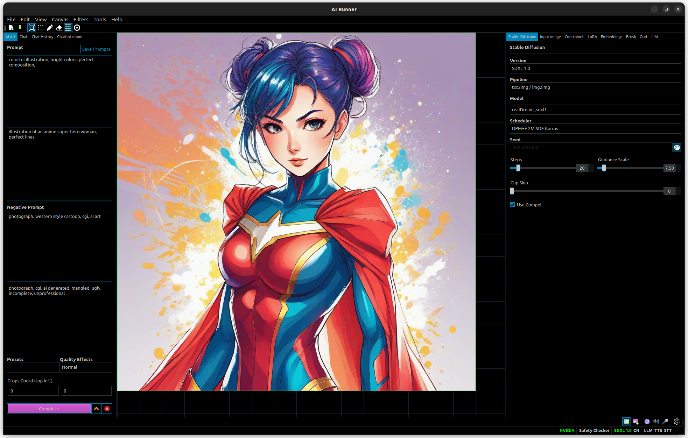

AI Runner allows you to run Stable Diffusion locally using your own hardware. It comes with drawing tools and an infinite canvas which lets you outpaint to any size you wish.

## [Download the official build on itch.io](https://capsizegames.itch.io/ai-runner)!

---

## Development

### Prerequisites

- Ubuntu 20.04+ or Windows 10+
- Python 3.10.6
- pip-23.0.1

#### Pypi installation

- `pip install airunner`
- `pip install git+https://github.com/w4ffl35/diffusers.git@ckpt_fix`
- `pip install git+https://github.com/w4ffl35/transformers.git@tensor_fix`

#### Development installation

Use this installation method if you intend to modify the source code of Chat AI.

- Ubuntu 20.04+ or Windows 10+
- Python 3.10.6
- pip-23.0.1

1. Fork this repo on github
2. `git clone https://github.com/Capsize-Games/airunner`
3. `cd airunner && pip install -r requirements.txt`
4. `cd sdrunner && python main.py`

---

## Usage

### Keyboard / Mouse controls

The following are some previous undocumented features

Misc
- `hold middle mouse + drag` - Pan the canvas

With the brush tool selected:
- `hold left or right mouse and drag` - Draw on the canvas

With the eraser tool selected:
- `hold left or right mouse and drag` - Erase on the canvas

With the active grid area tool selected:
- `hold ctrl or shift and scroll up or down` - Changes the width and height of the active grid area