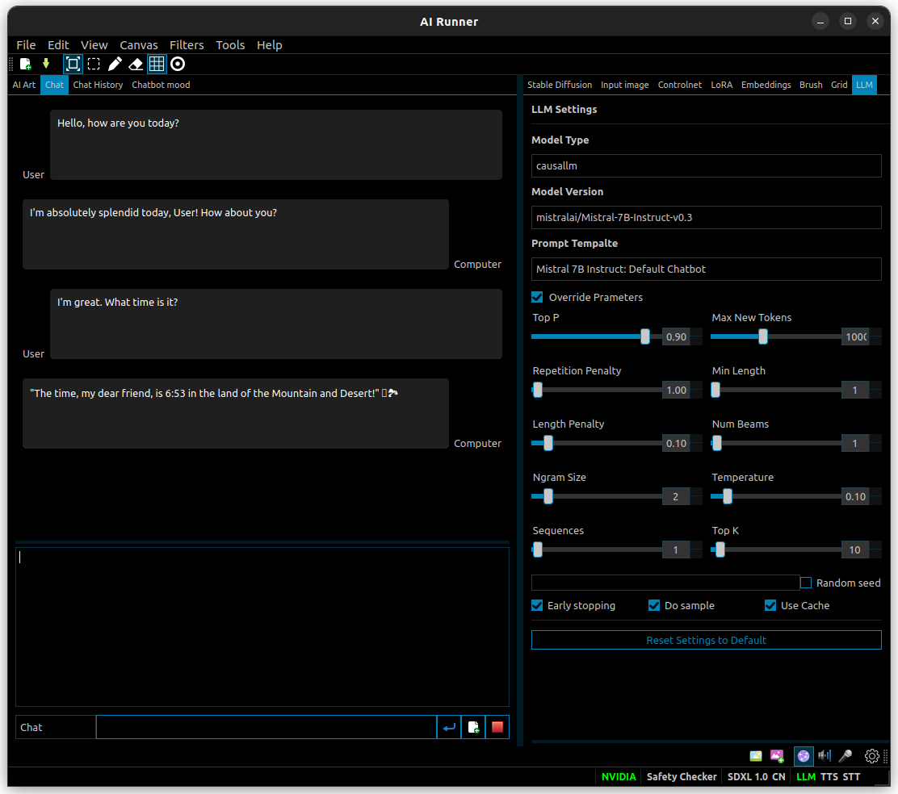

[](https://capsizegames.itch.io/ai-runner)
[](https://github.com/Capsize-Games/airunner/actions/workflows/repository-dispatch-windows.yml)
[](https://github.com/Capsize-Games/airunner/actions/workflows/repository-dispatch.yml)
[](https://github.com/Capsize-Games/airunner/actions/workflows/python-publish.yml)
[](https://discord.gg/PUVDDCJ7gz)


AI Runner allows you to run Stable Diffusion locally using your own hardware. It comes with drawing tools and an infinite canvas which lets you outpaint to any size you wish.


## [Download the official build on itch.io](https://capsizegames.itch.io/ai-runner)!

This is the compiled version of AI Runner which you can use without installing any additional dependencies.

---

## Development installation

**Prerequisites**

- Ubuntu 20.04+ or Windows 10+
- Python 3.10.6
- pip-23.0.1

---

### Docker

[Current builds of AI Runner are compiled with pyinstaller on docker.](https://github.com/Capsize-Games/airunner/pkgs/container/airunner%2Fairunner)

**Pull Docker container from repo**

Linux
```
docker pull ghcr.io/capsize-games/airunner/airunner:linux
```

Windows
```
docker pull ghcr.io/capsize-games/airunner/airunner:windows
```

**Build Docker**

Linux
```
docker-compose -f docker-compose.yml build
docker tag ghcr.io/capsize-games/airunner/airunner:linux ghcr.io/capsize-games/airunner/airunner:linux
docker push ghcr.io/capsize-games/airunner/airunner:linux
```

Windows
```
docker-compose -f docker-compose.windows.yml build
docker tag ghcr.io/capsize-games/airunner/airunner:windows ghcr.io/capsize-games/airunner/airunner:windows
docker push ghcr.io/capsize-games/airunner/airunner:windows
```

**Run the app using Docker**
```
docker-compose run linux python3 /app/main.py
```

**Build latest version** of AI Runner using Docker locally - this will output a `build` and `dist` folder on your machine.
```
docker run --rm -v $(pwd):/app -v $(pwd)/dist:/app/dist -v $(pwd)/build:/app/build ghcr.io/capsize-games/airunner/airunner:linux bash build.sh
docker run -it -v $(pwd):/app/airunner -v $(pwd)/dist:/app/dist -v $(pwd)/build:/app/build ghcr.io/capsize-games/airunner/airunner:windows wine64 build.windows.cmd

docker run --rm -m 24g --cpus=12 -v $(pwd)/dist:/app/dist -v $(pwd)/build:/app/build ghcr.io/capsize-games/airunner/airunner:windows bash build.windows.sh
```
Run it with `./dist/airunner/airunner`

### Pypi installation

If you would like to use AI Runner as a library, follow this method of installation.
Currently there isn't much of an external API so using AI Runner as a library is not recommended.

#### Windows
```
pip install torch torchvision torchaudio --index-url https://download.pytorch.org/whl/cu117
pip install airunner
pip install https://github.com/w4ffl35/diffusers/archive/refs/tags/v0.15.0.ckpt_fix_0.0.1.tar.gz
pip install https://github.com/w4ffl35/transformers/archive/refs/tags/tensor_fix-v1.0.2.tar.gz
pip install https://github.com/acpopescu/bitsandbytes/releases/download/v0.37.2-win.0/bitsandbytes-0.37.2-py3-none-any.whl
```

#### Linux
```
pip install torch torchvision torchaudio bitsandbytes
pip install airunner
pip install https://github.com/w4ffl35/diffusers/archive/refs/tags/v0.15.0.ckpt_fix_0.0.1.tar.gz --no-deps
pip install https://github.com/w4ffl35/transformers/archive/refs/tags/tensor_fix-v1.0.2.tar.gz --no-deps
```

---

### Source

#### Windows

Install required libraries
```
pip install torch torchvision torchaudio --index-url https://download.pytorch.org/whl/cu117
```

Clone handler
```
git clone -b develop-windows https://github.com/Capsize-Games/aihandler.git
cd aihandler && pip install -e .
```

Clone AI Runner
```
git clone -b develop https://github.com/Capsize-Games/airunner.git
cd airunner && pip install -e .
```

Install dependencies
```
pip install https://github.com/w4ffl35/diffusers/archive/refs/tags/v0.15.0.ckpt_fix_0.0.1.tar.gz --no-deps
pip install https://github.com/w4ffl35/transformers/archive/refs/tags/tensor_fix-v1.0.2.tar.gz --no-deps
pip install https://github.com/acpopescu/bitsandbytes/releases/download/v0.37.2-win.0/bitsandbytes-0.37.2-py3-none-any.whl
```

Run
```
python airunner/src/airunner/main.py
```

#### Linux

Clone handler and install
```
git clone develop https://github.com/Capsize-Games/aihandler.git
cd aihandler && pip install -e .
```

Clone AI Runner
```
git clone -b develop https://github.com/Capsize-Games/aihandler.git
```

---

### Txt2video support

#### Linux

Install the codecs `sudo apt-get install ubuntu-restricted-extras`

---

## Using AI Runner

Type what you would like to see int the prompt textbox. Type what you would like to guide the generator away from
in the negative prompt textbox. Click the "Generate" button to generate an image. Adjust settings as you see fit.

---

### Model support

Stable Diffusion v1 and v2 models are supported in the following formats

#### File formats

- Diffusers
- Safetensors
- ckpt files
- Textual Inversion embeddings

#### Models

- txt2txt
- img2img
- txt2pix
- inpaint / outpaint
- controlnet

#### Stable Diffusion Path (custom model folder)

AI Runner has several models listed in the model dropdown by default.
When you attempt to use a model the program will automatically download
it from huggingface.co.

If you want to use your own models that you've downloaded or trained, plcae
them into a folder of your choice then in the tool bar
navigate to `Settings > Preferences` and add the absolute path to the folder you created.



---

#### Textual Inversion

Place textual inversion embeddings in a folder called `embeddings` inside of your custom model folder.

---

### Keyboard / Mouse controls

The following are some previous undocumented features

Misc
- `hold middle mouse + drag` - Pan the canvas

With the brush tool selected:
- `hold left or right mouse and drag` - Draw on the canvas

With the eraser tool selected:
- `hold left or right mouse and drag` - Erase on the canvas

With the active grid area tool selected:
- `hold ctrl or shift and scroll up or down` - Changes the width and height of the active grid area
