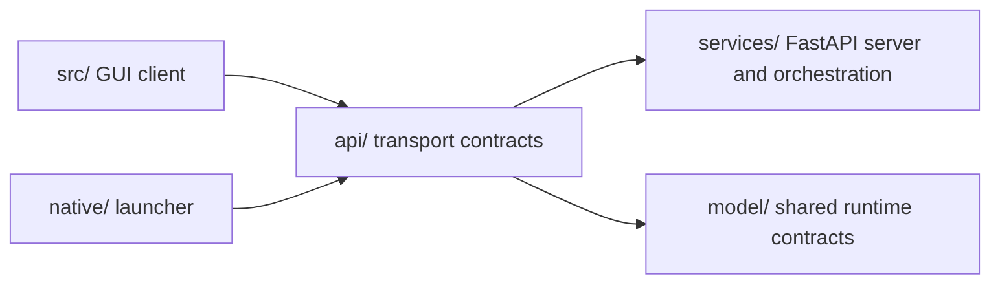

# API

The `api/` package is AIRunner's transport and wire-contract surface.
It defines the request or response envelopes, shared API models, server
bootstrap helpers, and the thin route or transport adapters that let the
daemon present a stable HTTP boundary.



## What This Package Owns

- transport-neutral envelopes in `airunner_api.messages`
- API bootstrap helpers such as `airunner_api.bootstrap`
- shared transport models and route wrappers under `airunner_api.transport`
- compatibility entry points used by the daemon and the split packages

## What It Does Not Own

- long-running daemon orchestration
- runtime lifecycle management
- inference backends such as `llama.cpp`, `whisper.cpp`, or OpenVoice
- GUI-facing clients and widget logic

Those concerns stay in [services/README.md](../services/README.md),
[model/README.md](../model/README.md),
[src/README.md](../src/README.md), and
[native/README.md](../native/README.md).

The current package map is documented in
[docs/architecture/layered_product_architecture.md](../docs/architecture/layered_product_architecture.md),
and the extraction status is tracked in
[docs/architecture/api_model_extraction_plan.md](../docs/architecture/api_model_extraction_plan.md).

## Installation

For a repo checkout, prefer the developer installer because it wires the
split packages together and builds the native sidecars used by the
functional tests:

```bash
./scripts/install.sh
```

For isolated API work, install the local `model/` dependency first and
then install `api/` in editable mode:

```bash
python -m venv venv
source venv/bin/activate
pip install --upgrade pip setuptools wheel
pip install -e ./model
pip install -e ./api[development]
```

## Test Running

The API package owns the main daemon-backed functional matrix for the
entire application. Start with the bootstrap smoke test:

```bash
./venv/bin/python -m pytest api/tests/test_service_bootstrap.py -v
```

Real end-to-end functional coverage lives in `api/tests/` and exercises
the composed daemon, runtimes, and GUI-client boundary:

```bash
./venv/bin/python -m pytest api/tests/test_tts_runtime_load.py -v
./venv/bin/python -m pytest api/tests/test_tts_synthesize_functional.py -v --timeout=120
./venv/bin/python -m pytest api/tests/test_llm_functional.py -v --timeout=900
./venv/bin/python -m pytest api/tests/test_llm_tts_functional.py -v --timeout=1200
./venv/bin/python -m pytest api/tests/test_stt_transcribe_functional.py -v --timeout=1200
./venv/bin/python -m pytest api/tests/test_gui_llm_tts_functional.py -v --timeout=1200
./venv/bin/python -m pytest api/tests/test_gui_stt_llm_tts_functional.py -v --timeout=1200
```

These tests use real local assets when present and skip cleanly when a
required model, sidecar, or reference asset is missing.