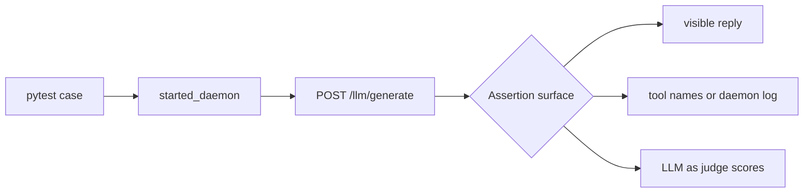

# Agent Eval Tests

The suites under `api/tests/eval/` are service-owned, daemon-backed
functional evals for the LLM agent path. They do not launch the GUI.
Each case starts a temporary `airunner_services.daemon`, sends one
request to `/llm/generate`, and asserts a stable workflow signal.



## Running The Suite

Prerequisites:

- Activate the project virtual environment.
- Ensure the target model artifacts already exist locally.
- Expect clean skips when a required model artifact is missing.

Recommended commands:

```bash
# Run the full agent-eval directory.
AIRUNNER_TEST_NO_GUI_LAUNCH=1 \
./venv/bin/python -m pytest api/tests/eval --tb=short -ra

# Run only eval-marked cases from the agent-eval directory.
AIRUNNER_TEST_NO_GUI_LAUNCH=1 \
./venv/bin/python -m pytest api/tests/eval -m eval --tb=short -ra

# Run one suite.
AIRUNNER_TEST_NO_GUI_LAUNCH=1 \
./venv/bin/python -m pytest api/tests/eval/test_agent_tool_eval.py \
  --tb=short -ra

# Run the current GPT-OSS flow slice only.
AIRUNNER_TEST_NO_GUI_LAUNCH=1 \
./venv/bin/python -m pytest api/tests/eval/test_agent_flow_eval.py \
  -k gpt-oss-20b --tb=short -ra
```

## Coverage Matrix

| Suite | Current model coverage | What it proves |
| --- | --- | --- |
| `test_agent_flow_eval.py` | `qwen3.5-9b`, `gpt-oss-20b` for simple chat; `qwen3.5-9b` for forced math | Baseline chat path and one forced argument-bearing tool path |
| `test_agent_mood_eval.py` | `qwen3.5-9b` | Mood updates from a persisted follow-up turn |
| `test_agent_response_eval.py` | `qwen3.5-9b` | Final response quality against short references using the service-owned judge helpers |
| `test_agent_tool_eval.py` | `qwen3.5-9b` | Deterministic individual tool usage for `clear_chat_history` and `get_current_datetime` |
| `test_agent_document_eval.py` | `qwen3.5-9b` | Attached-document loading plus `rag_search` retrieval routed back into the workflow |

Current gap: GPT-OSS only has the simple no-tool flow case today. The
other eval files still need parity work before GPT-OSS can be treated as
covered at the same level as Qwen.
The existing GPT-OSS simple-chat slice currently passes inside the shared
flow file.

## What The Tests Do

Shared harness files:

- `api/tests/llm_functional_support.py` starts a real headless daemon on
  an ephemeral port, waits for `/health`, and tears it down after the
  case finishes.
- `api/tests/eval/agent_eval_support.py` builds stable request payloads,
  posts them to `/llm/generate`, strips hidden thinking from the visible
  reply, and provides helper assertions.

Per-case flow:

1. `started_daemon()` boots a real service daemon with deterministic test
   env overrides.
2. `build_agent_request()` constructs a stable request. For Qwen, it
   also prepends `/no_think` for short deterministic prompts.
3. `run_agent_eval_case()` posts the request to `/llm/generate`.
4. Assertions check one or more of these surfaces:
   - assistant-visible reply text,
   - tool names returned in the payload or daemon log,
   - daemon log side effects such as mood updates or retrieved document
     evidence,
   - LLM-as-judge scores for short judged response cases.

## Tool Surfaces Covered Today

- `python_compute` covers a forced, argument-bearing tool path followed
  by digits-only synthesis.
- `clear_chat_history` and `get_current_datetime` cover deterministic
  individual tool execution.
- `rag_search` covers attached-document retrieval via request-scoped
  `rag_files`.
- Mood behavior is verified through the service log path because the
  authoritative update happens inside services, not the GUI.

The evals intentionally prefer deterministic surfaces. No-argument or
return-direct tools are currently more stable than wider free-form tool
use. That is why the individual tool file stays narrow while the flow
suites cover broader orchestration behavior.

## Qwen Notes

Observed constraints from the current Qwen eval bring-up:

- `qwen3.5-9b` runs these evals with `AIRUNNER_GGUF_N_CTX=4096` and
  `AIRUNNER_GGUF_N_GPU_LAYERS=10` in the shared harness.
- Exact stylistic assertions are brittle. Qwen can split visible words
  such as `Cheerful`, so punctuation or judged-quality checks are more
  stable than style-word matching.
- Forced tool cases are most reliable on deterministic tool surfaces.
- Attached-document retrieval through `rag_search` is stable, but the
  visible post-tool final answer is still less deterministic than the
  retrieved tool result. The document evals therefore assert on the
  service-owned retrieval signal in the daemon log rather than exact
  final wording.

Observed local timings from validated slices on May 25, 2026:

| Slice | Result |
| --- | --- |
| `test_agent_tool_eval.py` | `2 passed in 53.67s` |
| `test_agent_document_eval.py` | `2 passed in 87.29s` |
| `test_agent_flow_eval.py` | `3 passed in 178.10s` |
| `test_agent_flow_eval.py -k forced_math_tool_flow` | `1 passed in 52.25s` |
| `test_agent_response_eval.py -k personality-prompt` | `1 passed, 1 deselected in 177.16s` |

Treat those numbers as current local observations, not as a fixed
benchmark contract.