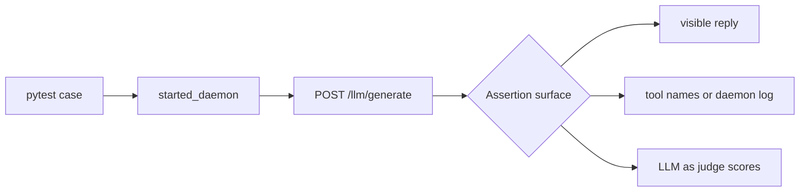

# Agent Eval Tests

The suites under `services/tests/eval/` are service-owned, daemon-backed
functional evals for the LLM agent path. They do not launch the GUI.
Each case starts a temporary `airunner_services.daemon`, sends one
request to `/llm/generate`, and asserts a stable workflow signal.



## Running The Suite

Prerequisites:

- Activate the project virtual environment.
- Ensure the target model artifacts already exist locally.
- Expect clean skips when a required model artifact is missing.

Recommended commands:

```bash
# Run the full agent-eval directory.
AIRUNNER_TEST_NO_GUI_LAUNCH=1 \
./venv/bin/python -m pytest services/tests/eval --tb=short -ra

# Run only eval-marked cases from the agent-eval directory.
AIRUNNER_TEST_NO_GUI_LAUNCH=1 \
./venv/bin/python -m pytest services/tests/eval -m eval --tb=short -ra

# Run one suite.
AIRUNNER_TEST_NO_GUI_LAUNCH=1 \
./venv/bin/python -m pytest services/tests/eval/test_agent_tool_eval.py \
  --tb=short -ra

# Run non-forced tool-selection coverage.
AIRUNNER_TEST_NO_GUI_LAUNCH=1 \
./venv/bin/python -m pytest \
  services/tests/eval/test_agent_tool_selection_eval.py \
  --tb=short -ra

# Run the full attached-document eval suite.
AIRUNNER_TEST_NO_GUI_LAUNCH=1 \
./venv/bin/python -m pytest services/tests/eval/test_agent_document_eval.py \
  --tb=short -ra

# Run the legacy markdown document-retrieval slice.
AIRUNNER_TEST_NO_GUI_LAUNCH=1 \
./venv/bin/python -m pytest services/tests/eval/test_agent_document_eval.py \
  -k 'codename or numeric' --tb=short -ra

# Run the tri-format Time Machine document-retrieval slice.
AIRUNNER_TEST_NO_GUI_LAUNCH=1 \
./venv/bin/python -m pytest services/tests/eval/test_agent_document_eval.py \
  -k time_machine_results --tb=short -ra

# Run only GPT-OSS-tagged cases across the eval directory.
AIRUNNER_TEST_NO_GUI_LAUNCH=1 \
./venv/bin/python -m pytest services/tests/eval \
  -k gpt-oss-20b --tb=short -ra

# Run judged response evals with Groq as the external judge.
# NOTE: GROQ_API_KEY must be exported for Python/pytest to see it.
source ~/.bashrc
export GROQ_API_KEY="$GROQ_API_KEY"
AIRUNNER_TEST_JUDGE_SERVICE=groq \
AIRUNNER_TEST_JUDGE_MODEL=llama-3.3-70b-versatile \
AIRUNNER_TEST_NO_GUI_LAUNCH=1 \
./venv/bin/python -m pytest \
  services/tests/eval/test_agent_response_eval.py \
  -k 'plain-chat' --tb=short -ra
```

## Coverage Matrix

| Suite | Current model coverage | What it proves |
| --- | --- | --- |
| `test_agent_flow_eval.py` | `qwen3.5-9b`, `gpt-oss-20b` | Baseline chat path plus one forced argument-bearing tool path |
| `test_agent_mood_eval.py` | `qwen3.5-9b`, `gpt-oss-20b` | Mood updates from a persisted follow-up turn |
| `test_agent_response_eval.py` | `qwen3.5-9b`, `gpt-oss-20b` | Final response quality against short references using the service-owned judge helpers |
| `test_agent_tool_eval.py` | `qwen3.5-9b`, `gpt-oss-20b` | Deterministic forced tool coverage for conversation/system/math/qa/file/search surfaces |
| `test_agent_tool_selection_eval.py` | `qwen3.5-9b`, `gpt-oss-20b` | Non-forced routing quality for datetime, math, and search category selection |
| `test_agent_document_eval.py` | `qwen3.5-9b`, `gpt-oss-20b` | Attached-document loading plus `rag_search` retrieval routed back into the workflow for the legacy markdown fixture and the vendored Time Machine EPUB/MOBI/PDF matrix |

Current parity note: the five service-owned eval files now cover both
`qwen3.5-9b` and `gpt-oss-20b`. The response-heavy GPT-OSS slices are
still materially slower than the deterministic tool slices, but the
coverage surface is now aligned.

## What The Tests Do

Shared harness files:

- `services/tests/llm_functional_support.py` starts a real headless daemon on
  an ephemeral port, waits for `/health`, and tears it down after the
  case finishes.
- `services/tests/eval/agent_eval_support.py` builds stable request payloads,
  posts them to `/llm/generate`, strips hidden thinking from the visible
  reply, and provides helper assertions.

Per-case flow:

1. `started_daemon()` boots a real service daemon with deterministic test
   env overrides.
2. `build_agent_request()` constructs a stable request. For Qwen, it
   also prepends `/no_think` for short deterministic prompts.
3. `run_agent_eval_case()` posts the request to `/llm/generate`.
4. Assertions check one or more of these surfaces:
   - assistant-visible reply text,
   - tool names returned in the payload or daemon log,
   - daemon log side effects such as mood updates or retrieved document
     evidence,
   - LLM-as-judge scores for short judged response cases.

## Tool Surfaces Covered Today

- `python_compute`, `sympy_compute`, and `numpy_compute` cover forced
  deterministic math execution.
- `clear_chat_history` and `get_current_datetime` cover deterministic
  conversation/system execution.
- `identify_answer_type` and `list_directory` cover non-search QA/file
  tool execution.
- `scrape_website` covers deterministic website extraction invocation.
- `test_agent_tool_selection_eval.py` validates non-forced selection
  behavior for datetime, math, and search intents using payload, log,
  and message fallback parsing.
- `rag_search` covers attached-document retrieval via request-scoped
  `rag_files`, including the vendored `The Time Machine` `.epub`,
  `.mobi`, and `.pdf` fixtures.
- Mood behavior is verified through the service log path because the
  authoritative update happens inside services, not the GUI.

The evals intentionally prefer deterministic surfaces. No-argument or
return-direct tools are currently more stable than wider free-form tool
use. That is why the individual tool file stays narrow while the flow
suites cover broader orchestration behavior.

For local GGUF models, some non-forced selection cases may complete tool
selection but still return `504 Gateway Timeout` on the final synthesis
turn. Selection assertions therefore rely on observed tool calls in the
payload and daemon log, with message-text fallback parsing for model
formats that emit pseudo-calls.

Groq judged eval note: in this shell setup, `GROQ_API_KEY` can exist as
a non-exported shell variable after `.bashrc` sourcing. Always export it
before running Python/pytest or the judge provider will fail to resolve
the key.

## Strict Tool Inventory Matrix

Legend:

- `Forced`: Covered in `test_agent_tool_eval.py`
- `Selection`: Covered in `test_agent_tool_selection_eval.py`
- `Doc/RAG`: Covered in `test_agent_document_eval.py`
- `Recommendation`: `keep`, `review`, or `remove-candidate`

| Tool | Category | Forced | Selection | Doc/RAG | Recommendation |
| --- | --- | --- | --- | --- | --- |
| `clear_chat_history` | `conversation` | yes | no | no | keep |
| `get_current_datetime` | `system` | yes | yes | no | keep |
| `python_compute` | `math` | yes | yes | no | keep |
| `sympy_compute` | `math` | yes | yes | no | keep |
| `numpy_compute` | `math` | yes | yes | no | keep |
| `identify_answer_type` | `qa` | yes | no | no | keep |
| `list_directory` | `file` | yes | no | no | keep |
| `scrape_website` | `search` | yes | no | no | keep |
| `search_web` | `search` | no | yes | no | keep |
| `search_news` | `search` | no | yes | no | keep |
| `rag_search` | `rag` | no | no | yes | keep |
| `search_knowledge_base_documents` | `search` | no | no | no | review |
| `save_to_knowledge_base` | `rag` | no | no | no | review |
| `record_knowledge` | `knowledge` | no | no | no | review |
| `recall_knowledge` | `knowledge` | no | no | no | review |
| `read_knowledge_file` | `knowledge` | no | no | no | review |
| `update_knowledge` | `knowledge` | no | no | no | review |
| `delete_knowledge` | `knowledge` | no | no | no | review |
| `list_knowledge_files` | `knowledge` | no | no | no | review |
| `store_user_data` | `knowledge` | no | no | no | review |
| `get_user_data` | `knowledge` | no | no | no | review |
| `verify_answer` | `qa` | no | no | no | review |
| `score_answer_confidence` | `qa` | no | no | no | review |
| `extract_answer_from_context` | `qa` | no | no | no | review |
| `generate_clarifying_questions` | `qa` | no | no | no | review |
| `rank_answer_candidates` | `qa` | no | no | no | review |
| `get_conversation_summary` | `conversation` | no | no | no | review |
| `load_conversation` | `conversation` | no | no | no | review |
| `quit_application` | `system` | no | no | no | review |
| `toggle_tts` | `system` | no | no | no | review |
| `read_file` | `file` | no | no | no | review |
| `write_file` | `file` | no | no | no | review |
| `search_tools` | `system` | no | no | no | review |
| `list_available_tools` | `system` | no | no | no | remove-candidate |
| `polya_reasoning` | `analysis` | no | no | no | review |
| `chain_of_thought` | `analysis` | no | no | no | remove-candidate |
| `categorize` | `analysis` | no | no | no | review |
| `generate_direct_response` | `generation` | no | no | no | review |
| `generate_description` | `generation` | no | no | no | review |
| `update_mood` | `mood` | no | no | no | review |
| `generate_image` | `image` | no | no | no | review |
| `set_image_dimensions` | `image` | no | no | no | review |
| `clear_canvas` | `image` | no | no | no | review |
| `open_image` | `image` | no | no | no | review |
| `get_image_model_info` | `image` | no | no | no | review |
| `validate_url` | `research` | no | no | no | review |
| `validate_content` | `research` | no | no | no | review |
| `extract_age_from_text` | `research` | no | no | no | review |
| `get_current_date_context` | `research` | no | no | no | review |
| `check_temporal_accuracy` | `research` | no | no | no | review |
| `validate_research_subject` | `research` | no | no | no | review |
| `search_document_chunks` | `research` | no | no | no | review |
| `update_research_summary` | `research` | no | no | no | review |
| `get_research_summary` | `research` | no | no | no | review |
| `intelligent_crawl` | `research` | no | no | no | review |
| `improve_writing` | `author` | no | no | no | review |
| `check_grammar` | `author` | no | no | no | review |
| `find_synonyms` | `author` | no | no | no | review |
| `analyze_writing_style` | `author` | no | no | no | review |
| `create_long_running_project` | `project` | no | no | no | review |
| `initialize_project_features` | `project` | no | no | no | review |
| `get_project_status` | `project` | no | no | no | review |
| `list_project_features` | `project` | no | no | no | review |
| `get_project_progress_log` | `project` | no | no | no | review |
| `list_long_running_projects` | `project` | no | no | no | review |
| `add_project_feature` | `project` | no | no | no | review |
| `update_feature_status` | `project` | no | no | no | review |
| `log_project_progress` | `project` | no | no | no | review |
| `get_next_feature_to_work_on` | `project` | no | no | no | review |

The document eval file intentionally validates the service-owned
retrieval path more than open-ended document QA. The Time Machine slice
forces `rag_search`, uses an exact-term `Morlocks` prompt across the
three file formats, and asserts on daemon-log retrieval signals rather
than brittle post-tool wording.

The legacy markdown slice uses the same deterministic shape. It forces
`rag_search`, asks for the exact phrase `Project Alpha` or the exact
term `73142`, keeps the request-scoped answer budget short, and asserts
status code, executed tool names, and daemon-log retrieval anchors
instead of exact post-tool wording.

## GPT-OSS Notes

Observed constraints from the current GPT-OSS eval bring-up:

- `gpt-oss-20b` runs these evals with `AIRUNNER_GGUF_N_CTX=4096` and
  `AIRUNNER_GGUF_N_GPU_LAYERS=0` in the shared harness.
- `test_agent_document_eval.py` also hides CUDA for GPT-OSS document
  runs with `CUDA_VISIBLE_DEVICES=''`; leaving CUDA visible can fail
  GGUF `llama_context` creation on this machine before the forced
  `rag_search` workflow initializes.
- Forced GPT-OSS tool cases use the raw Harmony prompting path with a
  prefilled tool envelope. The current service parser now handles both a
  single bare JSON argument object and duplicated adjacent JSON objects,
  which showed up on `clear_chat_history` during parity bring-up.
- Deterministic tool, mood, response, and attached-document slices now
  pass through the same daemon-backed files as Qwen.

## Qwen Notes

Observed constraints from the current Qwen eval bring-up:

- `qwen3.5-9b` runs these evals with `AIRUNNER_GGUF_N_CTX=4096` and
  `AIRUNNER_GGUF_N_GPU_LAYERS=10` in the shared harness.
- `test_agent_document_eval.py` hides CUDA for all document runs with
  `CUDA_VISIBLE_DEVICES=''`. Qwen document runs also override
  `AIRUNNER_GGUF_N_GPU_LAYERS=0` and
  `AIRUNNER_LOCAL_FALLBACK_TIMEOUT_SECONDS=900` because the document/RAG
  slice can otherwise fail GGUF `llama_context` creation or time out
  before the bounded post-tool answer completes on this machine.
- Exact stylistic assertions are brittle. Qwen can split visible words
  such as `Cheerful`, so punctuation or judged-quality checks are more
  stable than style-word matching.
- Forced tool cases are most reliable on deterministic tool surfaces.
- Attached-document retrieval through `rag_search` is stable, but the
  visible post-tool final answer is still less deterministic than the
  retrieved tool result. The document evals therefore assert on the
  service-owned retrieval signal in the daemon log rather than exact
  final wording.
- The document eval request budget is kept short (`max_new_tokens=64`)
  so Qwen has enough room to emit the forced `rag_search` call while the
  follow-up answer turn stays bounded.
- After a forced document retrieval succeeds, services now unbind tools
  for the follow-up answer turn so Qwen answers from the retrieved tool
  result instead of recursively re-invoking `rag_search`.

Recent local timings from validated slices:

| Slice | Result |
| --- | --- |
| `test_agent_document_eval.py (full file)` | `10 passed in 2180.13s (0:36:20)` |
| `test_agent_tool_eval.py (Qwen + GPT-OSS)` | `4 passed in 170.49s` |
| `test_agent_tool_eval.py (Qwen-only)` | `2 passed in 53.67s` |
| `test_agent_document_eval.py -k 'codename or numeric'` | `4 passed, 6 deselected in 451.11s` |
| `test_agent_document_eval.py -k time_machine_results` | `6 passed, 4 deselected in 455.94s` |
| `test_agent_flow_eval.py (shared flow slice)` | `3 passed in 178.10s` |
| `test_agent_flow_eval.py -k forced_math_tool_flow (Qwen-only)` | `1 passed in 52.25s` |
| `test_agent_response_eval.py -k personality-prompt (Qwen-only)` | `1 passed, 1 deselected in 177.16s` |

Treat those numbers as current local observations, not as a fixed
benchmark contract.