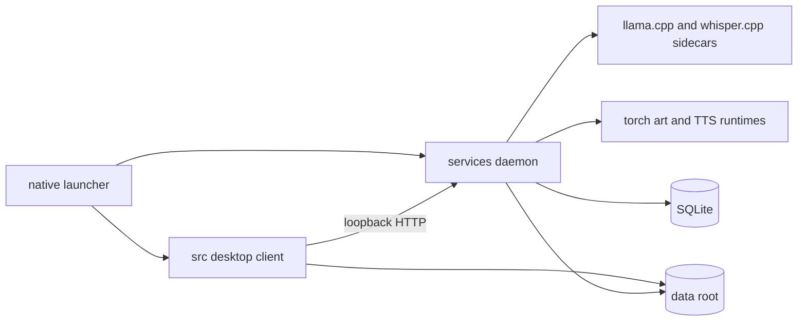

# AIRunner Architecture Complexity Audit

Date: 2026-08-16
Scope: whole-repository architecture assessment focused on structural
complexity, duplication, coupling, and drift — plus strengths and weaknesses.

---

## 1. Executive Summary

AIRunner's **core runtime architecture is sound and worth keeping**. A PySide6
desktop client ([`src/`](src/airunner)) talks to a locally owned FastAPI
daemon ([`services/`](services/src/airunner_services)) over loopback HTTP,
and the daemon owns model loading, runtime supervision, downloads, and
persistence. That boundary is what enables headless, remote, and
multi-machine operation, and it is the single most valuable architectural
decision in the codebase.

The complexity problem is **not the top-level topology** — it is a set of
**organizational and layering choices that have accumulated faster than they
have been retired**:

1. **Widespread duplication with active drift** across `src/` and `services/`
   (settings, contract enums, daemon client, model management).
2. A **stringly-typed, global signal bus** (`SignalMediator` + `SignalCode`)
   threaded through nearly every layer.
3. **Deep mixin inheritance** (a `MainWindow`/`SettingsMixin` hierarchy that
   spreads behavior across a dozen files).
4. **An incomplete migration** — the hybrid-runtime plan is marked done, but a
   large `legacy_*` surface (including a second HTTP server) still ships.
5. A **generic CRUD-over-HTTP persistence engine** plus multiple settings
   stores (env-var constants, SQLite, and QSettings) that add indirection
   without a clear single source of truth.

None of this requires a rewrite. Each item is addressable with small,
incremental consolidation, and the repo already ships the measurement tooling
(`radon`/`xenon` scripts, dead-code scanners, vulture whitelists) to drive it.

---

## 2. Methodology

This audit is based on static inspection of the repository layout and
representative high-coupling files, plus the existing internal reviews in
[`docs/architecture/architecture-review.md`](docs/architecture/architecture-review.md),
[`docs/architecture/gui-independent-service-audit.md`](docs/architecture/gui-independent-service-audit.md),
and [`HYBRID_RUNTIME_MIGRATION.md`](HYBRID_RUNTIME_MIGRATION.md). Line-of-code
figures are approximate and taken from the prior review rather than
re-measured; file sizes cited below were read directly from the files.

The complexity report generators at
[`scripts/gui_complexity_report.py`](scripts/gui_complexity_report.py) and
[`scripts/services_complexity_report.py`](scripts/services_complexity_report.py)
were reviewed to confirm the project already defines its own complexity
targets (files <= 250 SLOC, classes <= 250 lines, functions <= 20 lines,
Radon rank <= B, maintainability index >= 65).

---

## 3. As-Is Architecture

### 3.1 Package responsibilities

| Package | Contents | Approx. LOC | Role |
|---|---|---|---|
| `src/` (`airunner`) | PySide6 GUI, widgets, dialogs, daemon client | ~205k | Desktop client |
| `services/` (`airunner_services`) | FastAPI daemon, runtimes, downloads, model mgmt | ~140k | Headless daemon + API |
| `native/` (`airunner_native`) | Launcher entry, layout/path helpers, startup env | ~1k | Launcher + runtime helpers |
| `scripts/` | Dev/install/build/test tooling | ~3.7k | Repo tooling |

### 3.2 Runtime topology

The GUI and the daemon are separate processes. The GUI boots a daemon client
([`GuiDaemonClient`](src/airunner/daemon_client/gui_daemon_client.py)) and
routes model work through the daemon's runtime registry and sidecar clients
(`llama.cpp`, `whisper.cpp`) or supervised Python runtimes (torch-based art
and TTS).

---

## 4. Complexity Measurements

| Signal | Evidence | Assessment |
|---|---|---|
| Monolithic window | [`main_window.py`](src/airunner/components/application/gui/windows/main/main_window.py:162) is **3,244 lines** | High — violates the repo's own 250-line class target by >12x |
| God-class `App` | [`app.py`](src/airunner/app.py:63) composes 5 bases (`LocalizationMixin`, `UIRuntimeMixin`, `MediatorMixin`, `SettingsMixin`, `QObject`) | Medium — acceptable, but the mixins hide real breadth |
| Mixin sprawl | [`settings_mixin.py`](src/airunner/components/application/gui/windows/main/settings_mixin.py:32) inherits 7+ `*Mixin` classes; `model_management/` and `daemon_client/` are also mixin-partitioned | High — behavior spread across many files with implicit shared state |
| Signal bus | [`contract_enums.py`](src/airunner/contract_enums.py:8) `SignalCode` defines ~70+ string codes; [`signal_mediator.py`](src/airunner/utils/application/signal_mediator.py:183) is a process-wide singleton | High — stringly-typed pub/sub couples GUI and service layers |
| Duplicated settings | [`src/airunner/settings.py`](src/airunner/settings.py:1) (432 lines) vs [`services/.../settings.py`](services/src/airunner_services/settings.py:1) (490 lines) | High — two copies already drifting |
| Duplicated contracts | [`src/airunner/contract_enums.py`](src/airunner/contract_enums.py:1) (329 lines) vs [`services/.../contract_enums.py`](services/src/airunner_services/contract_enums.py:1) (434 lines) | High — two copies already drifting |
| Legacy API surface | ~20 `legacy_*` modules under [`services/src/airunner_services/api`](services/src/airunner_services/api) plus [`legacy_server.py`](services/src/airunner_services/api/legacy_server.py:159) | High — parallel API surface kept alive after migration |

---

## 5. Where the Architecture Is Over-Engineered

### O1 — Duplicated modules with observed drift (highest risk)

Several foundational modules exist in **both** `src/` and `services/` and have
already diverged:

- `settings.py` — default STT path differs:
  [`src`](src/airunner/settings.py:53) uses
  `Systran/faster-distil-whisper-large-v3`, while
  [`services`](services/src/airunner_services/settings.py:40) uses
  `ggerganov/whisper.cpp`.
- `contract_enums.py` — the `SignalCode` enum has diverged: the
  [`services`](services/src/airunner_services/contract_enums.py:40) copy adds
  members such as `LLM_TEXT_GENERATE_REQUEST_SIGNAL` and
  `LLM_TEXT_STREAMED_SIGNAL` that are absent from the `src` copy.
- `daemon_client/` — the HTTP client contract is implemented twice
  ([`src/airunner/daemon_client/`](src/airunner/daemon_client) and
  [`services/.../daemon_client/`](services/src/airunner_services/daemon_client)),
  so the two processes that must agree on the wire format are maintained in
  two places.
- `model_management/`, `runtimes/`, `startup_env`, `dev_build_token`,
  `linux_bundle_layout` — same pattern.

This is the clearest "over-engineered" finding: two copies of the truth
guarantee drift, and the drift is already observable.

### O2 — A global, stringly-typed signal bus threaded through everything

`SignalCode` is a large enum of string literals, and
[`SignalMediator`](src/airunner/utils/application/signal_mediator.py:183) is a
process-wide singleton. Components emit and listen by string across GUI,
worker, and API service layers. This works, but it:

- erases type safety at the most important seams;
- makes control flow implicit and hard to trace;
- couples otherwise independent layers to a shared, mutable singleton.

The same signal codes are duplicated in `contract_enums.py` in both packages,
compounding O1.

### O3 — Deep mixin inheritance for settings/window behavior

Behavior for the main window is decomposed across ~12 mixin files
(`SettingsPropertyMixin`, `SettingsListPropertyMixin`, `SettingsCacheMixin`,
`SettingsLoaderMixin`, `BasicSettingsUpdateMixin`, `ModelManagementMixin`,
and others). This looks like decomposition, but the mixins share state through
the host object and are not independently reusable, which turns inheritance
into an implicit bag of methods. The `model_management` and `daemon_client`
packages repeat the pattern.

### O4 — An incomplete migration with a parallel legacy surface

[`HYBRID_RUNTIME_MIGRATION.md`](HYBRID_RUNTIME_MIGRATION.md) marks all phases
complete, yet the codebase still carries:

- [`legacy_server.py`](services/src/airunner_services/api/legacy_server.py:159),
  a `BaseHTTPRequestHandler`-based server that coexists with the FastAPI
  [`server.py`](services/src/airunner_services/api/server.py:333);
- ~20 `legacy_*` route/handler modules for LLM, art, Ollama, OpenAI, and admin
  endpoints.

Keeping the new and old API surfaces side by side is the main reason the
`services/api` tree is so large.

### O5 — Multiple settings stores and a generic persistence engine

There are at least three places state lives:

- module-level environment-derived constants in `settings.py`;
- SQLite/SQLAlchemy records exposed through `resource_store` and a generic
  CRUD-over-HTTP layer
  ([`persistence.py`](services/src/airunner_services/api/routes/persistence.py),
  [`domain_resource_store.py`](services/src/airunner_services/api/routes/domain_resource_store.py),
  [`persistence_registry.py`](services/src/airunner_services/api/routes/persistence_registry.py));
- QSettings for GUI-local state.

The generic persistence engine is flexible but heavy for what is ultimately a
small set of known domain models; it adds indirection without a clear
single-source-of-truth story.

### O6 — Documentation that describes a different repository

The README and [`layered_product_architecture.md`](docs/architecture/layered_product_architecture.md)
reference `api/` and `model/` packages that do not exist in the current tree,
and describe a bundle/installer distribution model that has since been
stripped. The real layout is `src/`, `services/`, `native/`, `scripts/`.

---

## 6. Strengths

1. **Correct process boundary.** GUI ⇄ daemon over loopback HTTP is the right
   shape; it isolates GUI crashes from model loading and enables headless and
   remote deployment. This should not be collapsed.
2. **Runtime isolation.** The runtime registry and sidecar clients
   (`llama.cpp`, `whisper.cpp`) plus supervised Python runtimes for art/TTS
   keep heavyweight inference and GPU memory ownership out of the GUI and out
   of the main API process.
3. **Centralized model lifecycle.** The daemon owns model load/unload,
   memory management, and worker orchestration — the correct ownership for
   GPU memory and for concurrency.
4. **Strong documentation of intent.** The migration guide, package-split
   contract, and layered architecture notes record boundaries and gates, even
   where the docs have drifted from the code.
5. **Measurement tooling already exists.** The repo ships Radon/Xenon
   complexity reporters, dead-code scanners, and vulture whitelists — so the
   team already has the instruments to act on this audit.
6. **Meaningful test surface.** Unit, runtime-smoke, functional, offscreen
   GUI, and eval suites exist, including real daemon-backed end-to-end paths.

---

## 7. Weaknesses

1. **Duplication with drift** (O1) is the dominant risk and the fastest way
   for behavior to silently diverge between the GUI and daemon.
2. **Stringly-typed signal bus** (O2) makes the most important cross-cutting
   seams implicit and untraceable.
3. **Mixin depth** (O3) hides coupling rather than removing it.
4. **Unretired legacy surface** (O4) means two HTTP servers and two API
   generations are maintained simultaneously.
5. **Overlapping settings stores** (O5) create ambiguity about which value
   wins.
6. **Monolithic files** — a 3,244-line `MainWindow` and large `settings.py`
   files violate the project's own stated complexity targets.
7. **No single source of truth** for shared contracts, settings, and layout
   defaults across `src/`, `services/`, and `native/`.
8. **Documentation drift** (O6) means new contributors cannot trust the
   stated package map.

---

## 8. Risk Hotspots

| Hotspot | Why it matters |
|---|---|
| [`settings.py`](src/airunner/settings.py:1) + [`settings.py`](services/src/airunner_services/settings.py:1) | Divergent defaults can change runtime behavior silently |
| [`contract_enums.py`](src/airunner/contract_enums.py:1) + [`contract_enums.py`](services/src/airunner_services/contract_enums.py:1) | Divergent signal codes break cross-layer wiring |
| [`main_window.py`](src/airunner/components/application/gui/windows/main/main_window.py:162) | Largest file; high change-collision risk |
| [`signal_mediator.py`](src/airunner/utils/application/signal_mediator.py:183) | Global mutable state reached by many layers |
| [`legacy_server.py`](services/src/airunner_services/api/legacy_server.py:159) | Second HTTP server with an independent request path |
| `daemon_client/` in both packages | Wire contract duplicated across process boundary |

---

## 9. Recommendations (prioritized, no time estimates)

1. **Establish a single shared package** (e.g. `airunner_common`) for
   `settings`, `startup_env`, `dev_build_token`, `linux_bundle_layout`, and
   the transport contracts. Have `src/`, `services/`, and `native/` import
   from it and delete the per-package copies. This directly attacks O1/O6 and
   the highest-risk drift.

2. **Make one daemon client canonical.** Move the
   [`services` daemon client](services/src/airunner_services/daemon_client)
   to the shared package, and reduce the
   [`src` copy](src/airunner/daemon_client) to thin re-exports or delete it.

3. **Sunset the legacy API surface.** Freeze the `legacy_*` handlers and
   [`legacy_server.py`](services/src/airunner_services/api/legacy_server.py:159),
   confirm the versioned FastAPI routes cover the compatibility clients, then
   delete in reviewable slices. This is the single largest reduction in
   `services/` surface area.

4. **Narrow the signal bus.** Replace string-code emission at the hottest
   seams with typed calls or direct method dispatch, and keep `SignalCode`
   only where genuine decoupled publish/subscribe is required. Convert the
   duplicate `contract_enums.py` into one source.

5. **Flatten the mixin hierarchy.** Collapse the `Settings*Mixin` chain into
   cohesive, explicit classes rather than inherited bags of shared state;
   do the same for `model_management` and `daemon_client` mixins.

6. **Split `main_window.py`.** Decompose the 3,244-line class into
   per-concern controllers/views that meet the repo's own <= 250-line class
   target.

7. **Resolve the settings-store ambiguity.** Decide the canonical store per
   concern (service-owned DB vs client-local QSettings vs env constants) and
   document it; the prior
   [storage audit](docs/architecture/gui-independent-service-audit.md#storage-audit)
   already lists specific fields to move.

8. **Align documentation with the tree.** Remove `api/` and `model/`
   references and correct the package map so contributors can trust the docs.

9. **Add GUI crash capture.** Install `sys.excepthook` /
   `faulthandler` in the launcher so end-user GUI failures are logged instead
   of silent.

---

## 10. Conclusion

AIRunner is not architecturally broken — it is **architecturally correct at
the top and over-decorated underneath**. The GUI ⇄ daemon boundary and the
runtime/sidecar isolation are genuinely good and should be preserved. The
complexity is concentrated in duplication that has started to drift, a
stringly-typed event bus, deep mixin inheritance, and an unretired legacy API
layer. These are consolidation problems, not redesign problems, and the repo
already has the tooling and test coverage to execute the cleanup safely and
incrementally.
