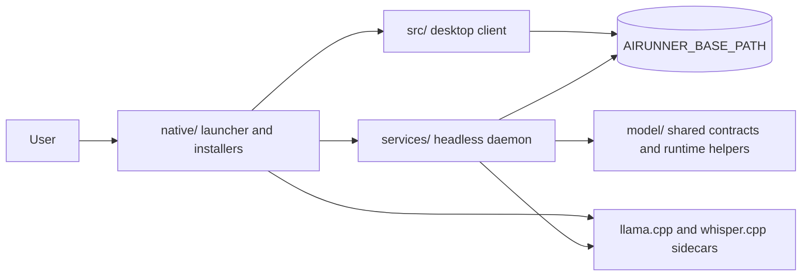

# Layered Product Architecture

This note describes the current AIRunner package layout and the intended
ownership boundaries between the split packages.

## Current Package Map

## Package Responsibilities

| Package | Owns | Does not own |
|---------|------|--------------|
| `services/` | daemon entry points, FastAPI server, WebSocket endpoints, runtime registry, downloads, persistence, modality orchestration | desktop-only widget behavior and client-local preferences |
| `model/` | shared runtime contracts, transport-neutral runtime envelopes, settings, ORM models, runtime helpers | transport-specific HTTP route ownership and GUI surfaces |
| `src/` | desktop app, daemon clients, widgets, GUI workflow surfaces | headless daemon ownership and bundle assembly |
| `native/` | launcher, bundle layout, installer-facing tooling, sidecar build integration | modality orchestration and GUI widget logic |

## Runtime Paths

### Desktop path

1. `native/` launches the packaged or checkout application.
2. `src/` renders the GUI and talks to the daemon through the service-owned HTTP or WebSocket API surface.
3. `services/` owns the headless daemon and runtime routing.
4. `model/` supplies shared contracts and runtime settings.
5. Native sidecars such as `llama.cpp` and `whisper.cpp` are supervised
   from the daemon path.

### Headless path

1. `services/` starts the daemon directly.
2. `services/` owns the daemon HTTP/WebSocket surface directly.
3. `model/` provides shared contract and runtime helpers.
4. Optional sidecars are launched through the runtime registry.

### Bundled product path

1. `native/` builds or installs the bundle.
2. `src/`, `services/`, `model/`, and `native/` are installed into the
   bundled environment.
3. The launcher resolves the runtime layout and bundled sidecars.

## Transitional Boundaries

The split is real, but not fully complete yet.

- Some runtime helpers still straddle `services/` and `model/`.
- GUI-to-daemon handoff code remains in `src/` while transport-neutral
   runtime contracts continue to consolidate under `model/`.

That transitional state is acceptable as long as new work respects the
target boundaries above rather than moving more ownership back into the
wrong layer.

## Validation Surface

AIRunner uses a mixed validation strategy:

- package-local unit or smoke coverage for focused changes
- daemon runtime smoke commands from `scripts/run_tests.py`
- real daemon-backed end-to-end suites under `services/tests/`

The validation matrix for each package lives in
[package_split_contract.md](package_split_contract.md).