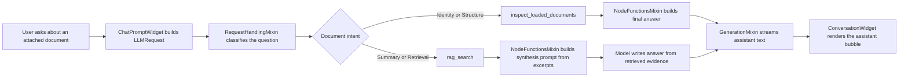
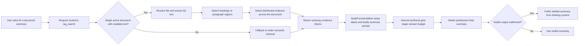

# Document RAG Flow

This note explains how document question answering works in AIRunner today.

## Simple Explanation

In simple terms, our RAG flow does three things:

1. It decides whether the user is asking about an attached document and what kind of document question it is.
2. It retrieves the right document data.
3. It asks the model to answer using only that retrieved data, then streams the answer into the chat UI.

For document questions, AIRunner currently uses two different tool paths:

- `inspect_loaded_documents` for document identity and structure questions.
- `rag_search` for summary and retrieval questions.

For summaries, the important detail is that the model does not answer directly from the raw tool output anymore. The synthesis layer strips the raw RAG inventory down to evidence bodies and then builds a summary-specific prompt around that evidence.

For a single active document, the summary path is now designed to be broader than ordinary semantic search. Instead of relying only on the highest-similarity chunks, it can build summary evidence from the full extracted document text so the final answer covers more than just the introduction.

## Diagram

## Summary-Specific Flow

## Where The Instructions Come From

If you want to know where the model is being told how to answer, check these layers in order:

### 1. Request routing

This decides whether the question is identity, structure, summary, or generic retrieval.

- [chat_prompt_widget.py](../src/airunner/components/chat/gui/widgets/chat_prompt_widget.py#L467): builds the `LLMRequest`, attaches document paths, and marks the request as RAG-capable when documents are attached.
- [request_handling_mixin.py](../src/airunner/components/llm/managers/mixins/request_handling_mixin.py#L267): `_apply_document_query_route()` stores the request-scoped document intent and forced tool.
- [document_query_routing.py](../src/airunner/components/llm/utils/document_query_routing.py#L93): `route_document_query()` is the pure routing function.

### 2. Tool output shape

These functions define the raw material that the model receives after retrieval.

- [rag_tools.py](../src/airunner/components/llm/tools/rag_tools.py#L376): `inspect_loaded_documents()` returns metadata and extracted structure headings.
- [rag_tools.py](../src/airunner/components/llm/tools/rag_tools.py#L417): `rag_search()` runs retrieval over loaded documents.
- [rag_tools.py](../src/airunner/components/llm/tools/rag_tools.py#L296): `_format_rag_search_results()` formats the raw retrieval result into document summaries plus excerpt blocks.
- [rag_search_mixin.py](../src/airunner/components/llm/managers/agent/mixins/rag_search_mixin.py): `search()` now honors requested retrieval breadth instead of always being effectively capped by the default retriever size.

For summary intent, `rag_search()` now has a different quality target than ordinary question answering:

- if there is one active readable document, it should build evidence from across that document rather than only returning the most similar intro-heavy chunks,
- if that broader path is unavailable, it should fall back to wider retrieval breadth instead of the narrow default.
- the summary fallback path should request more evidence than ordinary retrieval so the synthesis step has enough coverage to work with.

### 3. Post-tool synthesis instructions

This is the main place where the summary answer style is created.

- [node_functions_mixin.py](../src/airunner/components/llm/managers/mixins/node_functions_mixin.py#L530): `_generate_response_message_from_results()` decides whether to answer deterministically or run a synthesis pass.
- [node_functions_mixin.py](../src/airunner/components/llm/managers/mixins/node_functions_mixin.py#L812): `_build_document_summary_prompt_results()` strips summary prompts down to excerpt bodies so the model sees evidence instead of raw RAG inventory noise.
- [node_functions_mixin.py](../src/airunner/components/llm/managers/mixins/node_functions_mixin.py#L716): `_build_search_results_prompt()` writes the actual no-tool prompt that tells the model how to turn retrieved content into a user-facing answer.
- [node_functions_mixin.py](../src/airunner/components/llm/managers/mixins/node_functions_mixin.py#L2741): `_generate_streaming_response()` gathers streamed visible text, thinking content, and tool-call chunks.

Two extra safeguards now matter for summary turns:

- the internal no-tool summary synthesis pass uses a larger generation budget than the outer RAG action so it does not inherit the concise retrieval budget and truncate mid-thought,
- malformed prompt-tail fragments such as partial `Answer:` label text are rejected before they can override a better drafted summary recovered from thinking content.

### 4. Final streaming and rendering

These functions decide how the completed assistant text reaches the UI.

- [generation_mixin.py](../src/airunner/components/llm/managers/mixins/generation_mixin.py#L302): `_create_streaming_callback()` emits assistant stream chunks.
- [generation_mixin.py](../src/airunner/components/llm/managers/mixins/generation_mixin.py#L70): `_emit_visible_response()` emits a fallback visible answer if the workflow completed without streamed assistant text.
- [conversation_widget.py](../src/airunner/components/chat/gui/widgets/conversation_widget.py#L1087): `_process_sequential_tokens()` assembles streamed tokens into the active assistant bubble.
- [conversation_widget.py](../src/airunner/components/chat/gui/widgets/conversation_widget.py#L427): `_format_message_for_webview()` formats message payloads for the web view.
- [formatter_extended.py](../src/airunner/utils/text/formatter_extended.py#L179): `format_content()` converts markdown-looking assistant text into rendered HTML.

## What Happens For Each Kind Of Document Question

### Identity question

Example: "what is this document?"

1. The request is classified as `identity`.
2. The route forces `inspect_loaded_documents`.
3. The response is usually deterministic.
4. The final answer is built from metadata like title, author, and file type.

### Structure question

Example: "what chapters does it contain?"

1. The request is classified as `structure`.
2. The route forces `inspect_loaded_documents`.
3. The response is usually deterministic.
4. The final answer is built from extracted headings.

### Summary question

Example: "summarize the document for me"

1. The request is classified as `summary`.
2. The route forces `rag_search`.
3. If one active document is available, `rag_search()` can extract the full text and build distributed summary evidence across multiple sections or regions of the document.
4. If that path is unavailable, `rag_search()` falls back to a wider semantic retrieval pass.
5. `_build_document_summary_prompt_results()` removes filename, path, and excerpt-label clutter from the synthesis input.
6. `_build_search_results_prompt()` tells the model to synthesize a real summary from the evidence.
7. If the internal synthesis pass emits a malformed tail fragment, recovery prefers the better drafted summary from thinking content instead of trusting that fragment.
8. The streamed answer is rendered into the assistant bubble.

## Why Summary Quality Lives Mostly In One File

If the summary is weak, the most important file is:

- [node_functions_mixin.py](../src/airunner/components/llm/managers/mixins/node_functions_mixin.py)

That file controls:

- whether a document result should be answered deterministically or synthesized,
- which prompt is built for summary questions,
- how raw RAG results are cleaned before synthesis,
- how hidden thinking is recovered when the visible stream is empty or poor.

`rag_tools.py` matters because it shapes the raw excerpts, but the user-facing summary instructions are mainly created inside `NodeFunctionsMixin`.

After the summary-retrieval upgrade, the two most important files for summary quality are:

- [rag_tools.py](../src/airunner/components/llm/tools/rag_tools.py)
- [node_functions_mixin.py](../src/airunner/components/llm/managers/mixins/node_functions_mixin.py)
- [rag_search_mixin.py](../src/airunner/components/llm/managers/agent/mixins/rag_search_mixin.py)

`rag_tools.py` determines coverage. `rag_search_mixin.py` determines whether the requested breadth is even reachable. `NodeFunctionsMixin` determines how that evidence becomes the final assistant answer.

## Practical Debugging Order

When a document answer looks wrong, check the pipeline in this order:

1. Was the question routed to the right intent in [document_query_routing.py](../src/airunner/components/llm/utils/document_query_routing.py#L93)?
2. Did the right tool run in [request_handling_mixin.py](../src/airunner/components/llm/managers/mixins/request_handling_mixin.py#L267)?
3. Did the tool return good evidence in [rag_tools.py](../src/airunner/components/llm/tools/rag_tools.py#L417)?
4. Did `_build_document_summary_prompt_results()` and `_build_search_results_prompt()` in [node_functions_mixin.py](../src/airunner/components/llm/managers/mixins/node_functions_mixin.py#L716) create the right synthesis input?
5. Did the answer stream correctly through [generation_mixin.py](../src/airunner/components/llm/managers/mixins/generation_mixin.py#L302) and [conversation_widget.py](../src/airunner/components/chat/gui/widgets/conversation_widget.py#L1087)?

That order usually tells you whether the bug is routing, retrieval, synthesis, or rendering.