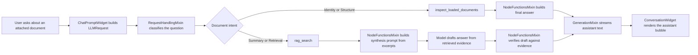

# Document RAG Flow

This note explains how document question answering works in AIRunner today.

## Simple Explanation

In simple terms, our RAG flow does three things:

1. It decides whether the user is asking about an attached document and what kind of document question it is.
2. It retrieves the right document data.
3. It drafts an answer from that retrieved data, verifies the draft against the same evidence, and only then emits the final answer into the chat UI.

For document questions, AIRunner currently uses two different tool paths:

- `inspect_loaded_documents` for document identity and structure questions.
- `rag_search` for summary and retrieval questions.

For summaries, the important detail is that the model does not answer directly from the raw tool output anymore. The synthesis layer strips the raw RAG inventory down to evidence bodies and then builds a summary-specific prompt around that evidence.

For a single active document, the summary path is now designed to be
broader than ordinary semantic search. Instead of relying only on the
highest-similarity chunks, it can build summary evidence from the full
extracted document text so the final answer covers more than just the
introduction.

That full-text path now has two summary modes:

- general summary queries still sample evidence across the document so
    the answer can cover the whole work,
- premise-style queries such as "what is this book about?" now prefer
    the opening setup and the earliest premise/conflict paragraphs instead
    of evenly sampling late-scene material from the whole narrative.

The retrieval layer now also normalizes the local E5 embedding inputs the way the model expects: document queries are embedded with a `query:` prefix and indexed passages are embedded with a `passage:` prefix. Persisted indexes that were built before that change are upgraded lazily on the next search so older documents do not stay stuck on the pre-prefix strategy.

## Diagram

## Summary-Specific Flow

```mermaid
flowchart LR
    A[User asks for a document summary] --> B[Request routed to rag_search]
    B --> C{Single active document with readable text?}
    C -->|Yes| D[Resolve file and extract full text]
    D --> E{Premise-style about query?}
    E -->|Yes| F[Prefer opening setup and early conflict evidence]
    E -->|No| G[Detect headings or paragraph regions]
    G --> H[Select distributed evidence across the document]
    F --> I[Return summary evidence blocks]
    H --> I
    C -->|No| H[Fallback to wider semantic retrieval]
    H --> I
    I --> J[NodeFunctionsMixin strips labels and builds summary prompt]
    J --> K[Internal draft synthesis gets larger answer budget]
    K --> L[Model drafts summary]
    L --> M[NodeFunctionsMixin verifies draft against evidence]
    M --> N{Visible output malformed?}
    N -->|Yes| O[Prefer drafted summary from thinking content]
    N -->|No| P[Use verified summary]
```

## Where The Instructions Come From

If you want to know where the model is being told how to answer, check these layers in order:

### 1. Request routing

This decides whether the question is identity, structure, summary, or generic retrieval.

- [chat_prompt_widget.py](../src/airunner/components/chat/gui/widgets/chat_prompt_widget.py#L467): builds the `LLMRequest`, attaches document paths, and marks the request as RAG-capable when documents are attached.
- [request_handling_mixin.py](../src/airunner/components/llm/managers/mixins/request_handling_mixin.py#L267): `_apply_document_query_route()` stores the request-scoped document intent and forced tool.
- [document_query_routing.py](../src/airunner/components/llm/utils/document_query_routing.py#L93): `route_document_query()` is the pure routing function.

### 2. Tool output shape

These functions define the raw material that the model receives after retrieval.

- [rag_tools.py](../src/airunner/components/llm/tools/rag_tools.py#L376): `inspect_loaded_documents()` returns metadata and extracted structure headings.
- [rag_tools.py](../src/airunner/components/llm/tools/rag_tools.py#L417): `rag_search()` runs retrieval over loaded documents.
- [rag_tools.py](../src/airunner/components/llm/tools/rag_tools.py#L296): `_format_rag_search_results()` formats the raw retrieval result into document summaries plus excerpt blocks.
- [rag_search_mixin.py](../src/airunner/components/llm/managers/agent/mixins/rag_search_mixin.py): `search()` now honors requested retrieval breadth instead of always being effectively capped by the default retriever size.

For summary intent, `rag_search()` now has a different quality target than ordinary question answering:

- if there is one active readable document, it should build evidence from across that document rather than only returning the most similar intro-heavy chunks,
- if the user is asking what a book or document is about, that single-document path should prefer opening premise and central-conflict paragraphs over later-scene snippets,
- if that broader path is unavailable, it should fall back to wider retrieval breadth instead of the narrow default.
- the summary fallback path should request more evidence than ordinary retrieval so the synthesis step has enough coverage to work with.

### 2.5 Retrieval runtime and persisted indexes

These files sit under the tool layer, but they matter directly for real answer quality.

- [rag_properties_mixin.py](../src/airunner/components/llm/managers/agent/mixins/rag_properties_mixin.py): wraps the local `intfloat/e5-large` embeddings so queries use `query:` and passages use `passage:` before embedding.
- [vector_index.py](../src/airunner/components/llm/managers/agent/vector_index.py): stores embedding-strategy metadata with each persisted index and lazily re-embeds legacy indexes on the next search when the strategy changes.
- [retriever.py](../src/airunner/components/llm/managers/agent/retriever.py): ensures loaded document indexes are refreshed to the current embedding strategy before similarity search runs.
- [model_status_widget.py](../src/airunner/components/model_management/gui/model_status_widget.py): surfaces the embedding runtime as its own `RAG Embeddings` row with status and unload support.

This means the RAG path now has a distinct embedding runtime that can be loading, loaded, or unloaded independently of the main LLM runtime.

### 3. Post-tool synthesis instructions

This is the main place where the summary answer style is created.

- [node_functions_mixin.py](../src/airunner/components/llm/managers/mixins/node_functions_mixin.py#L530): `_generate_response_message_from_results()` decides whether to answer deterministically or run the internal draft and verification passes.
- [node_functions_mixin.py](../src/airunner/components/llm/managers/mixins/node_functions_mixin.py#L1015): `_build_document_summary_prompt_results()` strips summary prompts down to excerpt bodies so the model sees evidence instead of raw RAG inventory noise.
- [node_functions_mixin.py](../src/airunner/components/llm/managers/mixins/node_functions_mixin.py#L831): `_build_search_results_prompt()` writes the draft prompt that turns retrieved content into an answer candidate.
- [node_functions_mixin.py](../src/airunner/components/llm/managers/mixins/node_functions_mixin.py#L935): `_build_search_results_verification_prompt()` writes the follow-up verification prompt that rewrites the final answer against the same evidence.
- [node_functions_mixin.py](../src/airunner/components/llm/managers/mixins/node_functions_mixin.py#L3164): `_generate_streaming_response()` gathers streamed visible text, thinking content, and tool-call chunks.

Three extra safeguards now matter for summary turns:

- the internal no-tool summary synthesis pass uses a larger generation budget than the outer RAG action so it does not inherit the concise retrieval budget and truncate mid-thought,
- for "what is this book/document about?" prompts, the synthesis guidance tells the model to lead with premise, setting, central conflict, and major relationships before isolated later scenes,
- after that draft pass, a second internal verification pass checks the draft against the same evidence and rewrites unsupported or stray details before any final answer is emitted,
- malformed prompt-tail fragments such as partial `Answer:` label text are rejected before they can override a better drafted summary recovered from thinking content.
- if the visible synthesis output merely echoes the summary instructions themselves, that prompt-guidance text is rejected and recovery falls back to drafted content from thinking, flattening numbered reasoning summaries into plain prose when needed.

### 4. Final streaming and rendering

These functions decide how the completed assistant text reaches the UI.

- [generation_mixin.py](../src/airunner/components/llm/managers/mixins/generation_mixin.py#L302): `_create_streaming_callback()` emits assistant stream chunks.
- [generation_mixin.py](../src/airunner/components/llm/managers/mixins/generation_mixin.py#L70): `_emit_visible_response()` emits a fallback visible answer if the workflow completed without streamed assistant text.
- [conversation_widget.py](../src/airunner/components/chat/gui/widgets/conversation_widget.py#L1087): `_process_sequential_tokens()` assembles streamed tokens into the active assistant bubble.
- [conversation_widget.py](../src/airunner/components/chat/gui/widgets/conversation_widget.py#L427): `_format_message_for_webview()` formats message payloads for the web view.
- [formatter_extended.py](../src/airunner/utils/text/formatter_extended.py#L179): `format_content()` converts markdown-looking assistant text into rendered HTML.

## What Happens For Each Kind Of Document Question

### Identity question

Example: "what is this document?"

1. The request is classified as `identity`.
2. The route forces `inspect_loaded_documents`.
3. The response is usually deterministic.
4. The final answer is built from metadata like title, author, and file type.

### Structure question

Example: "what chapters does it contain?"

1. The request is classified as `structure`.
2. The route forces `inspect_loaded_documents`.
3. The response is usually deterministic.
4. The final answer is built from extracted headings.

### Summary question

Example: "summarize the document for me" or "what is this book about?"

1. The request is classified as `summary`.
2. The route forces `rag_search`.
3. If one active document is available, `rag_search()` can extract the
    full text and either build distributed summary evidence across the
    document or, for premise-style about queries, prefer the opening
    setup and earliest conflict paragraphs.
4. Before searching a persisted index, the retrieval layer upgrades any legacy pre-prefix embeddings to the current E5 strategy when needed.
5. If that broader path is unavailable, `rag_search()` falls back to a wider semantic retrieval pass.
6. `_build_document_summary_prompt_results()` removes filename, path, and excerpt-label clutter from the synthesis input.
7. `_build_search_results_prompt()` tells the model to synthesize a
    real summary from the evidence, and premise-style about questions are
    steered toward setup and conflict first.
8. The first internal pass drafts a summary from the evidence.
9. A second internal pass verifies that draft against the same evidence and rewrites unsupported or stray claims before the answer becomes visible.
10. If the verified pass emits a malformed tail fragment or simply reflects the instructions back, recovery prefers the better drafted summary from thinking content instead of trusting that visible fragment.
11. The streamed answer is rendered into the assistant bubble.

## Why Summary Quality Lives Mostly In One File

If the summary is weak, the most important file is:

- [node_functions_mixin.py](../src/airunner/components/llm/managers/mixins/node_functions_mixin.py)

That file controls:

- whether a document result should be answered deterministically or synthesized,
- which prompt is built for summary questions,
- how the draft answer is verified against the same evidence before it becomes visible,
- how raw RAG results are cleaned before synthesis,
- how hidden thinking is recovered when the visible stream is empty or poor.

`rag_tools.py` matters because it shapes the raw excerpts, including the
new premise-focused evidence path for book-about questions, but the
user-facing summary instructions are mainly created inside
`NodeFunctionsMixin`.

After the summary-retrieval upgrade, the two most important files for summary quality are:

- [rag_tools.py](../src/airunner/components/llm/tools/rag_tools.py)
- [node_functions_mixin.py](../src/airunner/components/llm/managers/mixins/node_functions_mixin.py)
- [rag_search_mixin.py](../src/airunner/components/llm/managers/agent/mixins/rag_search_mixin.py)
- [rag_properties_mixin.py](../src/airunner/components/llm/managers/agent/mixins/rag_properties_mixin.py)
- [vector_index.py](../src/airunner/components/llm/managers/agent/vector_index.py)

`rag_tools.py` determines coverage. `rag_search_mixin.py` determines whether the requested breadth is even reachable. `rag_properties_mixin.py` determines how text is embedded for retrieval. `vector_index.py` determines whether old indexes are silently upgraded to the current strategy. `NodeFunctionsMixin` determines how that evidence becomes the final assistant answer and how malformed visible output is recovered.

## Practical Debugging Order

When a document answer looks wrong, check the pipeline in this order:

1. Was the question routed to the right intent in [document_query_routing.py](../src/airunner/components/llm/utils/document_query_routing.py#L93)?
2. Is the active embedding runtime using the expected E5 prefix strategy in [rag_properties_mixin.py](../src/airunner/components/llm/managers/agent/mixins/rag_properties_mixin.py)?
3. Did the persisted index refresh itself if it was built before the current embedding strategy in [vector_index.py](../src/airunner/components/llm/managers/agent/vector_index.py)?
4. Did the right tool run in [request_handling_mixin.py](../src/airunner/components/llm/managers/mixins/request_handling_mixin.py#L267)?
5. Did the tool return good evidence in [rag_tools.py](../src/airunner/components/llm/tools/rag_tools.py#L417)?
6. Did [_build_document_summary_prompt_results()](../src/airunner/components/llm/managers/mixins/node_functions_mixin.py#L1015), [_build_search_results_prompt()](../src/airunner/components/llm/managers/mixins/node_functions_mixin.py#L831), and [_build_search_results_verification_prompt()](../src/airunner/components/llm/managers/mixins/node_functions_mixin.py#L935) create the right draft and verification inputs, and did recovery reject any prompt-guidance echo?
7. Did the answer stream correctly through [generation_mixin.py](../src/airunner/components/llm/managers/mixins/generation_mixin.py#L302) and [conversation_widget.py](../src/airunner/components/chat/gui/widgets/conversation_widget.py#L1087)?

That order usually tells you whether the bug is routing, retrieval, synthesis, or rendering.