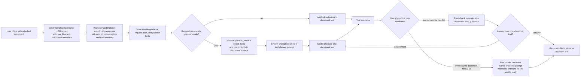
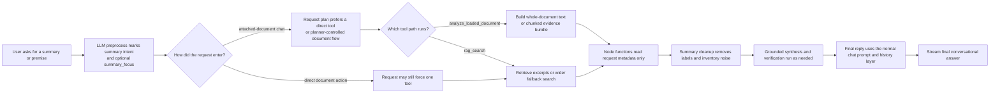

# Document RAG Flow

This note explains how document question answering works in AIRunner
today.

For the general LLM stack, see [llm-flow.md](llm-flow.md).

## Simple Explanation

In simple terms, AIRunner now has two document entry paths:

1. Attached-document chat can run either a direct document-tool turn or
   a planner-controlled document turn.
2. Direct document actions can still use explicit forced tools.

Both paths now start with the same request preprocess step. AIRunner
asks the LLM to read the user's query, recent conversation context, and
the available document tool inventory, then return structured request
metadata.

That preprocess can:

- rewrite a vague query into a clearer internal guidance string,
- choose document tool categories,
- nominate a primary tool,
- record `document_query_intent`, `document_summary_focus`, and
  `document_answer_mode`,
- provide planner hints for the first document turn.

The three document tools still have distinct roles:

- `inspect_loaded_documents` returns loaded-document identity and
  structure data.
- `analyze_loaded_document` prepares whole-document analysis context for
   summaries, premise/theme questions, and broad transformations.
- `rag_search` retrieves localized excerpts and remains the fallback
  document-content search tool.

The key architectural change is this: active document routing no longer
depends on raw prompt keyword heuristics. Downstream document policy,
prompt building, and chunk selection now read request metadata instead.

The retrieval layer also normalizes the local E5 embedding inputs the
way the model expects: document queries use a `query:` prefix and
indexed passages use a `passage:` prefix. Persisted indexes that were
built before that change are upgraded lazily on the next search.

## Attached-Document Chat Flow

## Summary-Specific Flow

## Current Planner And Finalization Behavior

- Attached-document chat in `LLMActionType.CHAT` does not activate
   planner mode just because `rag_files` are present.
- The request preprocess runs before planner/tool filtering unless an
  explicit `force_tool` already determines the route.
- The preprocess can store `rewritten_prompt` and a structured request
   plan containing tool categories, primary tool, planner mode,
   `document_query_intent`, `document_summary_focus`,
   `document_answer_mode`, and planner hints.
- After `inspect_loaded_documents`, planner mode stays in the loop so
  the model can answer or choose another document tool.
- After synthesized summary-style tool results, the next model turn can
  use the saved final chat prompt with tools unbound before the visible
  answer is generated.
- Internal document synthesis and verification now return one explicit
   `answer_text` block, and synthesized document answers now succeed
   only when a stage returns that committed field. Verification may keep
   or replace the draft only through a valid `answer_text` block; meta
   fragments, verifier commentary, and other reasoning text no longer
   count as successful document finalization.
- Those hidden synthesis and verification passes now run with model
   thinking disabled even though request-level thinking remains enabled.
   That keeps the internal stage budget focused on emitting the
   committed `answer_text` block instead of spending the turn on hidden
   reasoning prose.
- For local GGUF execution, `ChatGGUF` now enforces those hidden-stage
   presets at the adapter boundary, so per-pass `max_new_tokens`,
   `temperature`, `reasoning_effort`, and `enable_thinking` overrides
   actually reach `llama.cpp`.
- Direct document actions such as `PERFORM_RAG_SEARCH` can still use
  explicit forced tool routing.

## Where The Instructions Come From

If you want to know where the model is being told how to handle
documents, check these layers in order.

### 1. Request Preprocess And Planner Activation

These files decide whether the turn is document-aware, which document
intent it maps to, and whether planner mode is active.

- [chat_prompt_widget.py](../src/airunner/components/chat/gui/widgets/chat_prompt_widget.py)
- [request_handling_mixin.py](../src/airunner/components/llm/managers/mixins/request_handling_mixin.py)
- [tool_classification_mixin.py](../src/airunner/components/llm/managers/mixins/tool_classification_mixin.py)
- [tool_filtering_mixin.py](../src/airunner/components/llm/managers/mixins/tool_filtering_mixin.py)
- [system_prompt_mixin.py](../src/airunner/components/llm/managers/mixins/system_prompt_mixin.py)

This layer now does more than just store a route:

- it asks the LLM to classify and optionally rewrite the request,
- it can activate `planner_mode = "select_tools"` when the request plan
   explicitly calls for tool selection,
- it saves `final_system_prompt` for the last no-tool reply,
- it records `document_query_intent`, `document_summary_focus`,
  `document_primary_tool`, and `document_answer_mode`,
- it narrows planner turns to the document tool allowlist and can mark
  the turn as tool-required.

### 2. Tool Output Shape

These functions define the raw document material the model receives.

- [rag_tools.py](../src/airunner/components/llm/tools/rag_tools.py)
- [rag_search_mixin.py](../src/airunner/components/llm/managers/agent/mixins/rag_search_mixin.py)
- [
  _document_analysis.py](../src/airunner/components/llm/tools/rag_tools_helpers/_document_analysis.py)
- [
  _document_analysis_pipeline.py](../src/airunner/components/llm/tools/rag_tools_helpers/_document_analysis_pipeline.py)
- [
  _summary_evidence.py](../src/airunner/components/llm/tools/rag_tools_helpers/_summary_evidence.py)

Current roles:

- `inspect_loaded_documents()` returns metadata and extracted
  structure headings.
- `analyze_loaded_document()` returns either full-document text for
   small documents or a chunked evidence bundle with document coverage,
   deterministic refined synthesis, chunk summaries, and supporting
   excerpts for larger documents.
- `rag_search()` performs excerpt retrieval and wider fallback search.
- Summary evidence and chunk frontloading now use request metadata,
  especially `document_summary_focus`, instead of reparsing the prompt.
- `rag_search()` also uses the preprocess-owned rewritten query when one
   is available instead of pronoun-based document expansion in the tool
   layer.

### 2.5 Retrieval Runtime And Persisted Indexes

These files sit under the tool layer, but they matter directly for real
answer quality.

- [rag_properties_mixin.py](../src/airunner/components/llm/managers/agent/mixins/rag_properties_mixin.py)
- [vector_index.py](../src/airunner/components/llm/managers/agent/vector_index.py)
- [retriever.py](../src/airunner/components/llm/managers/agent/retriever.py)
- [model_status_widget.py](../src/airunner/components/model_management/gui/model_status_widget.py)

This means the document path has its own embedding runtime and its own
index-compatibility concerns, separate from the main chat runtime.

### 3. Tool Loop Control And Follow-Up Behavior

This layer decides whether the workflow should stay in tool mode, answer
deterministically, or unbind tools for the final visible reply.

- [routing_decision_mixin.py](../src/airunner/components/llm/managers/mixins/node_functions/routing_decision_mixin.py)
- [document_response_policy_mixin.py](../src/airunner/components/llm/managers/mixins/node_functions/document_response_policy_mixin.py)
- [search_results_prompt_mixin.py](../src/airunner/components/llm/managers/mixins/node_functions/search_results_prompt_mixin.py)
- [post_tool_instructions_mixin.py](../src/airunner/components/llm/managers/mixins/node_functions/post_tool_instructions_mixin.py)

Current behavior to remember:

- planner-controlled document turns do not force response synthesis as
  soon as one document tool finishes,
- planner post-tool guidance can tell the model to either answer from
  current evidence or choose another document tool,
- downstream document prompt and policy helpers now trust request
  metadata instead of reclassifying the raw question text.

### 4. Grounded Synthesis And Final Chat Reply

This is the main place where grounded document artifacts are assembled
and turned into visible replies.

- [node_functions_mixin.py](../src/airunner/components/llm/managers/mixins/node_functions_mixin.py)
- [document_conversational_followup_mixin.py](../src/airunner/components/llm/managers/mixins/node_functions/document_conversational_followup_mixin.py)
- [generation_mixin.py](../src/airunner/components/llm/managers/mixins/generation_mixin.py)

This layer controls:

- whether a document result should be answered deterministically or
  synthesized,
- how summary prompts are cleaned down to grounded evidence,
- how summary drafts are verified against that evidence,
- when the final normal chat prompt is restored,
- how committed `answer_text` fields are accepted or rejected across
   synthesis and verification stages,
- and how non-committed reasoning text is kept out of the visible reply
   path for synthesized document answers.

### 5. Final Streaming And Rendering

These functions decide how the completed assistant text reaches the UI.

- [generation_mixin.py](../src/airunner/components/llm/managers/mixins/generation_mixin.py)
- [conversation_widget.py](../src/airunner/components/chat/gui/widgets/conversation_widget.py)
- [formatter_extended.py](../src/airunner/utils/text/formatter_extended.py)

## What Happens For Each Kind Of Document Question

### Identity Question

Example: "what is this document?"

1. The preprocess classifies the request as `identity`.
2. Attached-document chat usually enters planner mode and hints
   `inspect_loaded_documents` first.
3. Direct document actions can still force
   `inspect_loaded_documents` immediately.
4. The answer is usually deterministic and built from metadata such as
   title, author, and file type.

### Structure Question

Example: "what chapters does it contain?"

1. The preprocess classifies the request as `structure`.
2. Attached-document chat usually hints
   `inspect_loaded_documents` first.
3. Planner mode can stay in the loop after inspection if another
   document step is still needed.
4. The final answer is usually built from extracted headings.

### Summary Or Premise Question

Example: "summarize the document for me" or
"what is this book about?"

1. The preprocess classifies the request as `summary` and can mark a
   `document_summary_focus` such as `premise`.
2. Attached-document chat can prefer `analyze_loaded_document` before
   `rag_search` when a broader single-document view is needed.
3. `analyze_loaded_document()` can return whole-document or chunked
   context, while `rag_search()` remains the excerpt and fallback search
   path.
4. Large-document `analyze_loaded_document()` turns now expose document
   coverage plus supporting evidence instead of deterministic map/reduce
   chunk summaries.
5. Summary evidence selection and chunk frontloading now follow request
   metadata instead of query-text heuristics.
6. Before search runs, legacy pre-prefix embeddings are upgraded to the
   current E5 strategy when needed.
7. Summary cleanup removes filename, path, and label clutter from the
   synthesis input.
8. Grounded synthesis and verification rewrite unsupported or stray
   details before the answer becomes visible.
9. The final visible answer uses the normal chat prompt and history
   layer rather than raw tool output.

### Broad Transformation Question

Example: "summarize the lab results in a table"

1. The preprocess classifies the request as a synthesized document
   task.
2. Planner hints can prefer `analyze_loaded_document` and then
   `rag_search`.
3. Whole-document context is preferred when the task needs more than a
   local excerpt window.
4. The visible answer is still expected to be grounded in document
   evidence, not improvised from the request alone.

## Why Document Quality Now Lives Across Multiple Layers

If the document answer is weak, the most important files are no longer
just in one place.

- [request_handling_mixin.py](../src/airunner/components/llm/managers/mixins/request_handling_mixin.py)
  and
  [tool_classification_mixin.py](../src/airunner/components/llm/managers/mixins/tool_classification_mixin.py)
  control preprocess routing, intent metadata, planner hints, and the
  saved final prompt.
- [rag_tools.py](../src/airunner/components/llm/tools/rag_tools.py),
  [
  _document_analysis.py](../src/airunner/components/llm/tools/rag_tools_helpers/_document_analysis.py),
  and
  [
  _summary_evidence.py](../src/airunner/components/llm/tools/rag_tools_helpers/_summary_evidence.py)
  control evidence coverage.
- [document_response_policy_mixin.py](../src/airunner/components/llm/managers/mixins/node_functions/document_response_policy_mixin.py)
  and
  [search_results_prompt_mixin.py](../src/airunner/components/llm/managers/mixins/node_functions/search_results_prompt_mixin.py)
  control how request metadata becomes grounded answer prompts.
- [node_functions_mixin.py](../src/airunner/components/llm/managers/mixins/node_functions_mixin.py)
  and
  [document_conversational_followup_mixin.py](../src/airunner/components/llm/managers/mixins/node_functions/document_conversational_followup_mixin.py)
  turn grounded evidence into the final assistant reply.

## Practical Debugging Order

When a document answer looks wrong, check the pipeline in this order:

1. Did
   [chat_prompt_widget.py](../src/airunner/components/chat/gui/widgets/chat_prompt_widget.py)
   attach the right documents and metadata?
2. Did the preprocess step in
   [tool_classification_mixin.py](../src/airunner/components/llm/managers/mixins/tool_classification_mixin.py)
   return the expected document intent, summary focus, and tool hints?
3. Did
   [request_handling_mixin.py](../src/airunner/components/llm/managers/mixins/request_handling_mixin.py)
   activate planner mode or explicit forced tooling the way you
   expected?
4. Did
   [tool_filtering_mixin.py](../src/airunner/components/llm/managers/mixins/tool_filtering_mixin.py)
   expose the right document tool allowlist and tool-choice behavior?
5. Did the adapter honor the expected tool mode in
   [chat_gguf.py](../src/airunner/components/llm/adapters/chat_gguf.py)
   or the active remote adapter?
6. Which document tool actually ran, and what evidence or analysis
   context did it return in
   [rag_tools.py](../src/airunner/components/llm/tools/rag_tools.py)?
7. Did the metadata-driven prompt/policy layer keep the right intent,
   answer mode, and summary focus all the way through synthesis?
8. Did grounded synthesis or fallback recovery produce the final answer
   you expected?
9. Did the reply stream and render correctly through
   [generation_mixin.py](../src/airunner/components/llm/managers/mixins/generation_mixin.py)
   and
   [conversation_widget.py](../src/airunner/components/chat/gui/widgets/conversation_widget.py)?

That order usually tells you whether the bug is request assembly,
preprocess routing, retrieval, loop control, synthesis, or rendering.