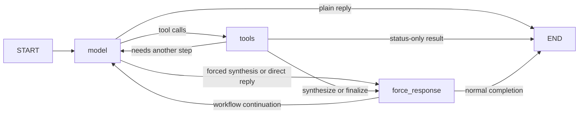

# Overall LLM Flow

This note explains how AIRunner uses its LLM stack today.

For document-specific behavior, see
[document-rag-flow.md](document-rag-flow.md).

## Simple Explanation

In simple terms, AIRunner's current LLM flow does eight things:

1. `ChatPromptWidget` turns the visible UI state into an `LLMRequest`.
2. `LLMAPIService` hands that request to the LLM worker.
3. `LLMGenerateWorker` asks `LLMModelManager` for the active backend.
4. `RequestHandlingMixin` runs an LLM preprocess step on the user query
   and recent conversation context.
5. That preprocess returns request metadata such as a query rewrite,
   tool categories, planner hints, and document intent.
6. AIRunner applies that metadata to the request, tool surface, system
   prompt, planner mode, and RAG state.
7. `WorkflowManager` runs the LangGraph `model` / `tools` /
   `force_response` loop.
8. `GenerationMixin` streams the visible reply, and
   `ConversationWidget` assembles the final assistant bubble.

AIRunner currently supports three main chat backends:

- local GGUF models through `ChatGGUF` and `llama.cpp`,
- OpenRouter through `ChatOpenAI`,
- Ollama through `ChatOllama`.

Local chat inference is GGUF-only. Transformers-based local chat
loading is intentionally disabled.

Thinking is now always enabled for request execution. The chat prompt
footer no longer exposes a thinking toggle; GPT-OSS-style models still
use the reasoning-effort control.

## Main Request Flow

```mermaid
flowchart LR
    A[User submits prompt] --> B[ChatPromptWidget builds LLMRequest]
    B --> C[LLMAPIService.send_request]
    C --> D[WorkerManager forwards to LLMGenerateWorker]
    D --> E[LLMGenerateWorker gets LLMModelManager]
    E --> F[RequestHandlingMixin.handle_request]
    F --> G[Load or switch provider and model]
    F --> H[LLM preprocesses prompt,<br/>conversation context, and tool inventory]
    H --> I[Apply rewrite guidance,<br/>tool filters, planner state, and RAG]
    I --> J[WorkflowManager.stream]
    J --> K[LangGraph model/tools/force_response loop]
    K --> L[GenerationMixin emits streamed text]
    L --> M[ConversationWidget assembles bubble]
```

## Workflow Graph

## Runtime Stages

### 1. Request Assembly

- `ChatPromptWidget` parses slash commands, action overrides, and the
  current prompt text.
- It builds `LLMRequest.for_visible_action(...)`.
- It attaches images for vision-capable models.
- It attaches `rag_files` and per-document metadata when documents are
  loaded.
- It sets request-scoped reasoning effort and always marks thinking as
  enabled.

### 2. Service And Worker Handoff

- `LLMAPIService.send_request()` packages the prompt, action,
  conversation ID, request ID, and `LLMRequest`.
- In the GUI path, `WorkerManager` forwards the request to
  `LLMGenerateWorker`.
- `LLMGenerateWorker` owns `LLMModelManager` and calls
  `handle_request()` on it.

### 3. Provider And Model Creation

- `LLMModelManager` uses
  [chat_model_factory.py](../src/airunner/components/llm/adapters/chat_model_factory.py)
  to create the active chat backend.
-
  [provider_config.py](../src/airunner/components/llm/config/provider_config.py)
  defines model capabilities such as context length, tool mode,
  thinking support, and default GGUF runtime settings.
- Local execution currently means GGUF plus `llama.cpp` through
  [chat_gguf.py](../src/airunner/components/llm/adapters/chat_gguf.py).
- Remote execution currently means OpenRouter or Ollama.

### 4. LLM Request Preprocess

-
  [tool_classification_mixin.py](../src/airunner/components/llm/managers/mixins/tool_classification_mixin.py)
  runs a dedicated LLM preprocess step before the workflow loop.
- The preprocess sees the user query, recent conversation context, and
  the request-scoped tool inventory.
- It can return an optional `rewritten_prompt` plus a structured
  request plan with tool categories, primary tool, planner mode,
  answer strategy, finalization mode, and document metadata such as
  `document_query_intent`, `document_summary_focus`, and
  `document_answer_mode`.
- This replaces active-path keyword and sentence heuristics for tool
  choice and document intent classification.
- Do not reintroduce keyword lists, regex routing, word-hit scoring,
  sentence matching, or similar heuristics for tool choice, query
  classification, or summary-mode selection. Those decisions belong to
  the LLM preprocess contract.

### 5. Request-Scoped Preparation

-
  [request_handling_mixin.py](../src/airunner/components/llm/managers/mixins/request_handling_mixin.py)
  applies request-scoped model-service, dtype, and conversation
  overrides.
- It can clear memory for ephemeral or no-memory requests.
- It applies preprocess results to planner mode, tool filters, saved
  prompt guidance, and RAG state.
- When the preprocess nominates one direct document tool, request
  handling now applies that tool directly instead of activating planner
  mode just because documents are attached.
- Rewritten prompt guidance augments the system prompt instead of
  replacing the user's visible prompt.

### 6. Tool Surface And Tool Mode

-
  [tool_filtering_mixin.py](../src/airunner/components/llm/managers/mixins/tool_filtering_mixin.py)
  narrows the tool surface by category, allowlist, or explicit
  `force_tool`.
-
  [tool_management_mixin.py](../src/airunner/components/llm/managers/mixins/tool_management_mixin.py)
  rebinds tools on the active workflow model for each request.
-
  [tool_manager.py](../services/src/airunner_services/llm/tool_manager.py)
  wraps registered tools, injects service-owned dependencies such as the
  API or active RAG manager at execution time, and applies request-
  scoped defaults.
- Dependency-injected wrappers expose only model-controlled arguments in
  the visible tool schema. Internal kwargs such as `api` stay hidden,
  which keeps forced-tool and LangGraph execution aligned with the real
  tool signature.
- `tool_choice` can be left unset, set to one named tool, or set to
  `"any"` when a tool call is required.
- In `ChatGGUF`, native llama.cpp tool binding is used only when
  `tool_calling_mode == "native"`.
- `json` mode injects tool instructions into the prompt and parses
  `<tool_call>...</tool_call>` output.
- `react` mode uses compact tool descriptions and
  `Action` / `Action Input` parsing.
- GPT-OSS uses its own raw-completion commentary/final tool path.

### 7. Model Loop, Finalization, And Recovery

-
  [workflow_manager.py](../src/airunner/components/llm/managers/workflow_manager.py)
  builds the request-scoped `WorkflowManager`.
-
  [workflow_building_mixin.py](../src/airunner/components/llm/managers/mixins/workflow_building_mixin.py)
  compiles the LangGraph graph.
-
  [node_functions_mixin.py](../src/airunner/components/llm/managers/mixins/node_functions_mixin.py)
  trims history, builds prompts, and calls the model.
-
  [routing_decision_mixin.py](../src/airunner/components/llm/managers/mixins/node_functions/routing_decision_mixin.py)
  decides whether to loop, synthesize, or end.
- `force_response` is used for grounded synthesis, direct tool results,
  duplicate-call recovery, and task-completing tool replies.
- Document-specific grounded replies can swap to a saved final chat
  prompt before the visible answer is generated. Those internal passes
  can unbind tools. Request-level thinking still stays on. Hidden
  document synthesis and verification now disable model thinking for
  flat document cases, but layered/frame-heavy document summaries can
  keep hidden-stage thinking enabled when structured document analysis
  says that extra reasoning is needed.
- In `ChatGGUF`, those hidden-stage generation presets are now applied
  as per-call adapter overrides, so stage-specific `max_new_tokens`,
  `temperature`, `reasoning_effort`, and `enable_thinking` settings
  reach `llama.cpp` instead of remaining manager-side metadata only.
- For large attached documents, `analyze_loaded_document` now carries a
  reduced whole-document bundle with coverage, a deterministic refined
  synthesis, chunk summaries, model-built structured document analysis,
  and supporting evidence so hidden synthesis/verification stages do
  not have to reason over raw excerpt inventories alone.
- Premise-focused document evidence now comes from model-selected span
  roles over structural candidate spans rather than marker or sentence
  heuristics. Verification uses the structured document-analysis layer
  and composition cautions to reject summaries that collapse staged,
  remembered, or frame-level material into literal plot facts.
- Internal document synthesis and verification now use a dedicated
  `answer_text` block contract so the visible reply comes only from one
  explicit committed answer field instead of free-form recovery.
  Verification may replace a synthesized draft only when it also
  returns a valid `answer_text` block. Reasoning prose, verifier
  critique text, and other non-committed fragments are treated as
  failed stage output, not as visible answers.
- If the workflow still ends with no visible final `AIMessage`,
  `GenerationMixin` first tries document-specific recovery from the
  checkpointed tool state for document requests before it falls back to
  the generic empty-result messages such as the read-only or
  non-mutating tool notices.
- The remaining hard failure mode in this path is no longer leaked
  reasoning; it is a stage returning no committed `answer_text` block
  even after the hidden no-think pass. When that happens, the pipeline
  fails closed and can still collapse into the empty-result fallback
  path.

### 8. Streaming And Rendering

- `GenerationMixin` emits `LLM_TEXT_STREAMED_SIGNAL` chunks.
-
  [streaming_mixin.py](../src/airunner/components/llm/managers/mixins/streaming_mixin.py)
  streams the workflow state and yields only new `AIMessage` entries.
-
  [conversation_widget.py](../src/airunner/components/chat/gui/widgets/conversation_widget.py)
  buffers chunks by request and sequence number.
- `_process_sequential_tokens()` appends ordered text into the active
  assistant message and updates the web view.

## Request-Scoped State

- `LLMRequest` carries the visible action, generation settings, tool
  preferences, attachments, and optional provider overrides.
- `handle_request()` can add internal fields such as `planner_mode`,
  `rewritten_prompt`, `preprocessed_primary_tool`,
  `document_query_intent`, `document_summary_focus`,
  `document_primary_tool`, `document_answer_mode`,
  `planner_tool_hints`, `final_system_prompt`, and `request_plan`.
- `request_id` and `conversation_id` stay attached to the request so
  tool status, streamed text, and the final reply stay correlated in
  the UI.

## Where Core Decisions Live

### UI And Request Packaging

- [chat_prompt_widget.py](../src/airunner/components/chat/gui/widgets/chat_prompt_widget.py)
- [llm_services.py](../src/airunner/components/llm/api/llm_services.py)
- [llm_generate_worker.py](../src/airunner/components/llm/workers/llm_generate_worker.py)

### Provider And Model Selection

- [llm_model_manager.py](../src/airunner/components/llm/managers/llm_model_manager.py)
- [chat_model_factory.py](../src/airunner/components/llm/adapters/chat_model_factory.py)
- [provider_config.py](../src/airunner/components/llm/config/provider_config.py)
- [chat_gguf.py](../src/airunner/components/llm/adapters/chat_gguf.py)

### Request Preprocess And Tool Orchestration

-
  [tool_classification_mixin.py](../src/airunner/components/llm/managers/mixins/tool_classification_mixin.py)
-
  [request_handling_mixin.py](../src/airunner/components/llm/managers/mixins/request_handling_mixin.py)
-
  [tool_filtering_mixin.py](../src/airunner/components/llm/managers/mixins/tool_filtering_mixin.py)
-
  [tool_management_mixin.py](../src/airunner/components/llm/managers/mixins/tool_management_mixin.py)
-
  [workflow_manager.py](../src/airunner/components/llm/managers/workflow_manager.py)
-
  [workflow_building_mixin.py](../src/airunner/components/llm/managers/mixins/workflow_building_mixin.py)

### Prompt Building, Routing, And Grounded Follow-Up

- [system_prompt_mixin.py](../src/airunner/components/llm/managers/mixins/system_prompt_mixin.py)
- [node_functions_mixin.py](../src/airunner/components/llm/managers/mixins/node_functions_mixin.py)
- [routing_decision_mixin.py](../src/airunner/components/llm/managers/mixins/node_functions/routing_decision_mixin.py)
- [document_response_policy_mixin.py](../src/airunner/components/llm/managers/mixins/node_functions/document_response_policy_mixin.py)
- [document_conversational_followup_mixin.py](../src/airunner/components/llm/managers/mixins/node_functions/document_conversational_followup_mixin.py)

### Streaming And Rendering

- [generation_mixin.py](../src/airunner/components/llm/managers/mixins/generation_mixin.py)
- [streaming_mixin.py](../src/airunner/components/llm/managers/mixins/streaming_mixin.py)
- [conversation_widget.py](../src/airunner/components/chat/gui/widgets/conversation_widget.py)

## Practical Debugging Order

When a reply looks wrong, check the stack in this order:

1. Was the request assembled correctly in
   [chat_prompt_widget.py](../src/airunner/components/chat/gui/widgets/chat_prompt_widget.py)?
2. Did
   [llm_services.py](../src/airunner/components/llm/api/llm_services.py)
   and
   [llm_generate_worker.py](../src/airunner/components/llm/workers/llm_generate_worker.py)
   hand it to the expected manager?
3. Did the preprocess step in
   [tool_classification_mixin.py](../src/airunner/components/llm/managers/mixins/tool_classification_mixin.py)
   return the expected rewrite, tool categories, and document metadata?
4. Did
   [request_handling_mixin.py](../src/airunner/components/llm/managers/mixins/request_handling_mixin.py)
   apply the right prompt guidance, tool filter, planner state, and
   RAG prep?
5. Did the adapter use the correct provider and `tool_calling_mode` in
   [chat_gguf.py](../src/airunner/components/llm/adapters/chat_gguf.py)
   or the active remote adapter?
6. Did the workflow route through `model`, `tools`, and
   `force_response` the way you expected?
7. Did generation recovery or fallback alter the final visible reply?
8. Did
   [conversation_widget.py](../src/airunner/components/chat/gui/widgets/conversation_widget.py)
   receive and order the streamed chunks correctly?
9. If the issue is document-specific, continue with
   [document-rag-flow.md](document-rag-flow.md).