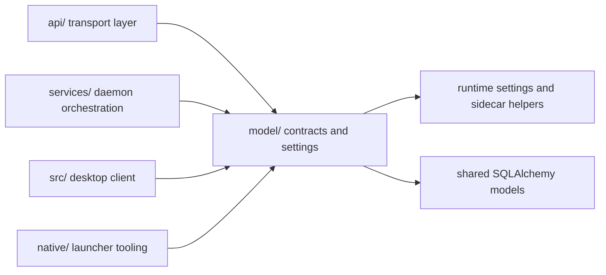

# Model

The `model/` package provides AIRunner's shared runtime contracts, data
models, database metadata, and runtime helpers that can be imported by the
API, services, GUI client, and native tooling without dragging GUI code
into headless paths.



## What This Package Owns

- shared request, response, and runtime contract types
- SQLAlchemy models and database helpers used across packages
- runtime settings resolution and sidecar runtime helpers
- shared persistence primitives used by the split package stack

The package architecture is summarized in
[docs/architecture/layered_product_architecture.md](../docs/architecture/layered_product_architecture.md),
and the current extraction status is tracked in
[docs/architecture/api_model_extraction_plan.md](../docs/architecture/api_model_extraction_plan.md).

## Installation

For full repo development, prefer the developer installer:

```bash
./scripts/install.sh
```

For isolated model-contract work, install the package directly:

```bash
python -m venv venv
source venv/bin/activate
pip install --upgrade pip setuptools wheel
pip install -e ./model[development]
```

Add `-e ./api`, `-e ./services`, `-e ./native`, or `-e .` on top of that
when you need to exercise the model package through its consumers.

## Test Running

`model/` is primarily validated through consumer-facing tests because its
contracts and runtime helpers are exercised by the daemon and GUI layers.
Start with the bootstrap import sanity check:

```bash
./venv/bin/python -m pytest api/tests/test_service_bootstrap.py -v
```

Then use the composed functional suites that cover the runtime helpers this
package feeds:

```bash
./venv/bin/python -m pytest api/tests/test_tts_runtime_load.py -v
./venv/bin/python -m pytest api/tests/test_tts_synthesize_functional.py -v --timeout=120
./venv/bin/python -m pytest api/tests/test_stt_transcribe_functional.py -v --timeout=1200
./venv/bin/python -m pytest api/tests/test_llm_functional.py -v --timeout=900
```

Those tests validate the same model-owned settings and runtime helper
paths that the daemon and GUI rely on in production.