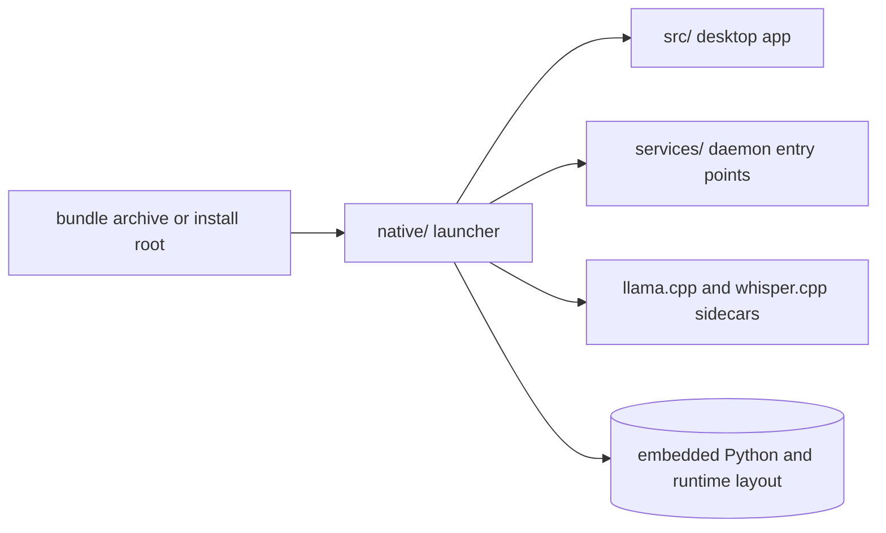

# Native

The `native/` package owns AIRunner's launcher, bundle assembly, and the
installer-facing logic that turns the Python packages and sidecars into a
deliverable desktop application.



## What This Package Owns

- the `airunner` launcher entry point provided by `airunner_native`
- end-user bundle assembly and runtime layout helpers
- installer-facing bootstrap logic for bundled desktop delivery
- repo-local support for pinned `llama.cpp` and `whisper.cpp` sidecars

Importable native code lives under `native/src/airunner_native/`.

## Installation

AIRunner supports three installer paths, and `native/` is involved in all
of them:

```bash
# single-package end-user install
./install.sh --bundle-archive dist/airunner-<version>-linux-desktop-bundle.tar.gz

# repo-local developer install
./scripts/install.sh

# distributed daemon and GUI-client install
./deployment/install_distributed.sh --role daemon
./deployment/install_distributed.sh --role gui-client
```

For isolated native tooling work in a checkout, install the split package
stack first and then install `native/` in editable mode:

```bash
python -m venv venv
source venv/bin/activate
pip install --upgrade pip setuptools wheel
pip install -e ./model
pip install -e ./api
pip install -e ./services
pip install -e ./native[development]
```

## Test Running

Native changes are validated through installer and launcher smoke checks plus
the daemon-backed functional suites that consume the built sidecars:

```bash
./scripts/install.sh --help
./deployment/install_distributed.sh --help
./scripts/build_runtime_sidecars.sh --target-platform linux
./venv/bin/python -m pytest api/tests/test_llm_functional.py -v --timeout=900
./venv/bin/python -m pytest api/tests/test_stt_transcribe_functional.py -v --timeout=1200
```

Use the package split contract in
[docs/architecture/package_split_contract.md](../docs/architecture/package_split_contract.md)
when a launcher or installer change affects the wider package matrix.