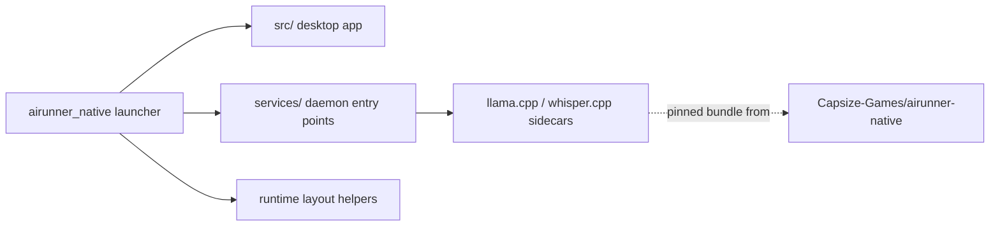

# Native

The `native/` package owns AIRunner's Python launcher entry point and
runtime layout helpers.

AIRunner is a Python application. There is no compiled C++ launcher and no
bundle/installer packaging; the desktop app runs directly from the installed
Python packages.

The `llama.cpp` / `whisper.cpp` sidecar binaries this launcher's runtime
depends on are no longer built here -- that build uses a different
toolchain (`cmake`/`mingw-w64`/`ninja`) and changes on its own cadence,
unrelated to this Python code, so it lives in its own repository,
[Capsize-Games/airunner-native](https://github.com/Capsize-Games/airunner-native).
`./scripts/install.sh` downloads the pinned bundle from there (see
`.github/native-sidecar-version` at the repo root for which release).


```mermaid
flowchart LR
	Python[airunner_native launcher] --> GUI[src/ desktop app]
	Python --> Services[services/ daemon entry points]
	Services --> Sidecars[llama.cpp / whisper.cpp sidecars]
	Sidecars -.pinned bundle from.-> NativeRepo[Capsize-Games/airunner-native]
	Python --> RuntimeLayout[runtime layout helpers]
```

## What This Package Owns

- the `airunner-native` launcher entry point provided by `airunner_native`
  (the GUI package owns the primary `airunner` command; issue #2042)
- repo and runtime layout helpers (`repo_paths`, `linux_bundle_layout`)
- startup environment and early torch/allocator configuration

Importable native code lives under `native/src/airunner_native/`.

The architecture audit and package map are tracked in
[docs/architecture/architecture-complexity-audit.md](../docs/architecture/architecture-complexity-audit.md)
and
[docs/architecture/layered_product_architecture.md](../docs/architecture/layered_product_architecture.md).

## Installation

AIRunner is installed as Python packages:

```bash
# repo-local developer install
./scripts/install.sh

# distributed daemon and GUI-client install
./deployment/install_distributed.sh --role daemon
./deployment/install_distributed.sh --role gui-client
```

For isolated native tooling work in a checkout, install the split package
stack first and then install `native/` in editable mode:

```bash
python -m venv venv
source venv/bin/activate
pip install --upgrade pip setuptools wheel
pip install -e ./services
pip install -e ./native[development]
```

## Test Running

Native changes are validated through the launcher smoke path (the Python
launcher entry point) plus the daemon-backed functional suites that consume
the built sidecars:

```bash
./scripts/install.sh --help
./deployment/install_distributed.sh --help
./venv/bin/python -m pytest services/tests/test_llm_functional.py -v --timeout=900
./venv/bin/python -m pytest services/tests/test_stt_transcribe_functional.py -v --timeout=1200
```

Building the sidecars themselves from source (for a CUDA build, or to
work on the build script) happens in
[Capsize-Games/airunner-native](https://github.com/Capsize-Games/airunner-native)
now: `./scripts/install.sh --sidecars-cuda` clones the pinned tag and
builds it there automatically.

Use the package split contract in
[docs/architecture/package_split_contract.md](../docs/architecture/package_split_contract.md)
when a launcher or installer change affects the wider package matrix.
