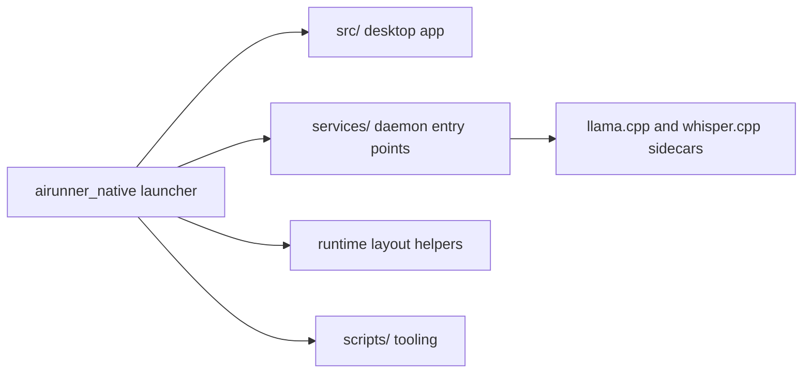

# Native

The `native/` package owns AIRunner's Python launcher entry point, runtime
layout helpers, and the pinned `llama.cpp` / `whisper.cpp` sidecar support.

AIRunner is a Python application. There is no compiled C++ launcher and no
bundle/installer packaging; the desktop app runs directly from the installed
Python packages.


```mermaid
flowchart LR
	Python[airunner_native launcher] --> GUI[src/ desktop app]
	Python --> Services[services/ daemon entry points]
	Services --> Sidecars[llama.cpp and whisper.cpp sidecars]
	Python --> RuntimeLayout[runtime layout helpers]
	Python --> Scripts[scripts/ tooling]
```

## What This Package Owns

- the `airunner` launcher entry point provided by `airunner_native`
- repo and runtime layout helpers (`repo_paths`, `linux_bundle_layout`)
- startup environment and early torch/allocator configuration
- repo-local support for pinned `llama.cpp` and `whisper.cpp` sidecars

Importable native code lives under `native/src/airunner_native/`.

The architecture audit and package map are tracked in
[docs/architecture/architecture-complexity-audit.md](../docs/architecture/architecture-complexity-audit.md)
and
[docs/architecture/layered_product_architecture.md](../docs/architecture/layered_product_architecture.md).

## Installation

AIRunner is installed as Python packages:

```bash
# repo-local developer install
./scripts/install.sh

# distributed daemon and GUI-client install
./deployment/install_distributed.sh --role daemon
./deployment/install_distributed.sh --role gui-client
```

For isolated native tooling work in a checkout, install the split package
stack first and then install `native/` in editable mode:

```bash
python -m venv venv
source venv/bin/activate
pip install --upgrade pip setuptools wheel
pip install -e ./services
pip install -e ./native[development]
```

## Test Running

Native changes are validated through the launcher smoke path (the Python
launcher entry point) plus the daemon-backed functional suites that consume
the built sidecars:

```bash
./scripts/install.sh --help
./deployment/install_distributed.sh --help
./scripts/build_runtime_sidecars.sh --target-platform linux
./venv/bin/python -m pytest services/tests/test_llm_functional.py -v --timeout=900
./venv/bin/python -m pytest services/tests/test_stt_transcribe_functional.py -v --timeout=1200
```

Use the package split contract in
[docs/architecture/package_split_contract.md](../docs/architecture/package_split_contract.md)
when a launcher or installer change affects the wider package matrix.
