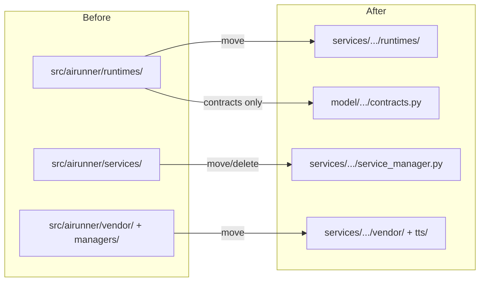

# Migration Plans: Runtimes, Services, TTS

## 1. Runtimes Migration: `src/airunner/runtimes/` → `services/src/airunner_services/runtimes/`

### Current State
`src/airunner/runtimes/` has 21 files managing sidecar process lifecycle:
- `bootstrap.py` — creates `RuntimeRegistry`, registers all sidecar clients
- `registry.py` — `RuntimeRegistry` class
- `base.py` — `RuntimeClient` base class
- `contracts.py` — `RuntimeKind`, `RuntimeAction`, `RuntimeDescriptor`, etc. (enums/dataclasses)
- `sidecar_*.py` — 12 files for Art, LLM, STT, TTS sidecar clients/launchers/executors
- `*_settings.py` — 4 runtime settings classes
- `bundled_runtime_paths.py` — resolves executable paths

### What Imports It
| Importer | What | Usage |
|----------|------|-------|
| `app.py:44` | `build_runtime_registry` | Creates registry at App startup |
| `app.py:110` | `self.runtime_registry` | Stored but barely used |
| `lifecycle_service.py:82` | `runtime_registry` | Status check only |
| `ipc/messages.py:11` | `RuntimeAction`, `RuntimeKind` | IPC message enums |

### Target Architecture
- The **daemon** already creates its own `RuntimeRegistry` via `service_app.py`
- The **GUI** should NOT create sidecar processes — the daemon handles that
- The GUI only needs `RuntimeAction` and `RuntimeKind` for IPC messages (or those can move too)

### Steps
1. **Move contracts to model**: `RuntimeAction`, `RuntimeKind`, `RuntimeDescriptor`, `RuntimeHealth` → `model/src/airunner_model/contracts.py` (shared between GUI and services)
2. **Move sidecar management to services**: All 21 files → `services/src/airunner_services/runtimes/`
3. **Remove from GUI**: Delete `build_runtime_registry()` call in `app.py`; remove `self.runtime_registry`
4. **Update imports**: `ipc/messages.py` imports from `airunner_model.contracts` instead

### Impact
- **Low risk**: The runtime registry in the GUI is barely used
- `ipc/messages.py` needs simple import update
- `lifecycle_service.py` status check becomes always `False` (acceptable)

---

## 2. Services Migration: `src/airunner/services/` → `services/src/airunner_services/`

### Current State
| File | Imported By | Purpose |
|------|------------|---------|
| `daemon_config.py` | `gui_daemon_client.py`, `bin/airunner_headless.py`, sidecar launchers | Daemon port/host config |
| `lifecycle_service.py` | `headless_runtime_mixin.py` | Core lifecycle for headless mode |
| `service_manager.py` | `bin/airunner_service.py` | Systemd service management |

### Target Architecture
- `daemon_config.py` — already exists in `services/src/airunner_services/api/daemon_config.py`? Let me check.
- `lifecycle_service.py` — used by `headless_runtime_mixin.py` which we're deleting. Can be removed.
- `service_manager.py` — systemd/Linux service management. Move to services package.

### Steps
1. **Check `daemon_config.py`**: If already in services, delete from GUI. Update `gui_daemon_client.py` import.
2. **Delete `lifecycle_service.py`**: Only used by `headless_runtime_mixin.py` (which we're deleting). Its tests also deleted.
3. **Move `service_manager.py`**: → `services/src/airunner_services/service_manager.py`
4. **Update `bin/airunner_service.py`**: Import from new location

---

## 3. TTS Migration: Inference → Services

### Current State
TTS has these components in `src/airunner`:

| Layer | Path | Purpose |
|-------|------|---------|
| **Vendor** | `vendor/melo/` (40+ files) | MeloTTS inference engine |
| **Vendor** | `vendor/openvoice/` (15 files) | OpenVoice voice cloning |
| **Managers** | `components/tts/managers/openvoice_model_manager.py` | Model loading |
| **Managers** | `components/tts/managers/openvoice_runtime_helpers.py` | Runtime helpers |
| **Workers** | `components/tts/workers/tts_generator_worker.py` | Already deleted (Phase 1) |
| **Workers** | `components/tts/workers/tts_vocalizer_worker.py` | Audio playback — KEEP |
| **Tests** | `components/tts/tests/` (9 files) | TTS tests |

### Target Architecture
- **GUI**: Only `tts_vocalizer_worker.py` — receives audio bytes, plays through system speakers
- **Services**: All Melo/OpenVoice vendor code + model managers — runs inference
- The GUI sends TTS requests via daemon API → `/api/v1/tts/synthesize`
- The daemon returns WAV audio bytes
- The vocalizer plays the received audio

### Steps
1. **Move vendor code**: `vendor/melo/` + `vendor/openvoice/` → `services/src/airunner_services/vendor/`
2. **Move managers**: `components/tts/managers/` → `services/src/airunner_services/tts/managers/`
3. **Move tests**: `components/tts/tests/` → `services/tests/tts/`
4. **Keep vocalizer**: `components/tts/workers/tts_vocalizer_worker.py` stays (playback only)
5. **Update imports**: All vendor/manager references updated to services paths

### Verification
- TTS synthesis should still work: GUI → daemon `/api/v1/tts/synthesize` → services-side TTS inference → WAV bytes → vocalizer plays
- The daemon already has this endpoint working (test services confirmed it)

---

## Summary: All Three Migrations

### Files to Move (total: ~80 files)
| From | To | Count |
|------|-----|-------|
| `src/airunner/runtimes/` | `services/src/airunner_services/runtimes/` | ~21 |
| `src/airunner/services/` | Delete (redundant) | ~3 |
| `src/airunner/vendor/melo/` | `services/src/airunner_services/vendor/melo/` | ~40 |
| `src/airunner/vendor/openvoice/` | `services/src/airunner_services/vendor/openvoice/` | ~15 |
| `src/airunner/components/tts/managers/` | `services/src/airunner_services/tts/managers/` | ~2 |
| `src/airunner/components/tts/tests/` | `services/tests/tts/` | ~9 |
| `src/airunner/ipc/messages.py` | Update import only | 0 |
