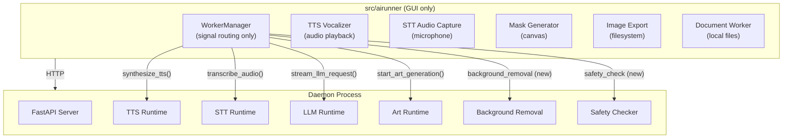

# Plan: Remaining Worker Migration + Daemon Startup Fix

## Part A: Daemon Startup Reliability Fix

### Root Cause
The daemon auto-starts via `DaemonLauncher`, but `_daemon_is_immediately_available()` uses a **0.2 second timeout** — far too short for a process that takes 2-5 seconds to initialize. Before the LLM/SD worker removal, the local fallback masked this. Now it fails immediately.

### Fix

**File: [`src/airunner/components/llm/api/llm_services.py`](src/airunner/components/llm/api/llm_services.py)**

In `_send_request_via_daemon()` (line ~355), the method checks `client is None or not request_id` then returns `False`. The caller (`send_request`) then logs an error. Instead, we should:

1. Add a retry loop with exponential backoff (up to 10 seconds) when the daemon is not yet available
2. If after waiting the daemon still isn't available, THEN fail with an error

**Option A**: Change `_daemon_is_immediately_available` timeout from 0.2s to 5s:
```python
return bool(availability_check(timeout_seconds=5.0))  # was 0.2
```

**Option B**: Add retry logic in `_run_daemon_request_or_fallback`:
```python
def _run_daemon_request_or_fallback(self, client, ...):
    deadline = time.monotonic() + 10.0
    while time.monotonic() < deadline:
        if self._daemon_is_immediately_available(client):
            break
        time.sleep(0.5)
    else:
        self.logger.error("Daemon not available after waiting 10s")
        return
    # ... proceed with daemon request
```

**Recommendation**: Option B (retry loop) — preserves fast path when daemon is already running but gives it time to start.

### Alternative: Ensure daemon is ready at GUI startup

We could also add a daemon readiness check during main window initialization in [`main_window.py`](src/airunner/components/application/gui/windows/main/main_window.py) or during `WorkerManager` init. This would block the GUI until the daemon is ready, providing a better UX.

---

## Part B: Remaining Worker Migration Plan

### Status of Remaining Local Workers

| Worker | Has Services Eq. | Has API Route | Has Daemon Client Method | Migratable Now? |
|--------|:---:|:---:|:---:|:---:|
| **TTS Generator** | ✅ | ✅ `/tts/synthesize` | ✅ `synthesize_tts()` | **Yes** |
| **TTS Vocalizer** | ❌ | ❌ | ❌ | No — audio playback is inherently local (uses system audio) |
| **STT Audio Capture** | ❌ | ❌ | ❌ | No — microphone capture is inherently local (uses system audio) |
| **STT Audio Processor** | ✅ | ✅ `/stt/*` | ✅ `transcribe_audio()` | **Yes** |
| **Background Removal** | ✅ | ❌ | ❌ | Needs API route + client method |
| **Image Export** | ✅ | ❌ | ❌ | Needs API route + client method |
| **Mask Generator** | ❌ | ❌ | ❌ | Canvas operation — may stay local |
| **Safety Checker** | ✅ | ❌ | ❌ | Needs API route + client method |
| **Document Worker** | ❌ | ❌ | ❌ | File I/O — may stay local |
| **HF Download** | ✅ (in `downloads/`) | ✅ `/downloads/*` | ? | Check daemon client |
| **Model Scanner** | ✅ | ❌ | ❌ | Needs API route + client method |

### Key Insight

Some workers are inherently GUI-side operations that cannot be moved to a daemon:
- **TTS Vocalizer** — plays audio through system speakers
- **STT Audio Capture** — captures microphone input from the user's device
- **Mask Generator** — operates on the GUI canvas (pixel-level mask drawing)
- **Document Worker** — local file I/O for document processing
- **Image Export** — writes files to the user's local filesystem

These CAN be partially moved: the heavy processing (STT transcription, TTS synthesis) goes to daemon, but the I/O (capture, playback, file read/write) stays local.

### Recommended Migration Phases

#### Phase A: TTS/STT (Highest Impact, Easiest)

**TTS Flow (target)**:
```
GUI sends text → daemon /tts/synthesize → returns audio bytes → local vocalizer plays
```
- Keep `tts_vocalizer_worker.py` (audio playback is local)
- Remove `tts_generator_worker.py` (synthesis goes through daemon)
- WorkerManager TTS signal handlers → route through `GuiDaemonClient.synthesize_tts()`
- The `tts_vocalizer_worker` only handles playback, not synthesis

**STT Flow (target)**:
```
Microphone → local audio_capture_worker (records audio) → daemon /stt/transcribe → returns text
```
- Keep `audio_capture_worker.py` (microphone is local hardware)
- Remove `audio_processor_worker.py` (transcription goes through daemon)
- WorkerManager STT signal handlers → route through `GuiDaemonClient.transcribe_audio()`

#### Phase B: Art Utilities (Medium Impact)

- **Background Removal**: Route through daemon; needs new API endpoint
- **Safety Checker**: Route through daemon; needs new API endpoint
- **Mask Generator**: Keep local (canvas operation)
- **Image Export**: Keep local (filesystem I/O)

#### Phase C: Infrastructure (Lower Priority)

- **HF Download**: Already has services-side and API route; may need daemon client method
- **Model Scanner**: Already has services-side; needs API route + client method
- **Document Worker**: Keep local (filesystem I/O) or add API route for heavy processing

### WorkerManager End State

After all migrations, WorkerManager should only handle:
1. Signal routing to daemon for heavy processing
2. TTS vocalizer (audio playback)
3. STT audio capture (microphone)
4. Mask generator (canvas)
5. Image export (filesystem)
6. Document worker (filesystem)
7. Downloads (can also go through daemon eventually)

---

## Execution Order

```
1. Fix daemon startup (retry loop in _run_daemon_request_or_fallback)
2. TTS migration (remove tts_generator_worker, route through daemon)
3. STT migration (remove audio_processor_worker, route through daemon)
4. Background removal migration (add API route + daemon client method)
5. Safety checker migration (add API route + daemon client method)
6. Download/model scanner migration (add API routes + daemon client methods)
```

## Mermaid: Target Architecture


