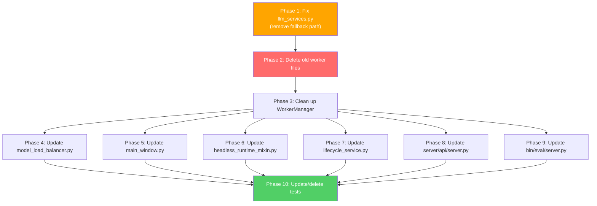

# Plan: Remove Redundant LLM/SD Workers from `src/airunner`

## Problem Summary

The `handle_message` method in [`src/airunner/components/llm/workers/llm_generate_worker.py`](src/airunner/components/llm/workers/llm_generate_worker.py:461) is almost entirely commented out (lines 473-579). When the daemon is unavailable and the local fallback path is triggered, requests are queued but never processed — causing LLM generation to silently fail.

The real, functional implementations live in `services/src/airunner_services/workers/`:
- [`services/src/airunner_services/workers/llm_generate_worker.py`](services/src/airunner_services/workers/llm_generate_worker.py)
- [`services/src/airunner_services/workers/sd_worker.py`](services/src/airunner_services/workers/sd_worker.py)

## Design Decision

**The daemon should always be required. Remove all local fallback paths. Show errors if daemon is unavailable.** This aligns with the re-architecture goal of `src/airunner` being purely a GUI layer that communicates with services via the API/daemon.

---

## Architecture: Current vs. Target

```mermaid
flowchart TD
    subgraph CURRENT["Current (Broken)"]
        GUI1["GUI sends message"]
        API1["LLMAPIService.send_request()"]
        DAEMON1{"Daemon available?"}
        HTTP1["HTTP → /api/v1/llm/chat/stream ✓"]
        FALLBACK1["Signal → WorkerManager → llm_generate_worker"]
        QUEUE1["Queue item added"]
        BROKEN["handle_message() IS COMMENTED OUT ✗"]

        GUI1 --> API1
        API1 --> DAEMON1
        DAEMON1 -- yes --> HTTP1
        DAEMON1 -- no --> FALLBACK1
        FALLBACK1 --> QUEUE1
        QUEUE1 --> BROKEN
    end

    subgraph TARGET["Target (Fixed)"]
        GUI2["GUI sends message"]
        API2["LLMAPIService.send_request()"]
        DAEMON2{"Daemon available?"}
        HTTP2["HTTP → /api/v1/llm/chat/stream ✓"]
        ERROR2["Log error / show message to user"]

        GUI2 --> API2
        API2 --> DAEMON2
        DAEMON2 -- yes --> HTTP2
        DAEMON2 -- no --> ERROR2
    end

    style BROKEN fill:#ff6b6b,color:#fff
    style ERROR2 fill:#ffa500,color:#fff
    style HTTP1 fill:#51cf66,color:#fff
    style HTTP2 fill:#51cf66,color:#fff
```

---

## Files to Delete

### LLM Worker Files
| File | Reason |
|------|--------|
| `src/airunner/components/llm/workers/llm_generate_worker.py` | `handle_message` is fully commented out; real impl in services |
| `src/airunner/components/llm/workers/llm_response_worker.py` | Related response worker; no longer needed locally |
| `src/airunner/components/llm/workers/llm_chat_prompt_worker.py` | Chat prompt formatting worker; belongs in services |
| `src/airunner/components/llm/workers/agent_worker.py` | Agent orchestration worker; belongs in services |
| `src/airunner/components/llm/workers/mixins/model_download_mixin.py` | Only used by llm_generate_worker |
| `src/airunner/components/llm/workers/mixins/quantization_mixin.py` | Only used by llm_generate_worker |
| `src/airunner/components/llm/workers/mixins/rag_indexing_mixin.py` | Only used by llm_generate_worker |
| `src/airunner/components/llm/workers/mixins/__init__.py` | Empty after mixins deleted |
| `src/airunner/components/llm/workers/__init__.py` | Empty after workers deleted |
| `src/airunner/components/llm/workers/tests/test_llm_generate_worker_pending_request.py` | Tests for deleted worker |
| `src/airunner/components/llm/workers/tests/__init__.py` | Empty after tests deleted |

### Art Worker Files
| File | Reason |
|------|--------|
| `src/airunner/components/art/workers/sd_worker.py` | SD generation should go through daemon only |
| `src/airunner/components/art/tests/test_sd_worker_daemon_runtime.py` | Tests for deleted worker |

### Note: Files to KEEP in `src/airunner/components/art/workers/`
These workers handle GUI-side operations that are not model inference — they stay:
- `background_removal_worker.py` — image processing, not model inference
- `image_export_worker.py` — file I/O from GUI canvas
- `mask_generator_worker.py` — canvas mask operations
- `safety_checker_worker.py` — safety checking (may be transitional)

---

## Files to Modify

### Phase 1: [`src/airunner/components/llm/api/llm_services.py`](src/airunner/components/llm/api/llm_services.py)

**Goal:** Remove all local fallback paths. Make daemon required.

**`send_request()` method (line 45):**
- Remove the `_emit_local_generation_request` fallback on line 133
- When daemon is unavailable, log an error and emit a user-visible error signal
- Keep the `_send_request_via_daemon` path as the only path

**`_local_llm_should_handle_unload()` method (line 206):**
- Remove entirely — this checks `_llm_generate_worker` which will no longer exist
- `unload()` should always go through daemon or log error

**`_emit_local_generation_request()` method (line 406):**
- Remove entirely

**`unload()` method (line 182):**
- Remove `_local_llm_should_handle_unload` check
- Always route through daemon; if no daemon, log error

### Phase 2: Delete Files
See "Files to Delete" section above.

### Phase 3: [`src/airunner/components/application/gui/windows/main/worker_manager.py`](src/airunner/components/application/gui/windows/main/worker_manager.py)

**Goal:** Remove `llm_generate_worker` and `sd_worker` properties. Remove or redirect all signal handlers that route to these workers.

**Properties to remove:**
- `llm_generate_worker` property (lines 363-371)
- `sd_worker` property (lines 292-301)
- `_llm_generate_worker` attribute (line 105)
- `_sd_worker` attribute (line 94)

**Signal handlers to remove or redirect (LLM-related):**

| Signal | Handler | Action |
|--------|---------|--------|
| `LLM_TEXT_GENERATE_REQUEST_SIGNAL` | `on_llm_request_signal` | **Redirect** — this should never be reached now; add a warning log and no-op |
| `LLM_UNLOAD_SIGNAL` | `on_llm_on_unload_signal` | Already has `_control_daemon_runtime_async` — keep daemon path, remove local fallback |
| `LLM_LOAD_SIGNAL` | `on_llm_load_model_signal` | Already has `_control_daemon_runtime_async` — keep daemon path, remove local fallback |
| `LLM_MODEL_CHANGED` | `on_llm_model_changed_signal` | Already has daemon path — remove local worker forward |
| `LLM_MODEL_DOWNLOAD_REQUIRED` | `on_llm_model_download_required_signal` | Remove local worker forward; downloads should go through daemon |
| `LLM_CONVERT_TO_GGUF_SIGNAL` | `on_llm_convert_to_gguf_signal` | Remove local worker forward |
| `RAG_RELOAD_INDEX_SIGNAL` | `on_llm_reload_rag_index_signal` | Remove local worker forward |
| `RAG_UNLOAD_SIGNAL` | `on_llm_unload_rag_signal` | Remove local worker forward |
| `RAG_INDEX_ALL_DOCUMENTS` | `on_rag_index_all_documents_signal` | Remove local worker forward |
| `RAG_INDEX_SELECTED_DOCUMENTS` | `on_rag_index_selected_documents_signal` | Remove local worker forward |
| `RAG_INDEX_CANCEL` | `on_rag_index_cancel_signal` | Remove local worker forward |
| `RAG_LOAD_DOCUMENTS` | `on_rag_load_documents_signal` | Remove local worker forward |
| `INDEX_DOCUMENT` | `on_index_document_signal` | Remove local worker forward |
| `LLM_START_QUANTIZATION` | `on_llm_start_quantization_signal` | Remove local worker forward |
| `LLM_CLEAR_HISTORY_SIGNAL` | `on_llm_clear_history_signal` | Remove local worker forward |
| `ADD_CHATBOT_MESSAGE_SIGNAL` | `on_llm_add_chatbot_response_to_history` | Remove local worker forward |
| `LOAD_CONVERSATION` | `on_llm_load_conversation` | Remove local worker forward |
| `CONVERSATION_DELETED` | `on_conversation_deleted_signal` | Remove local worker forward |
| `SECTION_CHANGED` | `on_section_changed_signal` | Remove local worker forward |
| `INTERRUPT_PROCESS_SIGNAL` | `on_interrupt_process_signal` | Remove LLM worker interrupt; keep TTS/STT parts |

**Signal handlers to remove or redirect (SD-related):**

| Signal | Handler | Action |
|--------|---------|--------|
| `DO_GENERATE_SIGNAL` | `on_do_generate_signal` | Already has `_control_daemon_runtime_async` — keep daemon path, remove local fallback |
| `SD_UNLOAD_SIGNAL` | `on_unload_art_signal` | Already has `_control_daemon_runtime_async` — keep daemon path |
| `SD_CANCEL_SIGNAL` | `on_sd_cancel_signal` | Remove local worker forward |
| `STOP_AUTO_IMAGE_GENERATION_SIGNAL` | `on_stop_auto_image_generation_signal` | Remove local worker forward |
| `INTERRUPT_IMAGE_GENERATION_SIGNAL` | `on_interrupt_image_generation_signal` | Remove local worker forward |
| `CHANGE_SCHEDULER_SIGNAL` | `on_change_scheduler_signal` | Remove local worker forward |
| `SD_LOAD_SIGNAL` | `on_load_art_signal` | Already has daemon path — remove local fallback |
| `SD_ART_MODEL_CHANGED` | `on_art_model_changed` | Remove local worker forward |
| `CONTROLNET_LOAD_SIGNAL` | `on_load_controlnet_signal` | Remove local worker forward |
| `CONTROLNET_UNLOAD_SIGNAL` | `on_unload_controlnet_signal` | Remove local worker forward |
| `SAFETY_CHECKER_LOAD_SIGNAL` | `on_safety_checker_load_signal` | Remove local worker forward |
| `SAFETY_CHECKER_UNLOAD_SIGNAL` | `on_safety_checker_unload_signal` | Remove local worker forward |
| `INPUT_IMAGE_SETTINGS_CHANGED` | `on_input_image_settings_changed_signal` | Remove local worker forward |
| `LORA_UPDATE_SIGNAL` | `on_update_lora_signal` | Remove local worker forward |
| `EMBEDDING_UPDATE_SIGNAL` | `on_update_embeddings_signal` | Remove local worker forward |
| `EMBEDDING_DELETE_MISSING_SIGNAL` | `delete_missing_embeddings` | Remove local worker forward |
| `START_AUTO_IMAGE_GENERATION_SIGNAL` | `on_start_auto_image_generation_signal` | Remove local worker forward |
| `ART_MODEL_DOWNLOAD_REQUIRED` | `on_art_model_download_required` | Remove local worker forward |
| `MODEL_STATUS_CHANGED_SIGNAL` | `on_model_status_changed_signal` | Remove SD worker forwarding; keep TTS/STT parts |
| `RMBG_UNLOAD_SIGNAL` | `on_unload_rmbg_signal` | **KEEP** — routes to `background_removal_worker`, not `sd_worker` |

**Queue processing in `handle_message` or equivalent:**
- Remove cases for `"llm_generate"` and `"image_generate"` / `"image_auto_generate"`

**Download completion routing:**
- Currently routes to `llm_generate_worker` for non-TTS/non-STT model downloads (line 1339)
- Remove or redirect this

### Phase 4: [`src/airunner/components/application/gui/windows/main/model_load_balancer.py`](src/airunner/components/application/gui/windows/main/model_load_balancer.py)

**Goal:** Remove direct references to old workers. Use daemon API for model status.

Changes needed:
- Remove `worker_manager.llm_generate_worker` references (lines 93, 143, 156, 177)
- Remove `worker_manager.sd_worker` references (lines 116-117, 180)
- Remove `_llm_generate_worker` reference (line 191)
- Replace with daemon status API calls where possible, or mark as TODO for later migration

### Phase 5: [`src/airunner/components/application/gui/windows/main/main_window.py`](src/airunner/components/application/gui/windows/main/main_window.py)

**Goal:** Remove `_llm_generate_worker` references.

Changes needed:
- Lines 2842-2844: Model status check using `_llm_generate_worker` — replace with daemon status
- Lines 2867-2869: Another model status check using `_llm_generate_worker` — replace with daemon status

### Phase 6: [`src/airunner/app_mixins/headless_runtime_mixin.py`](src/airunner/app_mixins/headless_runtime_mixin.py)

**Goal:** Remove RAG-related `llm_generate_worker` references.

Changes needed:
- `rag_manager` property (line 261-265): Returns `worker_manager.llm_generate_worker.model_manager` — replace with daemon API or remove
- `on_rag_load_documents_signal` (line 267-292): Routes to `worker_manager.llm_generate_worker.on_rag_load_documents_signal` — route through daemon instead

### Phase 7: [`src/airunner/services/lifecycle_service.py`](src/airunner/services/lifecycle_service.py)

**Goal:** Remove `llm_generate_worker` access during initialization.

Changes needed:
- Line 49: `_ = self.worker_manager.llm_generate_worker` — this was likely a pre-warm — remove

### Phase 8: [`src/airunner/components/server/api/server.py`](src/airunner/components/server/api/server.py)

**Goal:** Remove `_llm_generate_worker` and `_sd_worker` references.

Changes needed:
- `_llm_loaded_from_worker` static method (line 233-257): References `_llm_generate_worker` — replace with daemon status or remove
- Lines 316-335: References to `_sd_worker` for model status — replace with daemon status

### Phase 9: [`src/airunner/bin/eval/server.py`](src/airunner/bin/eval/server.py)

**Goal:** Remove `_llm_generate_worker` diagnostics.

Changes needed:
- Lines 32-37: Checks for `_llm_generate_worker` attribute — remove this diagnostic

### Phase 10: Test Files

**Delete:**
- `src/airunner/components/llm/workers/tests/test_llm_generate_worker_pending_request.py`
- `src/airunner/components/art/tests/test_sd_worker_daemon_runtime.py`

**Update (remove old worker mocking):**
- `src/airunner/components/application/tests/test_worker_manager_daemon_runtime.py` — mocks `_llm_generate_worker` and `_sd_worker` extensively
- `src/airunner/components/application/tests/test_main_window_model_status.py` — mocks `_llm_generate_worker`
- `src/airunner/components/application/tests/test_daemon_model_load_balancer.py` — mocks `_llm_generate_worker`
- `src/airunner/components/llm/api/tests/test_llm_services_daemon_bridge.py` — mocks `_llm_generate_worker`
- `src/airunner/components/server/tests/test_server_art_loaded_state.py` — mocks `_sd_worker`
- `src/airunner/components/server/tests/test_server_llm_loaded_state.py` — mocks `_llm_generate_worker`
- `src/airunner/services/tests/test_lifecycle_service.py` — mocks `llm_generate_worker`

---

## Execution Order (Dependency Graph)

---

## Risks and Mitigations

| Risk | Mitigation |
|------|-----------|
| Daemon not running when user makes LLM request | Log clear error message; consider adding a GUI notification that daemon must be running |
| TTS/STT workers also need similar treatment | Out of scope for this task; TTS/STT workers in WorkerManager are NOT being removed here |
| `server/api/server.py` is a large legacy file (3175 lines) | Be surgical — only remove the worker references, don't attempt a full refactor |
| Test files may reference old workers in complex ways | Accept that some tests will break and need careful updating or deletion |
| RAG functionality currently depends on `llm_generate_worker.model_manager` | Route RAG through daemon API endpoints; may need new daemon endpoints if they don't exist yet |
