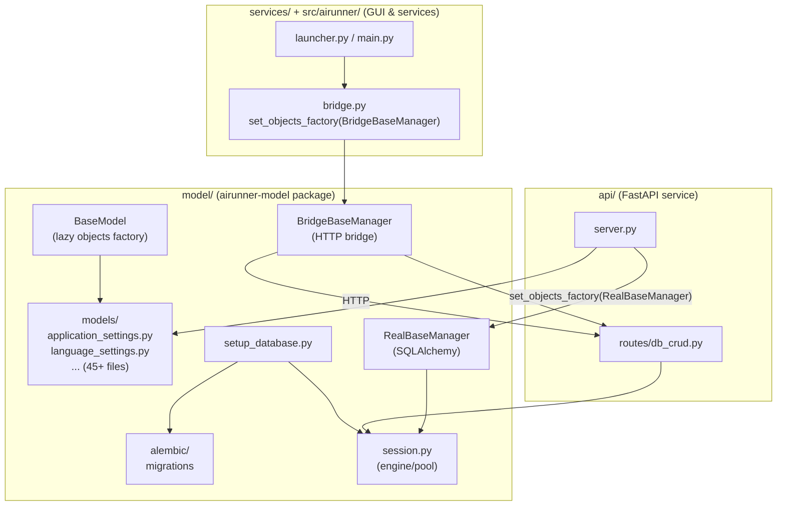

# Consolidated Data Models Architecture Plan

## Current State (problems to solve)

```
services/src/airunner_services/database/models/    ← 45+ model definitions (ORM)
src/airunner/components/settings/data/              ← 45+ DUPLICATE model definitions
├── application_settings.py    (with QSettings properties added)
├── language_settings.py       (with QSettings properties added)
└── ...
services/src/airunner_services/database/alembic/    ← Migrations
services/src/airunner_services/setup_database.py    ← DB setup (alembic runner)
src/airunner/components/data/models/base.py         ← Bridged to services layer
```

Three copies of every model: `src/airunner`, `services/database/models/`, and some in `api/`. The `src/airunner` versions have QSettings-backed @property overrides; the `services` versions are pure ORM.

---

## Target Architecture

### Package Layout

```
model/                                    # ← airunner-model (canonical package)
├── package_metadata.py                   # Update: add sqlalchemy dep
├── setup.py                              # Unchanged
├── README.md
└── src/airunner_model/
    ├── __init__.py                       # Update: export models + contracts
    ├── contracts.py                      # Existing
    ├── settings.py                       # Existing (AIRUNNER_LOG_LEVEL, etc)
    ├── base.py                           # NEW: Base, BaseModel with lazy objects
    ├── base_manager.py                   # NEW: RealBaseManager (SQLAlchemy)
    ├── bridge_manager.py                 # NEW: BridgeBaseManager (HTTP bridge)
    ├── session.py                        # NEW: session_scope for direct ORM
    ├── setup_database.py                 # MOVED from services/ → model owns DB setup
    ├── models/                           # NEW: canonical data models
    │   ├── __init__.py                   # Re-exports all models
    │   ├── application_settings.py       # Pure Columns + QSettings @property
    │   ├── language_settings.py          # Pure Columns + QSettings @property
    │   ├── path_settings.py
    │   ├── ... (all 45+ models)
    │   └── zimfile.py
    ├── alembic/                          # MOVED from services/
    │   ├── alembic.ini
    │   ├── env.py
    │   ├── script.py.mako
    │   └── versions/                     # All migration files
    ├── art/                              # Existing runtime models
    ├── llm/                              # Existing
    ├── runtimes/                         # Existing
    └── model_management/                 # Existing

api/src/airunner_api/                     # Uses real ORM via airunner_model.orm
├── server.py
├── routes/
├── services/
└── db/

services/src/airunner_services/           # Uses bridge via airunner_model.bridge
├── bridge/                               # DELETED: no more duplicate models
└── ...                                   # Only service logic remains

src/airunner/components/                  # Uses bridge via airunner_model.bridge
├── data/
│   ├── bridge.py                         # Thin re-export of bridge imports
│   └── models/                           # DELETED
├── settings/data/                        # DELETED (imports redirected to model)
└── ...
```

---

## Key Design Decisions

### 1. Lazy `objects` Factory (`airunner_model.base`)

The canonical `BaseModel` uses a **lazy factory** so that the same model classes work for both real ORM and bridge modes—initialized at first access, not at class-definition time:

```python
# airunner_model/base.py

Base = declarative_base()
_objects_factory = None

def set_objects_factory(factory):
    global _objects_factory
    _objects_factory = factory

def _get_objects_factory():
    global _objects_factory
    if _objects_factory is None:
        from airunner_model.base_manager import RealBaseManager
        _objects_factory = RealBaseManager  # safe default
    return _objects_factory

class BaseModel(Base):
    __abstract__ = True
    _objects = None

    def __init_subclass__(cls, **kwargs):
        super().__init_subclass__(**kwargs)

    @classmethod
    @property
    def objects(cls):
        if cls._objects is None:
            cls._objects = _get_objects_factory()(cls)
        return cls._objects
```

This means `ApplicationSettings.objects.first()` works in all three layers, but the underlying mechanism is determined by which factory was registered at startup.

### 2. Two Managers

| Manager | Used by | Mechanism |
|---------|---------|-----------|
| `RealBaseManager` (`airunner_model.base_manager`) | `api` | Direct SQLAlchemy `session_scope` |
| `BridgeBaseManager` (`airunner_model.bridge_manager`) | `services`, `src/airunner` | HTTP calls to `api` daemon process |

**`api` startup** (in `server.py` or bootstrap):
```python
from airunner_model.base import set_objects_factory
from airunner_model.base_manager import RealBaseManager
set_objects_factory(RealBaseManager)
```

**`src/airunner` + `services` startup** (in `launcher.py` or service bootstrap):
```python
from airunner_model.base import set_objects_factory
from airunner_model.bridge_manager import BridgeBaseManager
set_objects_factory(BridgeBaseManager)
```

Any import of a model class BEFORE the factory is configured falls back to the safe default (`RealBaseManager`). This means `api` works by default; `services`/`src` must configure the bridge before issuing queries.

### 3. Where Alembic Lives: `model/src/airunner_model/alembic/`

**Rationale:** Migrations are tightly coupled to model definitions. Since the canonical models live in `model`, the migrations should too. Both `api` and `setup_database.py` need alembic access—having it in `model` avoids circular dependencies.

The `airunner_services.database.alembic` path referenced in `setup_database.py` is updated to `airunner_model.alembic`.

### 4. Where `setup_database.py` Lives: `model/src/airunner_model/setup_database.py`

This function is called from two places:
1. `src/airunner/launcher.py:492` — GUI startup
2. `api` bootstrap — headless/daemon startup

Both already depend on `airunner_model`. Putting it in `model` means:
- One canonical implementation
- Direct access to alembic config (same package)
- No circular imports

### 5. QSettings Properties on Models (GUI only concern)

The models in `airunner_model.models` include `@property` descriptors for fields moved to QSettings (like `active_grid_size_lock`, `gui_language`, etc.). These properties use `try/except ImportError` guards to handle headless/daemon mode where PySide6/QSettings is unavailable.

This means **one model file serves all three layers**—the QSettings properties are no-ops when PySide6 isn't importable.

---

## Migration Plan (ordered steps)

### Phase 1: Prepare `model` Package

- [ ] **1.1** Update `model/package_metadata.py`: add `sqlalchemy>=2.0` to `MODEL_REQUIREMENTS`
- [ ] **1.2** Create `model/src/airunner_model/base.py` with `Base`, `BaseModel`, lazy factory
- [ ] **1.3** Create `model/src/airunner_model/base_manager.py` with `RealBaseManager`
- [ ] **1.4** Create `model/src/airunner_model/session.py` with `session_scope`, `create_configured_engine`, `reset_engine`
- [ ] **1.5** Move `services/src/airunner_services/utils/db/` → `model/src/airunner_model/db/` (column.py, table.py, engine.py, foreign_key.py, bootstrap.py)
- [ ] **1.6** Move all model files from `services/src/airunner_services/database/models/` → `model/src/airunner_model/models/`
- [ ] **1.7** Merge QSettings properties from `src/airunner/components/settings/data/` into the canonical models in `model/src/airunner_model/models/`
- [ ] **1.8** Update `model/src/airunner_model/__init__.py` to export models
- [ ] **1.9** Move `services/src/airunner_services/database/alembic/` → `model/src/airunner_model/alembic/`
- [ ] **1.10** Move `services/src/airunner_services/setup_database.py` → `model/src/airunner_model/setup_database.py`
- [ ] **1.11** Update imports in all moved files to reference `airunner_model.*` instead of `airunner_services.*`

### Phase 2: Create Bridge Layer

- [ ] **2.1** Create `model/src/airunner_model/bridge_manager.py` with `BridgeBaseManager` (HTTP calls to api routes)
- [ ] **2.2** Add CRUD routes to `api/src/airunner_api/routes/` for database operations (GET/POST/PUT/DELETE per model)
- [ ] **2.3** Create `src/airunner/components/data/bridge.py` to configure bridge factory at startup

### Phase 3: Update Consumers

- [ ] **3.1** Update `api` layer to import models from `airunner_model.models` (real ORM by default)
- [ ] **3.2** Update `src/airunner` layer to import models from `airunner_model.models` and configure bridge factory
- [ ] **3.3** Update `services` layer to import models from `airunner_model.models` and configure bridge factory
- [ ] **3.4** Update `src/airunner/launcher.py` to call `setup_database` from new location
- [ ] **3.5** Delete duplicate model files from `src/airunner/components/settings/data/`
- [ ] **3.6** Delete duplicate model files from `services/src/airunner_services/database/models/`
- [ ] **3.7** Delete `src/airunner/components/data/models/base.py` and `base_manager.py` (redirect to model package)

### Phase 4: Packaging & Install

- [ ] **4.1** Update `install.sh` to include `model` package installation step
- [ ] **4.2** Update `pyproject.toml` and root `setup.py` to depend on `airunner-model`
- [ ] **4.3** Update `services/setup.py` references to alembic
- [ ] **4.4** Run full test suite, fix import errors

### Phase 5: Cleanup

- [ ] **5.1** Remove old alembic from `services/`
- [ ] **5.2** Remove old model files from `src/airunner/`
- [ ] **5.3** Remove `src/airunner/components/data/session_manager.py` (superseded by `airunner_model.session`)

---

## Architecture Diagram



---

## Risk Mitigation

1. **Import order sensitivity:** The lazy factory pattern ensures `objects` is created at first ACCESS, not at import time. The `api` startup configures factory before serving requests; the GUI launcher configures it before creating windows.

2. **QSettings in headless mode:** All `@property` descriptors use `try/except ImportError` guards for `PySide6.QtCore.QSettings`.

3. **Migration compatibility:** Alembic migration files reference `airunner_model.models.*` for model classes. The `env.py` is updated to import from the new location.

4. **Backward compatibility:** Existing code that does `from airunner.components.settings.data.application_settings import ApplicationSettings` is updated to `from airunner_model.models import ApplicationSettings`. This is a mechanical change across ~100 files.

5. **Test isolation:** Test fixtures that set `AIRUNNER_DATABASE_URL` continue to work—`session.py` in the model package handles this via `create_configured_engine`.
