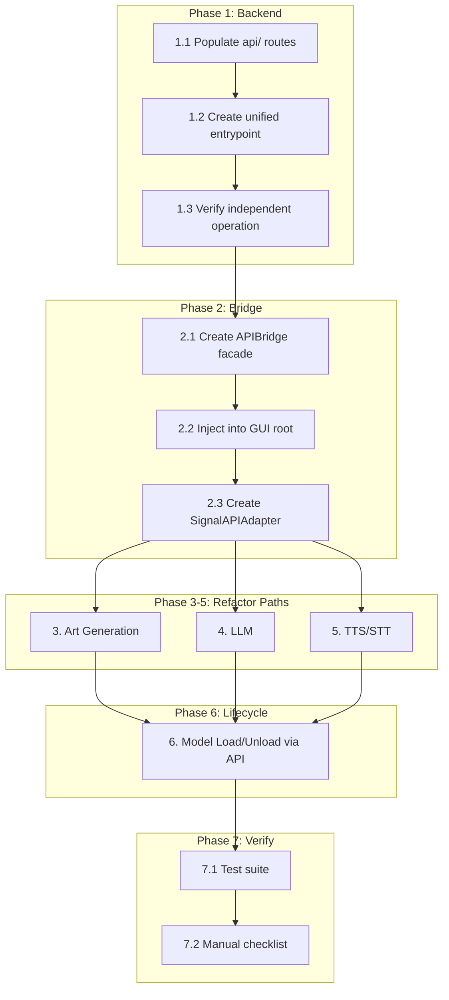

# AI Runner SOA Migration Plan: GUI → API Decoupling

## Architecture Context

### Current State (Monolithic)
The GUI process (`src/airunner/`) currently hosts workers, sidecar executors, and model managers in-process. Execution flows like:

```
GUI Widget → SignalCode → WorkerManager → Local SDWorker/LLMWorker → ModelManager → GPU
```

The API layer at [`src/airunner/services/src/airunner_services/api/server.py`](src/airunner/services/src/airunner_services/api/server.py:105) already exists with full REST routes, but the GUI bypasses it entirely, dispatching signals to in-process workers via [`worker_manager.py`](src/airunner/components/application/gui/windows/main/worker_manager.py:23).

### Target State (Service-Oriented)
```
GUI Widget → GuiDaemonClient (HTTP) → API Server → ServiceWorkerManager → Model Backend → GPU
```

The GUI process becomes a thin presentation layer. All model execution, database access, and resource management runs in the daemon backend.

---

## Phase 1: Bootstrap the API Service as an Independent Backend Stack

### 1.1 Populate the `api/` Directory as a Standalone Package

**Problem:** The top-level [`api/`](api/) directory contains empty stub subdirectories (`client/`, `db/`, `routes/`, `services/`). The actual implementation lives at [`src/airunner/services/src/airunner_services/api/`](src/airunner/services/src/airunner_services/api/).

**Actions:**

1. **Create [`api/setup.py`](api/setup.py)** with package metadata matching the existing [`src/airunner/services/setup.py`](src/airunner/services/setup.py) structure but named `airunner_api`.

2. **Populate [`api/src/airunner_api/routes/`](api/src/airunner_api/routes/)** by porting from `src/airunner/services/src/airunner_services/api/routes/`:
   - [`art.py`](api/src/airunner_api/routes/art.py) — art generation/job endpoints (838 lines in services)
   - [`llm.py`](api/src/airunner_api/routes/llm.py) — LLM chat/completion/stream endpoints (427 lines)
   - [`tts.py`](api/src/airunner_api/routes/tts.py) — TTS synthesis/voices endpoints (200 lines)
   - [`stt.py`](api/src/airunner_api/routes/stt.py) — STT transcription/upload endpoints (252 lines)
   - [`health.py`](api/src/airunner_api/routes/health.py) — health check and daemon status
   - [`daemon.py`](api/src/airunner_api/routes/daemon.py) — runtime lifecycle control
   - [`downloads.py`](api/src/airunner_api/routes/downloads.py) — HuggingFace/CivitAI download management
   - [`conversations.py`](api/src/airunner_api/routes/conversations.py) — conversation persistence
   - [`persistence.py`](api/src/airunner_api/routes/persistence.py) — model persistence
   - [`legacy.py`](api/src/airunner_api/routes/legacy.py) — backward-compatible endpoints
   - [`__init__.py`](api/src/airunner_api/routes/__init__.py)

3. **Create [`api/src/airunner_api/server.py`](api/src/airunner_api/server.py)** — copy the `APIServer` class and `create_app()` from [`src/airunner/services/src/airunner_services/api/server.py`](src/airunner/services/src/airunner_services/api/server.py:334). Update all internal imports from `airunner_services.*` to `airunner_api.*` or re-export shims.

4. **Create [`api/src/airunner_api/db/`](api/src/airunner_api/db/)** — database session management independent of the GUI's SQLAlchemy setup. Reference the existing `src/airunner/services/src/airunner_services/database/` patterns.

5. **Create [`api/src/airunner_api/services/`](api/src/airunner_api/services/)** — API service base classes (`APIServiceBase`) that the routes delegate to.

### 1.2 Create a Unified Service Entrypoint

**Actions:**

1. **Create [`api/src/airunner_api/service_entrypoint.py`](api/src/airunner_api/service_entrypoint.py)** — a single entrypoint that:
   - Initializes the `ServiceApp` headless shell
   - Builds the runtime registry via [`build_runtime_registry()`](src/airunner/runtimes/bootstrap.py:15)
   - Starts the FastAPI `APIServer`
   - Registers signal handlers for graceful shutdown

2. **Create a CLI launcher script** at [`api/bin/airunner_api_service`](api/bin/airunner_api_service) or reuse [`src/airunner/bin/airunner_service.py`](src/airunner/bin/airunner_service.py) to start the backend independently.

### 1.3 Verify Independent Backend Operation

**Actions:**

1. Add a smoke test at [`api/tests/test_service_bootstrap.py`](api/tests/test_service_bootstrap.py) that:
   - Starts the service in a subprocess
   - Calls `/api/v1/health`
   - Verifies all runtime statuses report correctly
   - Shuts down cleanly

2. Add a `docker-compose` override or new service definition at [`docker-compose.yml`](docker-compose.yml) for running the API service as a standalone container.

> **Phase 1 Implementation Notes (2026-05-23):**
>
> The transitional wrappers in `api/src/airunner_api/` already port routes
> from the architectural spike. These wrappers use `importlib.import_module()`
> to re-export `airunner_services.*` modules. The missing pieces were:
>
> 1. **`api/package_metadata.py`** — copied from `airunner_new/api/`
> 2. **`src/airunner/services/src/airunner_services/`** — copied 204 files from
>    `airunner_new/services/src/airunner_services/`
> 3. **`model/src/airunner_model/contracts.py` and `art/`** — synced from
>    `airunner_new/model/src/airunner_model/`
> 4. **`native/src/airunner_native/`** — synced from `airunner_new/native/src/`
> 5. **`api/src/airunner_api/service_entrypoint.py`** — standalone uvicorn launcher
> 6. **`api/bin/airunner_api_service`** — shell script with PYTHONPATH config
> 7. **`api/tests/test_service_bootstrap.py`** — smoke test verifying import
>    chain, FastAPI app construction, and route registration
>
> **Verified:** All route prefixes (`/api/v1/health`, `/api/v1/art`, `/api/v1/llm`,
> `/api/v1/tts`, `/api/v1/stt`, `/api/v1/daemon`) register correctly. The
> `create_app()` function returns a valid FastAPI instance.
>
> **Known limitation:** `PYTHONPATH` must include `api/src`, `model/src`,
> `native/src`, `src/airunner/services/src`, and `src` for the transitional
> wrapper chain to resolve. The `src/airunner/services/src/requests/` package
> shadows the real `requests` library — this must be addressed when the services
> package is refactored.

---

## Phase 2: Establish GUI API Client Connectivity Layer

### 2.1 Consolidate the Daemon Client Bridge

**Problem:** The [`GuiDaemonClient`](src/airunner/daemon_client/gui_daemon_client.py:35) already provides HTTP communication with the daemon, but it's used inconsistently. The GUI coexists with in-process workers and sometimes falls back to local workers silently.

**Actions:**

1. **Create a unified `APIBridge` facade** at [`src/airunner/api/api_bridge.py`](src/airunner/api/api_bridge.py) that wraps `GuiDaemonClient` and exposes typed, async-friendly methods for every operation the GUI needs:
   - `generate_image(request) -> JobHandle`
   - `chat_completion(messages, stream=True) -> AsyncIterator[str]`
   - `synthesize_tts(text, voice) -> bytes`
   - `transcribe_stt(audio_bytes) -> str`
   - `load_model(model_type, model_id) -> None`
   - `unload_model(model_type) -> None`
   - `get_model_status(model_type) -> ModelStatus`
   - `download_model(repo_id, model_type) -> JobHandle`
   - `cancel_generation(job_id) -> None`
   - `interrupt_llm() -> None`

2. **Ensure `APIBridge` is the single source of truth** for GUI-to-backend communication. All GUI code must go through this bridge. No direct worker references, no signal-based dispatch for model execution.

### 2.2 Inject `APIBridge` into the GUI Application Root

**Actions:**

1. Modify [`src/airunner/app.py`](src/airunner/app.py) to:
   - Instantiate `APIBridge` (wrapping `GuiDaemonClient`) during app initialization
   - Attach it as `self.api_bridge` on the root application object
   - Make it accessible to all GUI components via the existing `self.api` pattern or a new `self.api_bridge` property

2. Add a connection health indicator to the GUI status bar (via the existing [`stats_widget.py`](src/airunner/components/application/gui/widgets/stats/stats_widget.py)) that shows API connectivity state.

### 2.3 Create a GUI-Side Signal-to-API Translation Layer

**Actions:**

1. Create [`src/airunner/api/signal_api_adapter.py`](src/airunner/api/signal_api_adapter.py) — a mediator that:
   - Listens for legacy `SignalCode` emissions from GUI widgets
   - Translates them into `APIBridge` method calls
   - Emits response signals back to GUI widgets (e.g., `SD_GENERATE_IMAGE_SIGNAL` → `APIBridge.generate_image()` → result → `IMAGE_GENERATED_SIGNAL`)
   - This is the critical compatibility shim that allows phase-by-phase migration

2. Register the adapter in the `WorkerManager` signal handler map so that signals are intercepted before reaching local workers.

---

## Phase 3: Refactor Art Generation Path (`DO_GENERATE_SIGNAL` → API)

### 3.1 Current Flow

```
GUI Form → SignalCode.DO_GENERATE_SIGNAL
  → WorkerManager.on_do_generate_signal()     [worker_manager.py:412]
    → queue → handle_message("image_generate")
      → _handle_image_generation_request()     [worker_manager.py:1515]
        → _proceed_with_generation()           [worker_manager.py:1590]
          → sd_worker.on_do_generate_signal()  [sd_worker]
            → ZImageModelManager               [direct coupling!]
```

### 3.2 Target Flow

```
GUI Form → SignalCode.DO_GENERATE_SIGNAL
  → SignalAPIAdapter
    → APIBridge.generate_image(request)
      → GuiDaemonClient.start_art_generation()     [POST /api/v1/art/generate]
        → art_routes.generate_image()
          → RuntimeRegistry → SidecarArtClient → Sidecar Process
            → Art Model Backend
      → Poll GuiDaemonClient.art_job_status()      [GET /api/v1/art/status/{job_id}]
      → Fetch GuiDaemonClient.art_job_result()     [GET /api/v1/art/result/{job_id}]
    → SignalCode.IMAGE_GENERATED_SIGNAL (with result)
```

### 3.3 Specific Actions

1. **Modify [`worker_manager.py`](src/airunner/components/application/gui/windows/main/worker_manager.py:412)** — change `on_do_generate_signal()` to call `SignalAPIAdapter` instead of queuing to local `sd_worker`:
   ```python
   def on_do_generate_signal(self, data: Dict):
       # Route through API bridge instead of local worker
       self.api_bridge.generate_image_async(data)
   ```

2. **Add `generate_image_async()` to `APIBridge`** — extracts `ImageRequest` fields from the signal data dict, calls `GuiDaemonClient.start_art_generation()`, polls for completion, and emits the result back via `SignalCode.IMAGE_GENERATED_SIGNAL`.

3. **Keep the local `sd_worker` path as a fallback** gated behind a feature flag:
   ```python
   if self.application_settings.use_api_backend:
       self.api_bridge.generate_image_async(data)
   else:
       self.add_to_queue({...})  # old path
   ```

4. **Update `cancel()` handling** — the `SidecarArtExecutor.cancel()` calls `SignalCode.INTERRUPT_IMAGE_GENERATION_SIGNAL`. Replace with `APIBridge.cancel_generation(job_id)` → `POST /api/v1/daemon/runtimes/art/cancel`.

5. **Ensure the art API route** [`art.py`](src/airunner/services/src/airunner_services/api/routes/art.py:1) handles all pipeline actions (txt2img, img2img, inpaint, upscale) and properly translates the `GenerationRequest` into an `ArtInvocationRequest` for the runtime registry.

---

## Phase 4: Refactor LLM Request Path (`LLM_TEXT_GENERATE_REQUEST_SIGNAL` → API)

### 4.1 Current Flow

```
Chat Widget → SignalCode.LLM_TEXT_GENERATE_REQUEST_SIGNAL
  → WorkerManager.on_llm_request_signal()    [worker_manager.py:382]
    → llm_generate_worker.on_llm_request_signal()
      → LLMGenerateWorker → Llama.cpp
```

### 4.2 Target Flow

```
Chat Widget → SignalCode.LLM_TEXT_GENERATE_REQUEST_SIGNAL
  → SignalAPIAdapter
    → APIBridge.chat_completion(messages, stream=True)
      → GuiDaemonClient (WebSocket or HTTP streaming)
        → POST/WS /api/v1/llm/chat/completions
          → llm_routes → RuntimeRegistry → LLM Backend
      → Stream deltas back as SignalCode.LLM_TEXT_STREAMED_SIGNAL
```

### 4.3 Specific Actions

1. **Modify `on_llm_request_signal()`** in [`worker_manager.py`](src/airunner/components/application/gui/windows/main/worker_manager.py:382) to route through `APIBridge`.

2. **Add `chat_completion()` to `APIBridge`** — supports both streaming (WebSocket) and non-streaming (HTTP) modes. The existing [`llm.py` routes](src/airunner/services/src/airunner_services/api/routes/llm.py:1) already define both `POST /api/v1/llm/chat/completions` and WebSocket streaming.

3. **Add `chat_completion_stream()` to `GuiDaemonClient`** — if not already present, add WebSocket-based streaming to the daemon client. The existing client appears to use REST; WebSocket streaming may need to be added or the existing HTTP streaming endpoint can be used.

4. **Wire streaming deltas** — each token/chunk from the API stream emits `SignalCode.LLM_TEXT_STREAMED_SIGNAL` so the chat UI updates in real-time.

5. **Handle LLM control signals** (interrupt, clear history, load conversation) through API:
   - `INTERRUPT_PROCESS_SIGNAL` → `POST /api/v1/daemon/runtimes/llm/cancel`
   - `LOAD_CONVERSATION` → `GET /api/v1/llm/conversations/{id}`
   - `CLEAR_HISTORY` → `DELETE /api/v1/llm/conversations/{id}/messages`

---

## Phase 5: Refactor TTS/STT Paths (TTS/STT Signals → API)

### 5.1 TTS Flow

**Current:** `SignalCode.TTS_GENERATOR_WORKER_ADD_TO_STREAM_SIGNAL` → `tts_vocalizer_worker` → local TTS model

**Target:** `SignalCode` → `APIBridge.synthesize_tts()` → `POST /api/v1/tts/synthesize` → TTS runtime

**Actions:**
1. Modify [`on_tts_generator_worker_add_to_stream_signal()`](src/airunner/components/application/gui/windows/main/worker_manager.py:420) to call `APIBridge.synthesize_tts()`.
2. The existing [`GuiDaemonClient.synthesize_tts()`](src/airunner/daemon_client/gui_daemon_client.py:271) already calls `POST /api/v1/tts/synthesize` and returns bytes.
3. Stream audio chunks back to the audio playback subsystem.

### 5.2 STT Flow

**Current:** `SignalCode.AUDIO_CAPTURE_WORKER_RESPONSE_SIGNAL` → `stt_audio_processor_worker` → local Whisper model

**Target:** `SignalCode` → `APIBridge.transcribe_stt()` → `POST /api/v1/stt/transcribe` → STT runtime

**Actions:**
1. Modify [`on_stt_process_audio_signal()`](src/airunner/components/application/gui/windows/main/worker_manager.py:1988) to call `APIBridge.transcribe_stt()`.
2. Add `transcribe_stt()` to `GuiDaemonClient` if not already present — `POST /api/v1/stt/transcribe`.

---

## Phase 6: Wire Model Lifecycle Management (Load/Unload) Through API

### 6.1 Current State

Model loading/unloading is triggered by signals (`SD_LOAD_SIGNAL`, `LLM_LOAD_SIGNAL`, `SD_UNLOAD_SIGNAL`, etc.) handled in [`WorkerManager`](src/airunner/components/application/gui/windows/main/worker_manager.py). Some already route through `_control_daemon_runtime()` / `_control_daemon_runtime_async()`, but others fall through to local workers.

### 6.2 Target State

All model lifecycle operations go through the daemon API:

| GUI Action | Signal → API Call |
|---|---|
| Load Art Model | `SD_LOAD_SIGNAL` → `POST /api/v1/daemon/runtimes/art/load` |
| Unload Art Model | `SD_UNLOAD_SIGNAL` → `POST /api/v1/daemon/runtimes/art/unload` |
| Load LLM Model | `LLM_LOAD_SIGNAL` → `POST /api/v1/daemon/runtimes/llm/load` |
| Unload LLM Model | `LLM_UNLOAD_SIGNAL` → `POST /api/v1/daemon/runtimes/llm/unload` |
| Load TTS Model | `TTS_ENABLE_SIGNAL` → `POST /api/v1/daemon/runtimes/tts/load` |
| Unload TTS Model | `TTS_DISABLE_SIGNAL` → `POST /api/v1/daemon/runtimes/tts/unload` |
| Load STT Model | `STT_LOAD_SIGNAL` → `POST /api/v1/daemon/runtimes/stt/load` |
| Unload STT Model | `STT_UNLOAD_SIGNAL` → `POST /api/v1/daemon/runtimes/stt/unload` |

### 6.3 Specific Actions

1. **Audit all signal handlers** in [`worker_manager.py`](src/airunner/components/application/gui/windows/main/worker_manager.py:23-91) and categorize them:
   - **Already API-routed:** `on_enable_tts_signal`, `on_stt_load_signal`, `on_unload_art_signal`, `on_llm_on_unload_signal`, `on_llm_load_model_signal` — these partially use `_control_daemon_runtime()`.
   - **Need API routing:** Ensure fallback to local workers only when daemon is unavailable.
   - **GUI-only signals:** `CHANGE_SCHEDULER_SIGNAL`, `APPLICATION_SETTINGS_CHANGED_SIGNAL`, etc. — these should remain local.

2. **Update `ModelLoadBalancer`** at [`src/airunner/components/application/gui/windows/main/model_load_balancer.py`](src/airunner/components/application/gui/windows/main/model_load_balancer.py) — ensure it queries the daemon for model status rather than accessing local model managers.

3. **Update `ModelStatusWidget`** at [`src/airunner/components/model_management/gui/model_status_widget.py`](src/airunner/components/model_management/gui/model_status_widget.py) — populate status from API calls (`GET /api/v1/daemon/status`) rather than local `ModelStatus` signals.

4. **Ensure the [`daemon.py` routes](src/airunner/services/src/airunner_services/api/routes/daemon.py)** support all runtime lifecycle operations: `load_runtime`, `unload_runtime`, `runtime_status`, `cancel_runtime`.

---

## Phase 7: Integration Verification and Smoke Testing

### 7.1 Test Suite

1. **Create [`tests/integration/test_api_bridge.py`](tests/integration/test_api_bridge.py)** — integration tests for the `APIBridge`:
   - `test_health_check` — daemon reachable
   - `test_art_generation_flow` — submit job, poll status, fetch result
   - `test_llm_chat_flow` — send messages, receive completion
   - `test_tts_synthesis_flow` — synthesize text, get audio bytes
   - `test_stt_transcription_flow` — send audio, get text
   - `test_model_lifecycle` — load/unload models via API
   - `test_graceful_degradation` — GUI handles daemon unavailability

2. **Create [`tests/integration/test_end_to_end.py`](tests/integration/test_end_to_end.py)** — end-to-end test:
   - Start daemon service
   - Start GUI in headless test mode
   - Trigger art generation via GUI signal
   - Verify result comes back through API bridge
   - Shut down cleanly

### 7.2 Manual Verification Checklist

- [ ] Art generation: txt2img, img2img, inpaint all work through API
- [ ] LLM chat: streaming responses arrive in real-time
- [ ] TTS: audio plays after synthesis through API
- [ ] STT: microphone capture → transcription through API
- [ ] Model switching: changing models triggers proper load/unload via API
- [ ] Download: HuggingFace/CivitAI downloads trigger through API
- [ ] Graceful degradation: GUI shows meaningful error when daemon is down
- [ ] Resource cleanup: no orphaned GPU memory after API requests complete

---

## Dependency Graph for Implementation



---

## Feature Flag Strategy

To enable incremental rollout and easy rollback, every path refactor should be gated behind application settings flags:

| Flag | Default | Controls |
|---|---|---|
| `use_api_backend` | `False` | Master kill-switch; when `False`, all paths use legacy local workers |
| `api_backend_art` | `True` | Route art generation through API |
| `api_backend_llm` | `True` | Route LLM requests through API |
| `api_backend_tts` | `True` | Route TTS through API |
| `api_backend_stt` | `True` | Route STT through API |

These flags should be defined in `ApplicationSettings` (with an Alembic migration) and exposed in the settings UI.

---

## Excluded from This Plan (Deferred)

As specified, this plan does NOT include:
- Deleting or pruning legacy sidecar code (`sidecar_art_executor.py`, `sidecar_tts_executor.py`, etc.)
- Removing legacy database access from GUI components
- Cleaning up `ZImageModelManager` direct imports from GUI code
- Removing the `src/airunner/services/` duplicate once `api/` is fully populated
- Migrating away from `SignalCode`-based internal GUI communication (GUI widgets still use signals internally; only model execution signals are rerouted)

These will be addressed in a subsequent "Legacy Pruning" phase once the API bridge is proven stable.
