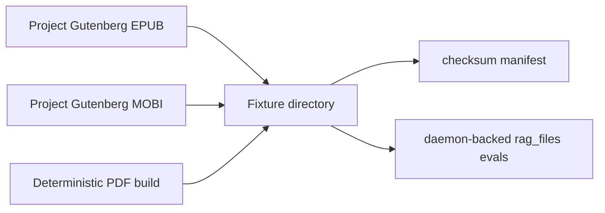

# RAG Format Fixture Plan

## Goal

Add reproducible daemon-backed RAG eval fixtures for three file formats:

- EPUB
- MOBI
- PDF

The fixture set should stay public-domain, live in-repo, and exercise the
same service-owned RAG path used by `server/tests/eval/test_agent_document_eval.py`.

## Current Boundary

What the code supports today:

- The service document loader has first-class loaders for `.epub`, `.mobi`,
  and `.pdf` in
  `server/src/airunner_services/llm/managers/agent/document_loader.py`.
- Request-attached document payloads special-case `.epub`, `.mobi`, and
  `.pdf` in
  `server/src/airunner_services/llm/managers/mixins/request_handling_mixin.py`.
- Worker-side document uploads route `.epub`, `.mobi`, and `.pdf` through the
  same byte-loading path in
  `server/src/airunner_services/workers/llm_generate_worker.py`.
- The broader document surface advertises `.mobi` as supported in
  `server/src/airunner_services/llm/tools/rag_tools_helpers/_shared.py`
  and `src/airunner/components/documents/document_import.py`.

What is missing today:

- Only `The Time Machine` has been vendored so far.
- The format matrix still needs a second multi-section fixture.

That keeps the remaining work focused on fixture breadth rather than loader
bring-up.

## Fixture Selection Principles

The fixture set should satisfy these constraints:

1. Use public-domain texts with a low copyright-risk surface.
2. Prefer one canonical text shared across formats so retrieval behavior is
   measured against content, not against format-specific wording drift.
3. Prefer born-digital or deterministic text-layer PDFs. Avoid scanned OCR PDF
   fixtures because they would turn the eval into an OCR-quality test.
4. Keep each fixture small enough for the repo, but large enough to include
   meaningful chapter or section structure.
5. Pin every upstream URL and record a checksum manifest for reproducibility.
6. Keep expected answers format-agnostic and grounded in stable facts,
   headings, and retrieved evidence rather than brittle phrase matching.

## Selected Public-Domain Works

### Primary Cross-Format Fixture

`The Time Machine` by H. G. Wells

Why it is a good fit:

- short enough for repo storage and quick eval iteration,
- chaptered narrative with strong structure,
- stable named entities and concepts,
- stable premise and theme questions that do not require word-for-word
  matching.

Selected upstreams:

- EPUB: `https://www.gutenberg.org/cache/epub/35/pg35-images-3.epub`
- MOBI: `https://www.gutenberg.org/cache/epub/35/pg35-images.mobi`
- Optional modern MOBI variant:
  `https://www.gutenberg.org/cache/epub/35/pg35-images-kf8.mobi`

Selected PDF strategy:

- derive a text-layer PDF from the same public-domain source text,
- store the derived PDF in-repo beside the downloaded EPUB and MOBI,
- record the source URL and derivation script in the fixture manifest.

Why derived PDF is the right default here:

- Project Gutenberg exposes direct EPUB and MOBI endpoints for this title,
  but the obvious same-source PDF cache paths return `404`.
- A deterministic text-layer PDF keeps the PDF eval focused on extraction,
  chunking, and retrieval instead of OCR noise.

Candidate stable eval prompts:

- identify the two future species,
- name the Eloi woman the Time Traveller rescues,
- identify the statue overlooking the Eloi world,
- locate the section that introduces the Morlocks,
- summarize the class-division theme using grounded excerpts.

### Secondary Multi-Section Fixture

`The Adventures of Sherlock Holmes` by Arthur Conan Doyle

Why it is a good fit:

- multiple story boundaries in one file,
- repeated protagonist names force section-aware retrieval,
- good for disambiguation across separate chapters or stories,
- broad enough to test retrieval precision without giant binaries.

Selected upstreams:

- EPUB: `https://www.gutenberg.org/cache/epub/1661/pg1661-images-3.epub`
- MOBI: `https://www.gutenberg.org/cache/epub/1661/pg1661-images.mobi`
- Optional modern MOBI variant:
  `https://www.gutenberg.org/cache/epub/1661/pg1661-images-kf8.mobi`

Selected PDF strategy:

- derive a text-layer PDF from the same public-domain source text,
- keep story titles intact in the generated PDF so section-aware retrieval
  remains testable.

Candidate stable eval prompts:

- identify which story contains a named clue or event,
- retrieve one fact tied to a specific story title,
- disambiguate between two Holmes stories with overlapping characters,
- summarize one story premise using retrieved evidence.

## Proposed Repo Layout



```text
server/tests/fixtures/rag_formats/
  the-time-machine/
    source.epub
    source.mobi
    source.pdf
    manifest.json
  sherlock-holmes/
    source.epub
    source.mobi
    source.pdf
    manifest.json
```

Each `manifest.json` should capture:

- title
- author
- source_urls
- original_publication_year
- local file names
- sha256 per file
- whether the PDF is downloaded or derived
- a small set of hand-labeled stable facts or section anchors for evals

## Format Handling Design

### EPUB

Keep the existing agent-side EPUB loader as the default path.

### PDF

Keep the existing `pypdf`-based loader for evals, but restrict the fixture set
to text-layer PDFs.

### MOBI

Add explicit `.mobi` support to the service document path.

Recommended implementation:

1. Add a `.mobi` loader to
   `server/src/airunner_services/llm/managers/agent/document_loader.py`.
2. Use the `mobi` Python package to unpack unencrypted MOBI files.
3. Feed the unpacked HTML, EPUB, or PDF artifact back through the existing
   loader path instead of building a separate chunker or parser branch.
4. Extend `_load_rag_document_payload()` to treat `.mobi` like `.epub` and
   `.pdf` when request-attached bytes are supplied.

Why this is the smallest safe design:

- it reuses existing EPUB and PDF normalization,
- it keeps the RAG chunking path unified,
- it avoids format-specific retrieval heuristics

## Eval Design

The first format-expansion pass should stay deterministic and evidence-first.

Phase 1 eval cases:

1. exact named-entity retrieval from `rag_search`,
2. cross-format character retrieval from `rag_search`,
3. section or chapter disambiguation from `rag_search`,
4. one summary or premise case that still asserts on grounded evidence rather
   than exact final answer wording.

Recommended assertion strategy:

- keep asserting on the retrieved evidence path first,
- allow visible reply assertions only when the answer is short and stable,
- store expected anchors as factual tuples or heading-plus-fact pairs instead
  of long literal passages.

Examples of stable anchors:

- `The Time Machine` -> `Eloi`, `Morlocks`, `Weena`, `Sphinx`
- `Sherlock Holmes` -> story title plus one fact unique to that story

## Implementation Order

1. Add the fixture manifest with pinned URLs.
2. Vendor the canonical EPUB and MOBI files.
3. Generate and vendor the text-layer PDF from the same source text.
4. Extend the existing document eval file with a
   per-format matrix.
5. Start with evidence assertions only.
6. Add summary or premise checks after the retrieval-only slice is stable.

## Near-Term Recommendation

Use `The Time Machine` as the first canonical tri-format fixture and land that
end-to-end before adding `Sherlock Holmes`.

Reason:

- it gives one clean content-equivalent EPUB, MOBI, and PDF matrix,
- it keeps the first MOBI loader bring-up small,
- it provides several stable named-entity retrieval targets,
- it reduces binary footprint for the first pass.
