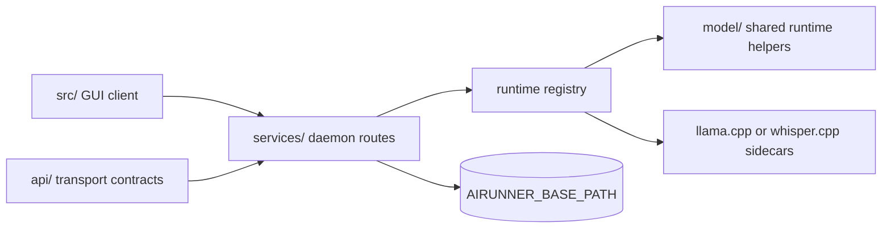

# Services

The `services/` package is AIRunner's headless orchestration layer. It
owns the daemon entry points, FastAPI server wiring, runtime registry,
downloads, persistence, lifecycle control, and the modality services that
coordinate LLM, STT, TTS, and art workloads.



## What This Package Owns

- FastAPI server bootstrap and daemon entry points
- runtime routing, runtime load or unload control, and health checks
- service-level downloads, migrations, persistence, and settings
- orchestration for daemon-backed LLM, TTS, STT, and art requests

Importable service code lives under `services/src/airunner_services/`.

The package split contract is documented in
[docs/architecture/package_split_contract.md](../docs/architecture/package_split_contract.md),
and the package map lives in
[docs/architecture/layered_product_architecture.md](../docs/architecture/layered_product_architecture.md).

## Installation

For normal repo development, use the developer installer. It installs the
split packages in editable mode and builds the pinned native sidecars used
by daemon-backed functional tests:

```bash
./scripts/install.sh
```

For an isolated service environment, install the local package stack and a
service extra that matches the workload you are validating:

```bash
python -m venv venv
source venv/bin/activate
pip install --upgrade pip setuptools wheel
pip install -e ./model
pip install -e ./api
pip install -e './services[headless,development]'
```

Use `services[desktop]` when you want the broader desktop-oriented extra
set, and use `./deployment/install_distributed.sh` when you are installing
the daemon or GUI client into separate roots.

## Test Running

The quickest service checks are the daemon runtime smoke commands exposed
by the repo test runner:

```bash
./venv/bin/python scripts/run_tests.py --llm-runtime-smoke
./venv/bin/python scripts/run_tests.py --stt-runtime-smoke
./venv/bin/python scripts/run_tests.py --art-runtime-smoke
./venv/bin/python scripts/run_tests.py --tts-runtime-smoke
```

The bootstrap sanity check for the server surface is:

```bash
./venv/bin/python -m pytest api/tests/test_service_bootstrap.py -v
```

When a change touches daemon routes, workers, or runtime coordination,
pair those smoke checks with the relevant daemon-backed functional suites
in `api/tests/`, especially:

```bash
./venv/bin/python -m pytest api/tests/test_tts_synthesize_functional.py -v --timeout=120
./venv/bin/python -m pytest api/tests/test_llm_functional.py -v --timeout=900
./venv/bin/python -m pytest api/tests/test_llm_tts_functional.py -v --timeout=1200
./venv/bin/python -m pytest api/tests/test_stt_transcribe_functional.py -v --timeout=1200
```

The functional tests live under `api/tests/` because they validate the
composed product boundary, even when the behavior under test is primarily
owned by `services/`.