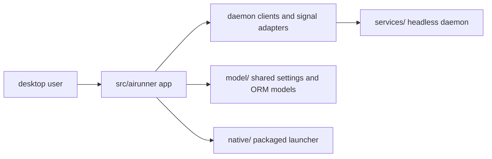

# Src

The top-level `src/` package contains AIRunner's desktop application,
including the GUI shell, daemon clients, widget tree, and the application
entry points that present chat, art, STT, and TTS as one local desktop
experience.



## What This Package Owns

- the desktop application entry points and launcher integration
- GUI widgets, windows, and user-facing workflow surfaces
- daemon client bridges and request adapters used by the desktop app
- local application behavior that should stay client-side rather than live
  in the shared daemon

Importable GUI code lives under `src/airunner/`.

## Installation

For repo work, use the developer installer so the GUI package, daemon,
shared packages, and native sidecars stay in sync:

```bash
./scripts/install.sh
```

For an isolated editable GUI environment in a checkout:

```bash
python -m venv venv
source venv/bin/activate
pip install --upgrade pip setuptools wheel
pip install -e ./model
pip install -e ./api
pip install -e './services[desktop,development]'
pip install -e ./native
pip install -e .
```

## Test Running

The desktop package has both GUI-safe unit coverage and real daemon-backed
functional coverage.

Run the general unit suite with the repo test runner:

```bash
./venv/bin/python scripts/run_tests.py --unit
```

Run the offscreen GUI functional suites from `api/tests/` when you need to
verify the real desktop-to-daemon path:

```bash
./venv/bin/python -m pytest api/tests/test_gui_llm_tts_functional.py -v --timeout=1200
./venv/bin/python -m pytest api/tests/test_gui_stt_llm_tts_functional.py -v --timeout=1200
```

Those tests set `QT_QPA_PLATFORM=offscreen` themselves and exercise the
desktop bridge without requiring manual application startup.